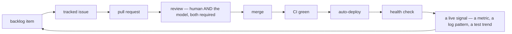

# AI in development, held to the same bar as AI in production

[The run-time half of this story](aiops.md) — the **production edge** — is a small local
model with a narrow write path to a production cluster. This is the other half, the
**development edge**: the cloud model used to *build* the estate in the first place — which
repository, which line, which architecture call. It gets exactly one exemption from the
rules below: none.

---

## Where it actually sits in the loop

Not a chat window open in a second monitor. The model works from inside the editor, with
governed, live access to the same context a human contributor would reach for:

Two details make that loop more than a diagram:

**The model can see the backlog and the repository at the same time, live.** Governed
connections to the issue tracker and the source host mean a proposed change and the ticket
that motivated it are both in front of the model in the same session — not pasted in by
hand, not stale by the time it answers. That is the "inline" part: the assistance is fused
into the actual working context, not bolted on as a separate lookup step.

**Every non-draft pull request gets the model requested as a reviewer, automatically.** Not
opt-in, not just for the changes someone remembered to ask about. The same review pass a
human would give — and it is a second opinion, not the only one.

---

## No exemption, and that is the whole design

This is the sentence worth taking literally: **a change proposed by the cloud model walks
through [the identical gate table](devsecops.md) as any other change** — same static
analysis, same secret scan, same tests, same signing — and a human remains the accountable
reviewer of what it produced.

That single rule answers the two obvious worries at once:

- *"What if it's wrong?"* — it goes through the same CI a wrong human commit would, and nothing
  merges on the model's say-so alone.
- *"What if it's used as a shortcut past review?"* — it can't be; requesting its review adds a
  second opinion, it does not replace the first one.

AI-assisted is welcomed explicitly. AI-*unaccountable* is the thing the rule exists to refuse.

> *Pure vibe coding remains an aspirational dream for professional work for me, for now.
> Supervised collaboration, though, is here today.*
> — DHH, [Promoting AI agents](https://world.hey.com/dhh/promoting-ai-agents-3ee04945) (January 2026)

---

## What "does it actually work" looks like when you ask it honestly

This is the part most write-ups skip, and it is the part that makes the rest of this page
credible.

**What it clearly does well, on the evidence:** the estate runs to dozens of architecture
decision records, a full runbook set, and documentation written at the pace of a much larger
team, produced by one person. A real incident postmortem on this platform carries its own
byline crediting the model that helped write it — a small, honest, checkable artifact rather
than a marketing claim.

**What it has not been made to prove:** there is no acceptance-rate metric, no measured
defect-escape delta, no before/after quality comparison. The honest claim is *"this clearly
helps"* — not *"this improves output by a stated percentage."* A page that measures
everything else on the platform this precisely and then hand-waves its own tooling would be
worth less than one that admits the gap.

**The most useful failure, because it is the one that proves the discipline is real:** during
one self-review pass, the model reported stale and partly wrong facts about the very platform
it was describing — claiming a piece of autoscaling configuration was absent when it was live,
and that no restore drill existed when one already did. Neither claim survived a query against
the live system. Nothing about that is an indictment of the tool; it is exactly the failure
mode every engineer using one should expect and check for.

> **AI accelerates the work. Verification is still the job.** The same rule this whole site
> applies to chaos controllers and reboot daemons applies to the model that helps write about
> them: read the value back off the live system before you believe the report — including the
> report the model just gave you.

---

## Where the line still sits

- **Nothing it proposes merges without a human accountable for it.** Requested review is
  additive, never a replacement for one.
- **It has no path to production that skips the gates.** [The pipeline](platform.md) does not
  know or care who authored a diff.
- **Its own output is not exempt from being checked** — see above. That is not a caveat added
  for balance; it happened, and it is the reason this page exists in this shape.
- **It is a different model, in a different place, for a different reason** than
  [the one that watches the cluster](aiops.md). Development-time judgement and a live write
  path to production are not the same risk, and they are not given to the same system.

---

## Read next

- **[The operations agent](aiops.md)** — the run-time half: a local, air-gapped model with a
  narrow, audited write path to the cluster.
- **[DevSecOps, end to end](devsecops.md)** — the gate table every change walks through,
  regardless of who or what proposed it.
- **[Testing, quality gates, and grading our own maturity](quality.md)** — the same
  no-exemption principle applied to code quality: fast lane, slow lane, and an honest score.

---

Written for publication. No hostnames, addresses, credential locations or internal tool
identifiers appear here, and a guard fails the build if they ever do.

