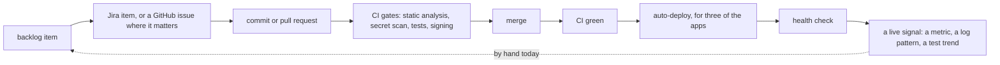


# AI in development, held to the same bar as AI in production

-orange)

[The run-time half of this story](aiops.md) — the **production edge** — is a small local
model with a narrow write path to a production cluster. This is the other half, the
**development edge**: the cloud model used to *build* the estate in the first place — which
repository, which line, which architecture call. It gets exactly one exemption from the
rules below: none.

---

## Where it sits in the loop

Not a chat window on a second monitor. The model works from the editor and from a terminal
agent, against the same backlog and repository a human contributor would use. The loop it
sits in:

```mermaid
flowchart LR
  B["backlog item"] --> ISS["Jira item, or a GitHub issue where it matters"]
  ISS --> PR["commit or pull request"]
  PR --> GATE["CI gates: static analysis, secret scan, tests, signing"]
  GATE --> MERGE["merge"]
  MERGE --> CI["CI green"]
  CI --> DEPLOY["auto-deploy, for three of the apps"]
  DEPLOY --> HEALTH["health check"]
  HEALTH --> SIG["a live signal: a metric, a log pattern, a test trend"]
  SIG -.->|"by hand today"| B
```

The last arrow is dashed because it is not wired. Nothing turns a recurring anomaly into a
backlog item automatically; the author notices it and writes the item. Auto-deploy on green
CI exists for three of the apps. The others are deployed by hand.

**The rulebook the model reads first.** The platform repository carries an `AGENTS.md` of
working agreements that every AI session reads before it touches anything. One of them is
Rule Zero: never pipe command output through `head`, `tail` or `grep`, because a filtered view
is a partial view. Another is that a green status line is a claim, not evidence. That is
checkable, which is more than can be said for a sentence about "governed connections".

---

## No exemption, and that is the whole design

A change proposed by the cloud model walks through [the same gate table](devsecops.md) as any
other: static analysis, secret scan, tests, signing. Nothing merges on the model's say-so.
It cannot be a shortcut past review, because it has no review powers to shortcut with.

"Same gates" is not "all green". Of the {{ s.supply_chain.images_first_party }} first-party
images running as of {{ s.generated_at | date: "%Y-%m-%d" }}, {{ s.supply_chain.first_party_signed_verified }}
verify against their signature, and [the status page](status.md) shows what else is
measurable. The rule is that nothing is exempt, not that nothing is red.

### Who reviews, honestly

This is a one-person repository, so the gate is CI, not a second human. One person reads and
pushes every change and is accountable for it. Of the {{ s.repo.commits }} commits as of
{{ s.generated_at | date: "%Y-%m-%d" }}, only 3 are merge commits, and almost nothing goes through a
pull request. The code owner file names that person as required reviewer for every path, but
GitHub cannot enforce it: on this private repository, on the plan in use, the branch
protection and ruleset APIs both answer 403.

> **Retraction, 2026-10-09.** This page used to say that every non-draft pull request gets the
> model requested as a reviewer automatically, and that both the human and the model were
> required. Neither was true. A workflow does ask for an AI reviewer on each non-draft pull
> request. GitHub rejects the request with HTTP 422, because the reviewer is not something it
> will accept for this repository. The step ends in `|| echo`, so the job still reports
> success. Of the 27 runs it has had, 11 failed outright and 15 of the 16 green ones show the
> same 422 in their log. Of the 41 pull requests ever opened, none has a review or a review
> request. A review that cannot be requested cannot be required, and a non-fatal step cannot
> gate a merge. I found it by reading the logs, not by trusting the green tick, which is the
> thesis of this site pointed at itself. The fix is to make the failure fatal, or to remove
> the claim; until then, an AI review is not part of the process.

So the real review process: one accountable human, the CI gates, and the model in the
session where it wrote the change, which is not independent of the change.

> *Pure vibe coding remains an aspirational dream for professional work for me, for now.
> Supervised collaboration, though, is here today.*
> — DHH, [Promoting AI agents](https://world.hey.com/dhh/promoting-ai-agents-3ee04945), 7 January 2026

Weeks after writing that, DHH's team tried the opposite. In his account, from around
February, designers were to ship through agents with no programmer in the loop:

> *We let them vibe. And we ended up with a lot of PRs that individually perhaps could have
> been justified for a hot moment, but taken all together, destroyed the architecture of the
> system. And we actually had to clean up manually, mop it up by hand.*
> — DHH, [Lex Fridman Podcast #501](https://lexfridman.com/dhh-2-transcript/) (transcript, published August 2026)

He adds, in the same answer: "that was February, by the way. Things are quite different now."
So the claim is narrower than "agents fail". Unsupervised agents fail in ways that no single
pull request shows, and that is why the rule here is supervision, not a verdict on the tools.

---

## What "does it actually work" looks like when you ask it honestly

**What it clearly does well, on the evidence.** As of {{ s.generated_at | date: "%Y-%m-%d" }} the
platform repository holds {{ s.repo.adrs }} architecture decision records, {{ s.repo.runbooks }}
runbooks and {{ s.repo.docs_pages }} documentation pages in {{ s.repo.commits }} commits over
{{ s.repo.age_days }} days, 1,743 of them by one person; the other six are bots (`git shortlog`, 2026-10-09). One of the four
post-mortems names its AI assistant in the byline: the Ceph exhaustion write-up credits GitHub Copilot
and a model. It is a draft, and it is not the post-mortem published on [the incident
page](incident.html). Since 2026-06-19, 19 commits carry a `Co-Authored-By` Claude trailer
(counted 2026-10-09 with `git log` over all {{ s.repo.commits }} commits). That is the more
checkable credit.

**What it has not been made to prove.** As of 2026-10-09 there is no acceptance-rate metric,
no measured defect-escape delta, no before/after quality comparison. The trailers do not fill
the gap: 19 of {{ s.repo.commits }} is about 1 percent, concentrated in October, so they
undercount earlier use. The cheapest measurement to try first is the share of commits
co-authored by AI against the revert and fix-up rate. Until then the honest claim is *"this
clearly helps"*, not *"this improves output by a stated percentage."*

**The most useful failures, because they prove the discipline is needed.** Two, and neither
was the model's alone.

- The review request above: the flagship control was inert, configured and plausible, and
  reported success.
- During one self-review pass the model reported stale and partly wrong facts about the
  platform it was describing: that a piece of autoscaling configuration was absent when it was
  live, and that no restore drill existed when one already did. Neither survived a query
  against the live system.

Neither is an indictment of the tool. It is the failure mode every engineer using one should
expect and check for.

> **AI accelerates the work. Verification is still the job.** The same rule this whole site
> applies to chaos controllers and reboot daemons applies to the model that helps write about
> them: read the value back off the live system before you believe the report, including the
> report the model just gave you. The page you are reading was itself corrected on
> 2026-10-09 by a fact audit against the live system.

---

## Where the line still sits

- **Nothing it proposes reaches production without a human accountable for it.** The human is
  the one who reads and pushes, not a review click.
- **It has no path to production that skips the gates.** [The pipeline](platform.md) does not
  know or care who authored a diff.
- **It is a different model, in a different place, for a different reason** than
  [the one that watches the cluster](aiops.md). Development-time judgement and a live write
  path to production are not the same risk, and they are not given to the same system.

---

## Read next

- **[The operations agent](aiops.md)** — the run-time half: a local, air-gapped model with a
  narrow, audited write path to the cluster.
- **[DevSecOps, end to end](devsecops.md)** — the gate table every change walks through,
  regardless of who or what proposed it.
- **[Testing, quality gates, and grading our own maturity](quality.md)** — the same
  no-exemption principle applied to code quality: fast lane, slow lane, and an honest score.

---

Written for publication. No hostnames, addresses, credential locations or internal tool
identifiers appear here, and a guard fails the build if they ever do.

