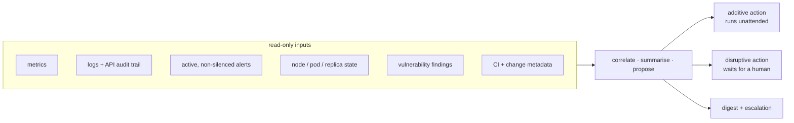

# An AI ops agent with a narrow, audited write path

There is a lot of "AI for ops" that is a chat window in front of a dashboard. This one has a
write path to a production cluster, which makes the interesting question not *what can it
do* but **what is it allowed to do without asking.**

---

## It runs outside the cluster, deliberately

The agent does not run as a workload on the cluster it watches.

> A monitor that dies with the thing it monitors is not a monitor.

It runs on a separate small machine, supervised by the host's own service manager, reaching
the cluster over the network like any other client. When the cluster is unhealthy — which is
the only time the agent matters — the agent is still up, still has its history, and can
still say so.

The model itself is **local**. No cluster state, no logs, no alert payloads and no
configuration leave the house to be inferred on. That is a privacy property and a
dependency property at once: the ops brain does not stop working because someone else's API
is down or has changed its terms.

---

## What it reads

Correlation across those sources is the actual product. A pod restart is noise; a pod
restart *plus* a node's disk latency climbing *plus* a change merged forty minutes earlier
is a hypothesis worth a human's attention.

Specialist collectors feed it: one samples application errors out of the log store, one
tracks traffic and capacity trends, one watches build and test failure rates. The agent's job
is to turn those into a short list, not a longer dashboard.

---

## The line that makes a write path safe

Every proposed remediation lands on one side of a single question: **does this action only
add state, and is it idempotent?**

| | Runs unattended | Waits for a human |
|---|---|---|
| **Principle** | strictly additive, idempotent, reversible by doing nothing | removes, reschedules, or reduces capacity |
| **Examples** | raise a replica count within configured bounds · restart a pod that has a disruption budget guaranteeing a survivor · apply a corrective configuration value · clear a poisoned cache · post a notification | drain a node · scale below a floor · delete a volume claim · run an arbitrary cluster command |
| **Failure mode if wrong** | a spurious extra replica, or a restart that was not needed | an outage |

Draining a node is instructive: it is frequently *safe* by the quorum arithmetic, and it is
still on the gated side. Safety is not the criterion — **reversibility** is. Adding a replica
that was not needed costs some memory. Draining a node that should not have been drained
costs an incident.

A third category exists and is not reachable by approval at all: whole-cluster operations sit
behind a flag that defaults to off and is documented as *leave it there*. Some capabilities
should require editing configuration and thinking about it, not clicking a button while
distracted.

Every gated action shows the exact command, who asked for it, and a dry run of its effect
before anyone can approve it. Every step is logged and attributed. An approval that does not
show you what you are approving is a rubber stamp.

---

## The chaos safety controller, and fail-closed as a default

Scheduled fault injection runs against the platform. The controller that guards it is the
part worth copying.

It pauses **every** fault schedule when any of these is true:

- the feature is switched off
- the cluster is not in steady state — any alert at or above a severity threshold is firing,
  or a workload is degraded
- **the check itself errored**

That third one is the design decision. "I could not determine whether the cluster is healthy"
is treated identically to "the cluster is unhealthy." A safety control that fails open is
decoration; the whole reason it exists is the case where something unexpected is happening,
and "unexpected" very often means the check broke too.

It also tracks *duration*. A brief blip pauses injection quietly. An injected fault that has
not self-healed inside its recovery budget escalates loudly, with the correct framing: the
alarming thing is not the fault, it is that **the automatic recovery loop is not recovering.**

### Schedules are discovered, never listed

The controller enumerates fault schedules from the live cluster on every tick. It does not
read a configured list of things to guard.

This is the same lesson as [deriving vulnerability-scan scope from the cluster](devsecops.md)
instead of maintaining it by hand, and it was learned the same way: an earlier kill switch
matched **one hardcoded name**, and a second class of fault had been added afterwards. The
switch reported success and covered half the system.

> A hand-maintained list of things to protect drifts in exactly one direction: smaller than
> everyone believes.

Derived scope means adding a new fault class enrols it in its own safety guard at the moment
it exists — not once someone remembers.

---

## The lesson that makes this page honest

The safety controller had **never been deployed to the machine whose only job was to hold
it.** The deployment mechanism copied a directory rather than checking out the repository,
so the host quietly kept a months-old build. Arming the controller would have been a no-op
that reported success.

It was armed for real only after that was found. The first fault it actually guarded fired
days later.

The pattern is identical to [the reboot daemon that never rebooted](reliability.md) and the
fault injector that had never fired: **configured, plausible, and inert.** The
distinguishing field in all three cases is the same one, and it was on no dashboard:

> **When did this last actually run?**

"Armed" and "has fired" are different claims. Only one of them is evidence.

---

## Small operational scars worth keeping

Two, because they are the kind of thing that only appears once something runs unattended for
months:

**A process-level watchdog, because libraries wedge.** The messaging socket the agent uses
for approvals can enter a permanent reconnect loop after the host sleeps — connected
according to every log line, delivering nothing. The agent counts broken-pipe errors and,
past a threshold inside a short window, deliberately exits so the host's service manager
respawns it with a fresh connection. Self-healing at the process level, because *the library
believed it was fine* and only the failure rate disagreed.

**Formatting is a correctness bug when the message is the interface.** An automated
remediation notice double-wrapped its own code fences and rendered as unreadable literal
markup. If the only channel through which a human approves a cluster change is garbled, the
control is degraded regardless of how correct the logic behind it is.

---

## How it is evaluated

Three layers, deliberately:

- **Unit tests** with no cluster access — prompt regression, command parsing, state
  transitions.
- **Integration tests that run against the real cluster** from the agent's actual host, over
  its real access path. A mock cannot tell you that the credential, the route and the
  permissions are all correct simultaneously.
- **Live operation.** It has run unsupervised for months. Additive remediations have executed
  and are logged. The safety controller has paused schedules, resumed them, and its state is
  served from an endpoint that a dashboard reads — so *its* liveness is itself observable
  rather than assumed.

---

## Honest limits

- **It is one instance.** Losing it degrades autonomy, not availability — which is why it is
  ranked below the storage and registry gaps rather than above them.
- **It proposes far more than it applies.** The unattended surface is intentionally the
  boring end of the action space, and that is the design working, not a shortfall.
- **A small local model is not an engineer.** It is very good at correlating six data
  sources at 3am and saying "these three facts are related." It is not good at deciding
  whether the related facts justify an outage.
- **None of it proves reachability or intent.** The agent reasons over the same signals a
  human would read, with the same limits those signals have.
- **The approval channel is a third-party messaging service.** If it is down, gated actions
  cannot be approved. Additive ones still run; the escalation path degrades to the alert
  router.

---

## Read next

- **[High availability, audited](reliability.md)** — the single-fault inventory, the drain
  that removed its own control surface, and why the patching loop is the best chaos
  experiment on the platform.
- **[DevSecOps, end to end](devsecops.md)** — the gates, and the derived-scope principle this
  page borrows.

---

Written for publication. No hostnames, addresses, credential locations or channel
identifiers appear here, and a guard fails the build if they ever do.

