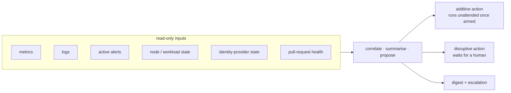

# An AI ops agent with a narrow, audited write path


{{ rules }} mapped, {{ refused }} refused


There is a lot of "AI for ops" that is a chat window in front of a dashboard. This one has a
write path to a production cluster, which makes the interesting question not *what can it
do* but **what is it allowed to do without asking.**

This is the run-time half of a two-part practice, the production edge. [The dev-time
half](ai-dev.html) is a cloud model as a reviewed engineering peer, deliberately a different
model, in a different place, for a different reason.

*Counts below are read from the agent's source as of 2026-10-09 and will move; they are
typed here, not generated, which is the one weakness of this page.*

---

## It runs outside the cluster, deliberately

> A monitor that dies with the thing it monitors is not a monitor.

The agent does not run as a workload on the cluster it watches. It runs on a separate small
machine, supervised by the host's own service manager, reaching the cluster over the network
like any other client. When the cluster is unhealthy, which is the only time the agent
matters, the agent is still up, still has its history, and can still say so.

The model itself is **local**. No cluster state, no logs, no alert payloads and no
configuration leave the house to be inferred on. That is a privacy property and a dependency
property at once: the ops brain does not stop working because someone else's API is down or
has changed its terms.

---

## What it reads


```mermaid
flowchart LR
  subgraph IN["read-only inputs"]
    M["metrics"]
    L["logs"]
    A["active alerts"]
    K["node / workload state"]
    C["identity-provider state"]
    P["pull-request health"]
  end
  IN --> AG["correlate · summarise · propose"]
  AG --> ADD["additive action<br/>runs unattended once armed"]
  AG --> DIS["disruptive action<br/>waits for a human"]
  AG --> REP["digest + escalation"]
```

Correlation across those sources is the intent: a pod restart is noise; a pod restart *plus*
a node's disk latency climbing *plus* a recent merged change is a hypothesis worth a human's
attention. Whether the local model actually does that well is a claim I have not measured.

Two things I had listed here and have taken out as of 2026-10-09. Vulnerability findings are
synced to a ticket tracker and announced in chat, but nothing in the code feeds them into the
correlation. The cluster's API audit trail is in the log store, but I found no agent code
that queries it. Specialist collectors feed the rest, and the job is a short list, not a
longer dashboard.

---

## Two paths in, one guardrail authority

A cluster action reaches execution through exactly one of two entry points, and both are
forced through the same builder before anything is allowed to run.

> *I had to be in the driver’s seat. I had to tell it what I wanted, and I had to be the
> reviewer, the auditor of what was coming out.*
> — DHH on the first phase of agentic development, [Lex Fridman Podcast #501](https://lexfridman.com/dhh-2/) (2026)

For this agent that is the permanent design, not a transitional one. The guardrails are not
a stepping stone toward a model that runs unsupervised; they are the point.

### Chat path

A deterministic parser handles ordinary phrasing; an LLM router only takes over when the
parser misses and the text looks like it wants a mutation. Neither one ever produces a
command. Both can only emit a skill name plus typed parameters, chosen from a **closed
vocabulary of {{ skills }}**: scale, restart, drain, activate, rebalance, backup. **Every
chat-triggered action, all {{ skills }} skills with no exceptions, is posted as a dry run and
waits for an explicit human approval.** There is no unattended path from a conversation,
however additive the request looks. An approval that nobody clicks expires after ten minutes.

### Alert path

A firing alert triggers a lookup, and the model is not in this loop at all. A small,
hand-written table maps specific alerts to one of the same {{ skills }} skills. An alert is
untrusted input, and routing it through an LLM before acting would add exactly the
prompt-injection surface the rest of this design exists to avoid. A lookup is deterministic,
testable, and cannot be talked into anything.

As of 2026-10-09 the table holds **{{ rules }} rules, and {{ refused }} further alert types are explicitly
declared un-actionable, each with a written reason**: a level-based alert that would loop
forever if acted on, a symptom whose "fix" would erase the evidence, a physical fault no
command can touch. Absence is an oversight; a name on that second list is a decision.

Only **{{ additive }} of the {{ rules }}** are additive (an on-demand backup, which adds an
object and touches nothing live). Only those are *eligible* to run unattended, and only once
a separate switch has been deliberately armed. **That switch is still off.** The other
{{ restarts }} are restarts, which are correct but disruptive: a restart can erase the
evidence of what crashed, or cycle replicas that were still serving. They queue through the
identical approval card as the chat path. The fifth rule, a restart for a backup component
that had ended up on the same node as its database primary, was added on 2026-09-16; it
touches no database and is still gated.

> A silent self-heal is not one. Even the unattended path always announces what it did.

### Shared guardrails

Every guardrail lives in the single shared builder, so neither entry point can route around
it by construction: the skill vocabulary, a rule that no service can be scaled to zero, one
permanently protected control-plane node, a five-minute rate limit between any two
executions, and the approval timeout. Even a worst case stays bounded. A hostile instruction
smuggled into a log line the model is summarising can, at most, produce a structured request
like *scale to zero*; the guardrail refuses it, and a human would still have had to click
approve. Three independent stops between suggestion and effect.

Draining a node is instructive on its own: it is frequently *safe* by the quorum arithmetic,
and it is still always on the gated side. Safety is not the criterion, **reversibility** is.
An unnecessary on-demand backup costs one wasted object. A node drained that should not have
been costs an incident.

A third category sits outside even this: whole-cluster operations live behind a flag that
defaults to off and is documented as *leave it there*. Some capabilities should require
editing configuration and thinking about it, not clicking a button while distracted.

Every gated action shows the exact command, who asked for it, and a dry run of its effect
before anyone can approve it, and every step is logged and attributed. An approval that does
not show you what you are approving is a rubber stamp.

### The refusal list is the load-bearing half

The mapping from alert to action is a **plain dictionary, not a model decision**; the local
model is weakest at exactly the structured extraction that routing requires, so routing
never reaches it. What is more interesting is the second table, which is longer. This is an
abridged excerpt, with the names shortened, the labels left out and the reasons paraphrased:

```python
# Eligible to run unattended: additive only. Creates an object, destroys nothing.
REMEDIATIONS = {
    "BackupStale":      Rule(skill="backup",  auto=True),
    "LastBackupFailed": Rule(skill="backup",  auto=True),
    # Correct, but disruptive: a restart erases the evidence of what crashed.
    "AppPodDown":            Rule(skill="restart", auto=False),
    "AppDeploymentDegraded": Rule(skill="restart", auto=False),
    # ... and the backup-component co-location restart, also auto=False
}

# Refused outright, each with a reason. This table is longer than the one above
# and that ratio is the point.
NEVER_REMEDIATE = {
    "ContainerOOMKilled":
        "level-based stale gauge: the alert stays firing after recovery, so a "
        "restart would re-trigger it forever (verified 2026-08-07)",
    "ClusterLostRedundancy":
        "a replica with an unusable data directory needs a rebuild, not a restart",
    # ... fourteen more
}
```

And a test that pins the property rather than the contents, so the rule cannot be quietly
widened later:

```python
def test_only_additive_skills_may_auto_apply():
    for name, rule in REMEDIATIONS.items():
        if rule.auto:
            assert rule.skill == "backup", (
                f"{name} is marked auto but {rule.skill!r} is not additive"
            )
```

That test was **falsified before it was trusted**: flip a restart rule to `auto=True` and
watch it fail, because a guard nobody has seen fail is not known to be a guard.

**Retraction, 2026-10-09.** This section used to say the refusal list "proved itself in
production" over a database incident, with the agent proposing zero actions across three
days. I cannot back that with a dated log: the incident is undated, the remediation
proposals were not armed in the infrastructure code until 2026-09-29, and the diagnosis the
old text quoted from that incident turned out to be wrong. What I can still stand behind is
smaller. `ContainerRestartingFrequently` is on the refusal list, so a crash-looping database
pod does not get restarted by this agent; a restart rule for it would have cycled a pod
mid-recovery and destroyed the log evidence. On the same day as this note a database replica
that had silently diverged at a failover two weeks earlier crash-looped on its first restart,
and the alerts that now cover that class are alerts for a human. None of them is mapped to an
action.

> Zero false positives over a real incident is a better result than a clever remediation,
> and it is the harder one to demonstrate, because success looks like an empty log. I do not
> yet have the log.

---

## The chaos safety controller, and fail-closed as a default

Scheduled fault injection runs against a staging target on the platform: call it the
resident **provocateur**. Its entire job is manufacturing exactly the kind of trouble
everything else on this site is built to survive. The controller that guards it is the part
worth copying.

It pauses **every** fault schedule when any of these is true:

- the feature is switched off
- the cluster is not in steady state: any alert at or above a severity threshold is firing,
  or a workload is degraded
- **the check itself errored**

That third one is the design decision. "I could not determine whether the cluster is healthy"
is treated identically to "the cluster is unhealthy." A safety control that fails open is
decoration; the whole reason it exists is the case where something unexpected is happening,
and "unexpected" very often means the check broke too.

It also tracks *duration*. A brief blip pauses injection quietly. An injected fault that has
not self-healed inside its recovery budget (five minutes by default) escalates loudly, with
the correct framing: the alarming thing is not the fault, it is that **the automatic
recovery loop is not recovering.**

As of 2026-10-09 there are two schedules, a pod kill and a packet-loss fault, each hourly on
weekdays in the daytime, and the controller pauses and
re-arms each one as the steady-state check changes, so whether they are armed is a reading
of that moment and not a fact to type here. Their last fires were on 2026-10-08. The controller
was armed in the infrastructure code on 2026-09-22.

**Schedules are discovered, never listed.** The controller enumerates fault schedules from
the live cluster on every tick; it does not read a configured list of things to guard. This
is the same lesson as [deriving vulnerability-scan scope from the cluster](devsecops.md), and
it was learned the same way: an earlier kill switch matched **one hardcoded name**, and a
second class of fault had been added afterwards. The switch reported success and covered half
the system. A hand-maintained list of things to protect drifts in exactly one direction:
smaller than everyone believes. Derived scope means a new fault class is enrolled in its own
safety guard at the moment it exists, not once someone remembers.

---

## The lesson that makes this page honest

The safety controller had **never been deployed to the machine whose only job was to hold
it.** The deployment mechanism copied a directory rather than checking out the repository,
so the host quietly kept an old build, and arming the controller would have been a no-op
that reported success. It was armed for real only after that was found. The copy mechanism
is still how the agent ships (a directory sync that deletes what is not in the source), which
is why this lesson is in the present tense.

The pattern is identical to [the reboot daemon that never rebooted](reliability.md) and the
fault injector that had never fired: **configured, plausible, and inert.** The
distinguishing field in all three cases is the same one, and it was on no dashboard:

> **When did this last actually run?**

"Armed" and "has fired" are different claims. Only one of them is evidence.

---

## A scar worth keeping

**A process-level watchdog, because libraries wedge.** The messaging socket the agent uses
for approvals can enter a permanent reconnect loop after the host sleeps: connected according
to every log line, delivering nothing. The agent counts broken-pipe errors and, past a
threshold inside a short window, deliberately exits so the host's service manager respawns
it with a fresh connection. Self-healing at the process level, because *the library believed
it was fine* and only the failure rate disagreed.

A smaller one: an automated remediation notice once double-wrapped its own code fences and
rendered as unreadable literal markup. When the message is the interface, formatting is a
correctness bug.

---

## How it is evaluated

Three layers, deliberately:

- **Unit tests**: {{ tests }} test functions across the agent's suite as of 2026-10-09 (a
  static count of definitions, not a pass rate; parametrised cases make the collected count
  higher). They run offline, with no cluster and no model reachable: prompt-router
  regression, command parsing, and every guardrail asserted directly. Those are the
  never-scale-to-zero rule, the protected node, the rate limit, and both recognisers landing
  on the same action for the same request.
- **Integration tests** written to run against the real cluster from the agent's host, over
  its real access path, because a mock cannot tell you that the credential, the route and
  the permissions are all correct simultaneously. They exist in the repository; I have not
  found a schedule that runs them, so I do not claim they run regularly.
- **Live operation, dated.** The agent was first scaffolded in April 2026, but for most of
  that time it answered chat mentions only. Scheduled polling and the daily digest have been
  in the infrastructure code since 2026-09-06, the chaos safety controller since 2026-09-22,
  and approval-gated remediation proposals since 2026-09-29. Unattended auto-apply has never
  been switched on.

**Retraction, 2026-10-09.** This section used to say the agent "has run unsupervised for
months" and that "additive remediations have executed and are logged". The first is true of
the chat loop only. The second I cannot support: the unattended path has never been armed,
and the agent's audit log lives in memory and does not survive a restart, so there is no
trail to point to. Its chaos state is served read-only over HTTP for a dashboard, but that
server is off by default, so its liveness is observable only where it has been enabled.

---

## Honest limits

- **It is one instance.** Losing it degrades autonomy, not availability, which is why it is
  ranked below the storage and registry gaps rather than above them.
- **It proposes far more than it applies.** The unattended surface is intentionally the
  boring end of the action space, and that is the design working, not a shortfall. I have no
  count of proposals approved, rejected and expired, because the audit log is not persisted
  yet.
- **A small local model is not an engineer.** It is good at saying "these three facts are
  related" at 3am. It is not good at deciding whether the related facts justify an outage.
- **None of it proves reachability or intent.** The agent reasons over the same signals a
  human would read, with the same limits those signals have.
- **The approval channel is a third-party messaging service.** If it is down, gated actions
  cannot be approved, and today that means all remediation, because auto-apply is off. Once
  it is armed, additive ones will still run.

---

## Read next

- **[High availability, audited](reliability.md)**: the single-fault inventory and the drain
  that removed its own control surface.
- **[DevSecOps, end to end](devsecops.md)**: the gates, and the derived-scope principle.
- **[AI in development](ai-dev.md)**: the other half, a cloud model as a reviewed peer.

---

<sub>Written for publication. No hostnames, addresses, credential locations or channel
identifiers appear here, and a guard fails the build if they ever do.</sub>

<script type="module">
  import mermaid from 'https://cdn.jsdelivr.net/npm/mermaid@11/dist/mermaid.esm.min.mjs';
  mermaid.initialize({ startOnLoad: false, theme: 'neutral' });
  document.querySelectorAll('pre > code.language-mermaid').forEach((el) => {
    const div = document.createElement('div');
    div.className = 'mermaid';
    div.textContent = el.textContent;
    el.parentElement.replaceWith(div);
  });
  mermaid.run();
</script>
