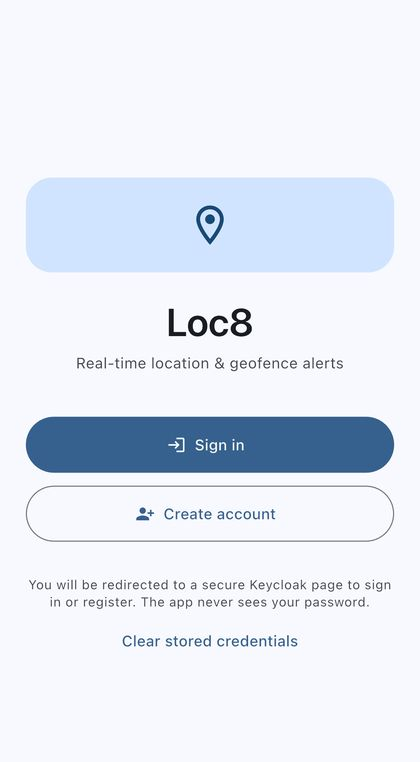
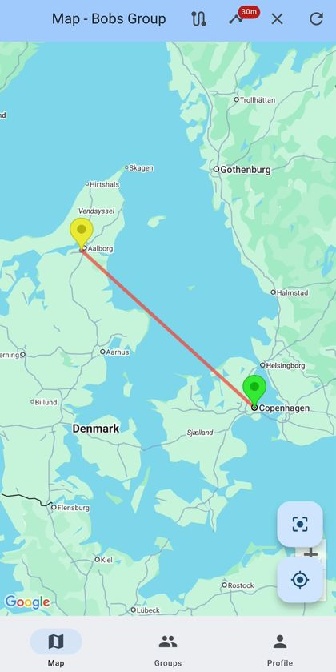
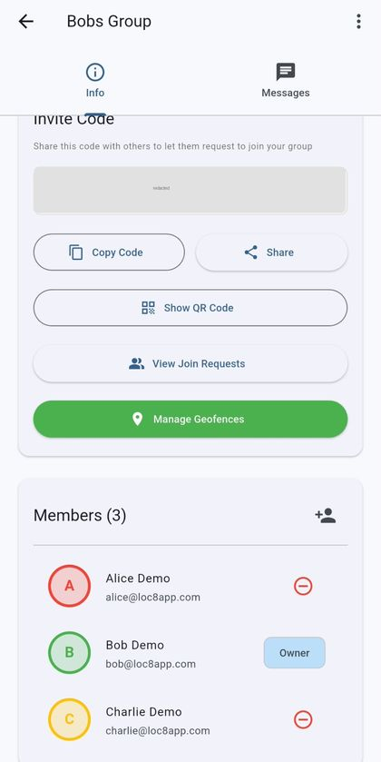
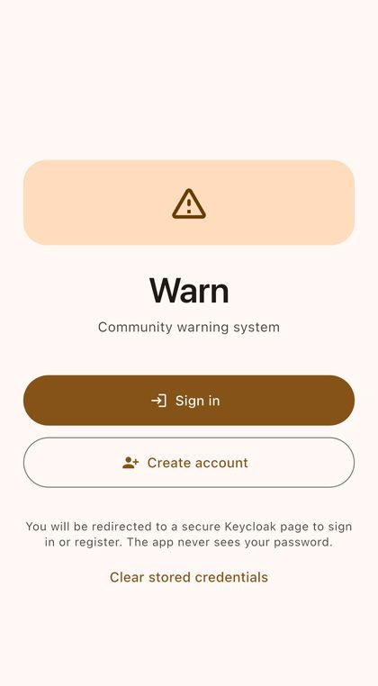
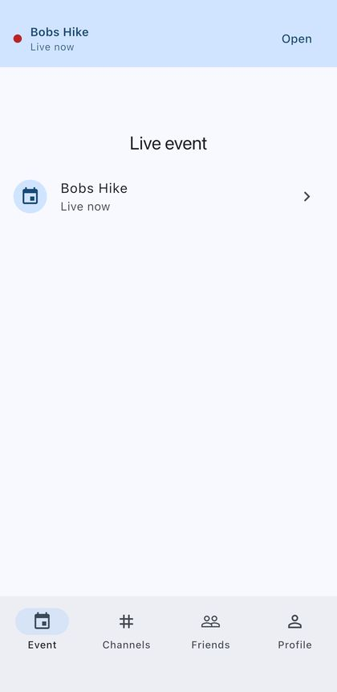



# The apps: the load the platform proves itself against

Three mobile apps, each a Flutter client for Android and iOS and a Spring Boot service on
the platform: **Loc8** shares location inside small groups, **Warn** maps road hazards that
people report, **Talk** is a messenger with channels and time-boxed live events. They were
chosen because together they push a complete vertical slice through every layer of the
estate: identity, ingress, database, metrics, a signed image, a mobile release.

**They are not a product, and this page says so first.** None of them is in an app store,
and the Android release builds are signed with a debug key. The clients are built to talk to
a private homelab, so a visitor cannot install one and use it. "Create account" leads to the
identity provider's registration page, which the platform's state notes say has been
switched off since 2026-09-29 (not re-checked today), so only I can make an account. The
people in the screenshots are three demo accounts. The apps exist to exercise the platform,
and one of the bugs they exposed is [lesson
12](lessons.md#12-the-bug-that-signed-people-out-and-the-wrong-diagnosis-that-explained-it).
The repository holds five Flutter clients; these three are the ones this site describes.

Versions are read from each app's committed `pubspec.yaml` by [the stats
generator](status.md): Loc8 **{{ s.repo.app_loc8_version }}**, Warn
**{{ s.repo.app_warn_version }}**, Talk **{{ s.repo.app_talk_version }}**. That is what the
repository declares, not a store release. Two of the apps' About dialogs carry a
hard-coded version string that has fallen behind (see the end of this page), which is why the
numbers above come from the file and not from the app.

## What they look like

Real screenshots, taken on a Samsung phone and in the iOS simulator on 2026-10-09 against
the live platform, using demo accounts. The images are cropped (status bar off), resized to
420 px wide, and in one the group's invite code is covered by a grey box, because a live
invite code lets whoever reads it ask to join. Nothing else is edited.

<figure style="margin:0;text-align:center;max-width:220px"><figcaption>Loc8, signed out. No password field: the app hands off to the identity provider.</figcaption></figure>
<figure style="margin:0;text-align:center;max-width:220px"><figcaption>Loc8 map: two members as coloured pins, a 30-minute trail. The positions are simulated, one near Aalborg and one in Copenhagen.</figcaption></figure>
<figure style="margin:0;text-align:center;max-width:220px"><figcaption>Loc8 group: invite code (covered here), a Show QR Code button, join requests, geofences, members.</figcaption></figure>
<figure style="margin:0;text-align:center;max-width:220px"><figcaption>Warn, signed out. Same sign-in pattern, its own colour.</figcaption></figure>
<figure style="margin:0;text-align:center;max-width:220px"><figcaption>Talk, a live event ("Bobs Hike", a demo). The red dot means live now.</figcaption></figure>

**What is missing.** There is no screenshot of Warn's map with hazards on it: the simulator
showed no map tiles when I tried, and a grey screen with one pin would read as broken. The
Loc8 map is from a real phone for the same reason.

## Loc8: who is where, in a group you chose

Private, invite-only location sharing. You make a group, and others join with an
eight-character invite code or by scanning its QR code, and **the owner approves each
request**. Members appear on a Google map as coloured pins that fade as their last fix
ages (full under five minutes, faint after fifteen). A trail toggle draws where each member
has been over a window from five minutes to a day. Each group has a text chat. The owner
can draw circular **geofences** on the map.

Tracking has four modes, from High Accuracy (a fix every 30 s or 10 m) to Stay Alive (every
five minutes or 500 m), and works in the background on both platforms: an Android
foreground-service notification, the iOS background-location indicator.

The backend stores positions in PostGIS. For geofences it checks every uploaded position
against the active zones of the uploader's groups and records enter and exit events, for
zones that have the matching notify flag switched on.

## Warn: hazards near you, reported by people near you

A crowdsourced road-warning map. Speed cameras, police checkpoints, accidents, road works,
animals: ten warning types, each a marker on the map, with a count of how many are within 5
km. You report one with a type and an optional description at your current position, and
other people vote it up or down. In the background, the app alerts you as you come within
500 m of one. That check runs on the phone; the server only answers "what is near this
point".

Queries use PostGIS distance-on-the-globe over a spatial index, warnings expire on their
own after a day, and deleting your account **anonymises your reports** rather than removing
them, which is what a public-safety dataset wants and what store rules allow.

## Talk: a messenger with a live-event mode

Direct messages, channels, forums with threads, reactions, typing indicators, and **events**:
time-boxed sessions you join by scanning a QR code. Inside an event, members can opt in to
share live location on a shared map with breadcrumb trails, a rally point, and a halo on
anyone falling behind the group. Real-time messages travel over a WebSocket (STOMP) that
re-authorises before every reconnect.

Join tokens are signed, stateless QR payloads, and a geofence can limit joining to people
who are actually at the place. The straggler check is one spatial query on the database
rather than a loop in application code.

## How they sign in

All three work the same way, and none has a password field.

- **Hosted login.** The app opens the identity provider's own page in the system browser
  and receives a code back (OAuth 2.0 authorisation code with PKCE). **The app never sees
  your password.** "Create account" is the same call with a registration hint.
- **Tokens.** Held in the platform keychain (iOS Keychain, Android Keystore-backed
  storage). The access token lasts an hour. The offline refresh token lasts 30 days from
  last use, so a phone that is opened at least once a month stays signed in.
- **One refresh at a time.** A burst of failing requests triggers a single refresh, and a
  request that got a 401 is replayed once if that refresh succeeds. Refresh tokens rotate,
  and a double refresh could invalidate the session.
- **Only a rejected refresh token signs you out.** This is the part that was wrong, and
  the next section says how.

## The bug that was real

On 2026-10-09 the question was why old devices had to sign in again "very often". The
identity provider's timeouts were not the cause: the apps ended a session on *any* failure
while refreshing a token, a dropped connection included. They now sign you out only when the
server positively rejects the refresh token (an exact `invalid_grant`), and a cold start with
no network keeps you in. The mechanism, and what I got wrong on the way, is in [lesson
12](lessons.md#12-the-bug-that-signed-people-out-and-the-wrong-diagnosis-that-explained-it).
The realm settings that go with it (token lifespans, event logging, the demo accounts) are
code in the platform's provisioning playbook as of 2026-10-09, not something clicked into an
admin console.

## What they are not (yet)

Stated plainly, because the screenshots above flatter them.

- **Not live, in most places.** Loc8's map refreshes every 30 seconds while the app is in
  the foreground, and its chat on pull or reopen. Talk's channel and event chat is live over
  WebSocket; whether a direct message appears on the other side without reopening the chat
  I read as a probable bug and have not checked on a device.
- **Loc8's geofence alerts are not delivered.** The server detects entry and exit and
  publishes events. The app has no code listening for them. The sign-in screen's tagline
  ("real-time location and geofence alerts") describes the intention, not the current app.
- **Warn's vote counting is naive.** Votes are not per user, so a count is not a trust
  signal yet. Every Warn data endpoint needs a signed-in user, viewing included.
- **Settings rows that do nothing.** The Notifications and Privacy rows on the Loc8 and
  Talk profile pages are stubs. The About dialogs of Loc8 and Talk show a hard-coded version
  that no longer matches their `pubspec.yaml`.
- **Tests are counted, not weighed.** The platform has {{ s.repo.tests_dart }} Dart test
  definitions across its Flutter clients (counted, not run; [how](status.md)). Close to half
  of the ones for these three exercise the sign-in and refresh logic, which is where the bug
  was. Nothing tests the maps, Loc8's chat or any real-time behaviour (Talk's chat screen has
  one render check), and in Loc8 about a fifth of the counted tests are empty templates with
  no assertion. A count of tests is not a measure of
  confidence in them.
- **Release is demo-grade.** Debug-signed Android builds, an unsigned iOS archive unless an
  Apple distribution identity is present, no store submission.

Several of these are the kind of gap [the lessons page](lessons.md) is about: the README
and the code disagreed, and the code was right. The apps' own READMEs still describe
features, such as push notifications, that the code does not have.

## Where this fits

The apps are the workload, and [the platform](platform.md) is the point. They are why the
database failover mattered, why [the incident](incident.md) had somewhere to land, and why
the synthetic traffic that [the estate page](index.md#none-of-this-is-a-demo) describes has
real endpoints to hit. Source for the apps is in the private platform repository, with the
rest of the estate.
