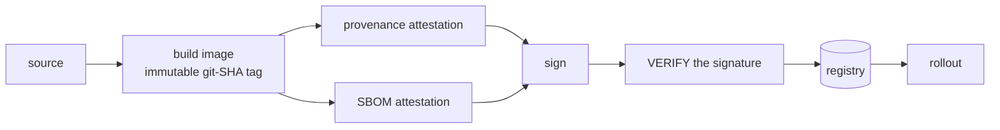

# DevSecOps, end to end

Security controls are easy to install and hard to keep honest. This page walks the whole
chain — commit to running pod to continuously re-evaluated inventory — and, at each stage,
says what the control *actually proves* rather than what it is marketed to prove.

Every number here is measured on the live system, not estimated.

---

## 1. The gates before a commit becomes an image

| Gate | Runs on | Catches | Blocking |
|---|---|---|---|
| **CodeQL** | cloud | SAST across Java and JS | yes |
| **Secret scanning** | cloud | credentials committed by accident | yes |
| **Trivy + Syft** | cloud | image CVEs, and the SBOM itself | yes |
| **DAST baseline** | cloud | live-app web findings | advisory |
| **API contract tests** | cloud | schema drift against the published OpenAPI | yes |
| **Exposure contract** | cloud | *what is reachable from the internet* — see §5 | yes |
| **Rate-limit contract** | cloud | the auth endpoint's throttle still throttles | yes |
| **Infra validation** | cloud | manifests, playbooks, shell, YAML | yes |

The unglamorous ones — the exposure and rate-limit contracts — are the two that have
actually caught regressions, because they assert a *property of the running system* rather
than a property of the source.

None of these gates check who, or what, authored the commit. **A change proposed by
[the cloud model used as a development peer](index.md) walks through the identical table** —
same SAST, same secret scan, same signing — and a human reviewer is still accountable for
what it produced. AI-assisted is not a bypass lane.

---

## 2. Build, sign, and the step most people skip

Two decisions carry most of the weight:

**The tag is the git SHA, never a floating `latest`.** A floating tag lets a rollout pull a
cached older layer and report success — so "what is running" stops being answerable at
exactly the moment you need the answer.

**The signature is verified, not merely produced.** Signing without a verification step is
ceremony. The verify step is the control; the signing step is just its input.

---

## 3. What gets scanned — derived from the cluster, never typed

This is the part that changed most recently, and it is the part worth presenting, because
the bug it fixed is one almost every organisation has.

The nightly SBOM job used to hold a **hand-typed list** of applications to scan. Two live
applications, both running two replicas, were not on it. They had no SBOM and no
vulnerability record, and nothing anywhere reported a problem — the job printed success
every night for exactly the apps it had been told about.

It was the third instance of one failure class on this platform:

- an application sat in `ImagePullBackOff` for **12 days** because a build list never
  named it
- another was missing from **both** ship lists while running healthy
- and then the scan list

So the lists were deleted. Scope is now **derived at run time**:

| Job | Scope | Source of truth |
|---|---|---|
| application scan | the apps we build | every Deployment in the application namespace |
| platform scan | everything else | every image on every pod, init containers included |

Deploying something enrols it. An empty derivation is a **hard failure**, not an empty
loop — the old mode failed by being quietly smaller than anyone believed, which is the
mode worth killing.

The result of pointing that at reality for the first time:

> **62 distinct images run on the cluster. 56 of them are third-party. None of them had an
> SBOM.** The public identity provider — the single most exposed component in the estate —
> had no vulnerability record at all. Nor did the databases, the object store, the metrics
> and log stores, the storage layer, or the vulnerability tracker itself.

Dependency bumping was already automated, so nothing was *stale*. But a bump only proves a
newer version exists. It never says what is exploitable **now**. That was the gap.

**And no exclusion list was introduced to replace it.** Scanning everything costs about ten
minutes of machine time a night. A "don't scan these" list is the identical bug pointed the
other way, and it drifts in the direction that flatters.

---

## 4. Prioritising without lying: two axes, both derived

Scanning everything is cheap. *Triaging* everything is not. So every project in the
vulnerability tracker is tagged from live cluster objects, on two axes — because either one
alone ranks things wrongly:

| Tag | Derived from |
|---|---|
| `exposure:public` | behind an ingress route on the public allowlist |
| `exposure:lan` | behind any ingress, or a node-port / load-balancer service |
| `exposure:internal` | cluster-internal service only |
| `privileged` | a privileged container, or host network / PID / IPC |

Current spread: **4 public, 19 LAN-only, 39 internal; 8 privileged.**

Why both axes, in one example each:

- **Reachability alone** would call a storage driver sidecar harmless — nothing can reach
  it. It is privileged with host mounts, so a compromise is total.
- **Privilege alone** would call the dashboard stack harmless — it is unprivileged. It
  holds credentials for every data source behind a login.

A tempting split was explicitly rejected: **"delivery tooling versus observability
tooling."** That is an *availability* taxonomy — it answers which capability stops working
when a component dies — and it does not transfer to security. The log store is
"observability" and holds logs, which routinely contain tokens. The alert router makes
outbound webhook calls. Meanwhile the storage sidecars are unreachable and all-powerful.

> **Tags order triage. They never justify suppression.** `exposure:internal` means *less
> reachable*, not *not affected* — everything internal becomes reachable the moment anything
> external is.

---

## 5. Exposure is asserted, not assumed

The public edge is **default-deny**: a short allowlist of application path prefixes, and
everything else returns 404. Internal surfaces — health/metrics endpoints, API schema
endpoints, the operator consoles, the whole monitoring stack — are unreachable from the
internet by rule, not by obscurity.

Two findings from doing this properly:

**The allowlist alone was bypassable.** Prefix matching runs against the *raw* path, but the
downstream router resolves `../` afterwards. So a request to an allowed prefix followed by
traversal reached the monitoring stack — verified as a real bypass, returning live data. The
fix is a URL-decoding traversal rejection ordered *before* the allowlist, which covers the
encoded variants too. Order matters; a correct rule in the wrong position is not a control.

**Two places now state what is public, so they are checked against each other.** The edge
configuration *enforces* the allowlist; the scanner's classifier *labels* by it. A verifier
fails the build if they disagree — otherwise projects would be tagged with an exposure they
do not have, silently, in the reassuring direction.

The authentication path additionally tracks the **failed** request rate rather than the
total, so a credential-stuffing flood is cut off while legitimate token traffic is never
throttled.

---

## 6. Measurement traps found by checking

A presentation-worthy trio, because each one produces *confident, wrong* numbers:

**96% of every SBOM was unmatchable filler.** The generator's file cataloger emitted a
component per file — bare paths, no package identifier of any kind. A vulnerability tracker
matches on package identifiers, so those rows could never produce a finding. One application
carried **7,110 components, of which 6,847 were noise**. Turning the cataloger off took it to
**264**, with the matchable set byte-identical. Verified on a minimal base image first: 92
components to 15, same 14 packages.

**A rejected upload still created the project.** The SBOM generator's default output format
had moved to a specification version the tracker rejects. The upload returned an error —
*and the project was created anyway, with its tags applied*. Checking "does the project
exist?" would have said yes, forever, while nothing was ever ingested. The format is now
pinned explicitly, with a comment saying why it cannot be simplified.

**The inventory API caps result rows regardless of the requested page size.** An early
conclusion here — "no test-scope dependencies are present" — was drawn from the first 100 of
7,110 components. The conclusion happened to survive the full set, but the evidence had not
earned it. The honest total lives in a response header.

And a fourth, which is the purest of the set:

**Licence data was generated correctly, then deleted immediately before upload.** A single
filter clause stripped every licence out of the SBOM on its way to the tracker. The
justification was written down and was *true when written* — an older tracker version
rejected the licence formats the generator emitted, and licences were not needed for
vulnerability matching. Both halves of that justification expired: the tracker was upgraded,
and a copyleft policy now needs exactly that field.

So the control existed, the data existed, and one clause between them made both useless for
three months. It was found by testing the assumption rather than reading the comment —
*upload the unfiltered document and see what actually happens.* It returned success, ingested
**243 licences**, and the copyleft policy fired for the first time. Four applications went
from zero licences to a full set.

Two competing theories were tested and **disproved** on the way, which is the part worth
keeping: a merge step was suspected of stripping them (it does not — it keeps both copies),
and the tracker was suspected of preferring the licence-free duplicate (it does not — it
keeps the licence). Guessing would have produced a plausible fix for the wrong cause.

> **Defensive code written against an external tool's behaviour has an expiry date, and
> nothing tells you when it passes.** A comment explaining why something is disabled is a
> claim about a version that has since moved.

That licence data feeds a real policy, and the policy's first honest version over-fired: it
flagged copyleft components by the hundred, and every single hit turned out to be ordinary
base-image operating-system tooling that carries no service obligation — not one was an
application dependency. The policy was split in two: an informational count of copyleft
anywhere in the inventory, and a **failing** check scoped to application dependencies only.
The baseline dropped to zero false positives without weakening what the policy actually
guards against. [The fuller licensing picture](compliance.md) — what running each licence
family obligates versus what selling a service on top of it would — lives on its own page.

A fifth trap, found while chasing why that same policy looked like it was doing nothing at
first: **a 403 with an empty body is indistinguishable from zero violations.** The
automation credential used to upload SBOMs had never been granted permission to read policy
violations back, so every query for "did this fail the policy?" returned an empty,
unauthorized response that looked exactly like a clean pass. The fix was a permission grant,
not a policy change — but until it was found, a policy that had been firing correctly the
whole time was invisible to the one system that was supposed to act on it.

---

## 7. Below the application: hosts, kernels, and what "patched" means

Every node's root filesystem is inventoried and tracked continuously, alongside the
container images. This was the one layer an otherwise strong supply-chain posture did not
cover: an unpatched kernel or TLS library *on the machine* had zero visibility while every
image running on it was scanned nightly.

OS patching is automatic and reboots are coordinated: one node at a time, drained first,
held back while defined alert conditions are firing.

### Measuring it is where it gets subtle

Host vulnerability counts are dominated by kernel packages, and one kernel source inflates
into several binary packages. Worse, a patched machine keeps its previous kernel installed
as a fallback — so the **raw count barely moves** after patching even though real exposure
has gone to zero.

So the exporter splits them:

- **running** — against the kernel the machine is actually booted on. Must reach zero.
- **superseded** — against a retained fallback kernel. Structural, never zero.
- **non-kernel** — the genuine backlog worth working.

Without that split, a real 300-to-0 improvement showed as "600 findings, unchanged."

### And then: patched is not running

The automation had two halves. The patching half worked. The rebooting half read the wrong
path — inside its container, the location it checked resolved to its own empty directory
rather than the host's — so it concluded nothing needed rebooting and **logged that
conclusion hourly, on every node, for weeks.**

The result was a fleet where every fix was applied to disk and none of it was running:
**16,002 host findings, every single one with a fix already available**, and four different
kernel series live simultaneously across nine machines. No error, no alert, no dashboard
anomaly — the patching automation was recorded as shipped.

> A vulnerability is closed when the fixed code is **executing**, not when the package is
> installed. Those are different measurements and only one of them is the control.

The [reliability page](reliability.md) carries the full incident and the procedural change it
forced.

---

## 8. From finding to tracked work, without a human retyping either side

Every prior section answers *is something wrong*. None of them answer the next question:
does anything happen about it, or does it sit in a dashboard nobody opens?

A scheduled agent — the same one described on [its own page](aiops.md) — polls both
vulnerability trackers every 30 minutes and keeps a matching set of tickets open in the work
tracker: a new Critical or High finding opens one, a finding that disappears (a dependency
bump merged, an image rebuilt, the next scan confirms it is gone) closes it automatically.
No one retypes a CVE ID into a ticket, and no one remembers to close one either.

**The interesting decision was how the two systems talk, not that they do.** The
straightforward design has the tracker push a webhook when a ticket closes — and the house
is behind carrier-grade NAT with no inbound path from the internet, the same constraint that
shapes [the delivery chain](platform.md). A push-based design would have been a dead end
before it started. Polling *outward* from inside the house needs nothing open to the
internet in either direction, which turned the constraint that blocks the obvious design into
the reason the actual one is simpler.

Scope was chosen deliberately, not exhaustively. The embedded image's firmware findings and
the first-party applications' dependency findings are tracked — **166 open tickets** across
both. The far larger pool of third-party platform-image findings is not: an automated
dependency bumper is already the fixer there, and a human triaging a four-figure ticket count
for CVEs they cannot act on faster than that bumper would be manufactured work, not caught
work.

> The first live run mis-set a filter and tracked *every* severity instead of two. Ninety-eight
> low-and-medium tickets existed for about an hour before the fix landed and they were closed in
> bulk. Caught by reading the actual count against the expected one, not by the run reporting
> success — which it did, the whole time.

---

## 9. Chaos, and a safety controller that has teeth

Faults are injected on a schedule, against a real target chosen for being *genuinely*
unreliable rather than synthetically degraded. A safety controller halts injection when the
system is not in steady state, and escalates when an injected fault does not self-heal
inside its recovery budget.

The controller was itself the source of the best lesson on this platform: it had never been
deployed to the machine whose only job was to hold it. Arming it would have been a no-op
that reported success. **"Armed" and "has fired" are different claims** — the field that
distinguishes them is *when did this last run*, and it was on no dashboard.

---

## 10. What this does not do

Stated plainly, because a control you misunderstand is worse than one you lack:

- **A scanner match is a hypothesis, not a vulnerability.** Reachability is not proven by
  any of the above.
- **Runtime behaviour is not monitored** for exploitation; this is build- and
  inventory-time analysis plus network-level exposure control.
- **The pull-request gate is narrower than the badge row suggests.** Only *critical*
  severity with an available fix blocks a merge; high, medium and low are report-only, and
  the dependency-level scan runs nightly rather than per pull request. A change introducing
  a vulnerable dependency merges clean and surfaces afterwards. That is a deliberate
  throughput trade-off, and it is tracked as an open gap rather than presented as coverage.
- **There is no secrets manager.** No sealed secrets, no vault, no external secrets
  operator. It is the recurring root cause behind a whole class of placeholder-credential
  defects, it is the highest-value unstarted item on the register, and writing it down here
  is more useful than implying it away.
- **The deploy path has a single point of failure** — one self-hosted runner, on the LAN
  side of a carrier-grade NAT boundary, because nothing in the cloud can reach the cluster.
- **Satellite repositories bypass the release policy gate**, by design of the small
  contract. Their own CI is the only thing between a commit and a rollout — and
  [the contract does not require them to have one](platform.md).
- **Closing a tracked finding does not verify a fix.** It records that a human decided to
  stop tracking it — a real remediation, or a judgement call. The tracker takes that
  decision on trust; nothing re-scans to confirm the underlying issue is actually gone
  before honouring it.

---

## Read next

- **[High availability, audited](reliability.md)** — the single-fault inventory, the drain
  that removed its own control surface, and why the patching loop is the best chaos
  experiment on the platform.
- **[The operations agent](aiops.md)** — the additive-versus-disruptive split that makes an
  automated write path to a production cluster defensible.
- **[The embedded side](yocto.md)** — the same supply chain pointed at a Linux image built
  from source.
- **[Legal, licensing, and the regulatory posture](compliance.md)** — what the same supply
  chain buys against a real regulation, and the two places a label was checked and found
  wrong.
- **[Testing, quality gates, and grading our own maturity](quality.md)** — the quality half
  of this gate table, and an honest self-graded score.
- **[Legal, licensing, and the regulatory posture](compliance.md)** — what the same supply
  chain buys against a real regulation, and the two places a label was checked and found
  wrong.
- **[Testing, quality gates, and grading our own maturity](quality.md)** — the quality half
  of this gate table, and an honest self-graded score.

---

Written for publication. Machines, addresses, hostnames and credential locations are
absent by construction and enforced by a guard that fails the build.

