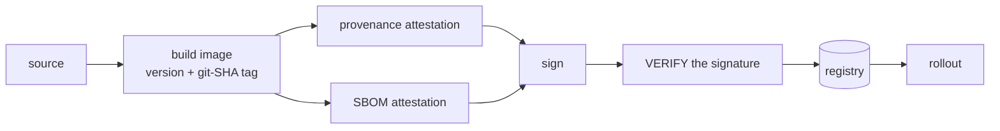


{% assign asof = s.generated_at | date: "%Y-%m-%d" -%}
# DevSecOps, end to end


Security controls are easy to install and hard to keep honest. This page walks the whole
chain, commit to running pod to continuously re-evaluated inventory, and at each stage says
what the control *actually proves* rather than what it is marketed to prove.

**What the numbers mean.** The "now" figures (badges, counts of images and runners) are
rendered from the [status page](status.md) and were measured at {{ s.generated_at }}. The
exposure tiers and the privileged count are not in that file; they are from a classifier run
against the live cluster on 2026-10-09 and are dated where they appear. Everything else
is an incident or a one-off measurement, and carries its own date or says it cannot be
re-measured. An earlier version of this page said every number was measured on the live
system. That was not true of the page, and the sentence is gone.

> **Corrections, 2026-10-09.** Four things this page claimed were wrong when audited.
> The badge row said *every* image was signed and verified: it is the first-party images,
> {{ s.supply_chain.first_party_signed_verified }} of {{ s.supply_chain.images_first_party }} running, and the cluster does not enforce the signature at admission.
> The gate table said all gates run in the cloud: none does. It marked two advisory gates as
> blocking (CodeQL, API contract) and listed two languages where there are three. And "one self-hosted runner" was
> out of date (§10).

---

## 1. The gates before a commit becomes an image

All {{ s.ci.runs_on_self_hosted }} CI jobs across {{ s.ci.workflows }} workflow files run on
self-hosted runners; {{ s.ci.runs_on_github_hosted }} run on GitHub-hosted ones (counted from the
workflow files, as of {{ asof }}). Seven of the eight gates below trigger on pull requests,
and all but the secret scan are path-filtered, so they do not run on every change.

| Gate | Triggers | Catches | Blocking |
|---|---|---|---|
| **CodeQL** | pull request | SAST across Java/Kotlin, JavaScript/TypeScript and Python | no: the analysis step is `continue-on-error` |
| **Secret scanning** | pull request | credentials committed by accident | yes |
| **Trivy + Syft** | pull request | image CVEs, and the SBOM itself | yes (critical with a fix only, see §10) |
| **DAST baseline** | pull request | live-app web findings | advisory |
| **API contract tests** | pull request | schema drift against the published OpenAPI | no: report-first; only failing to boot the target fails the job |
| **Exposure contract** | push to the main branch, daily, on demand | *what is reachable from the internet*, see §5 | yes |
| **Rate-limit contract** | pull request | the auth endpoint's throttle still throttles | yes |
| **Infra validation** | pull request | manifests, playbooks, shell, YAML | yes |

"Yes" means the job fails the workflow. Whether a failed check actually stops a merge depends
on a repository ruleset, and I found two files that disagree about whether one exists, so I
do not claim it. CodeQL runs as advisory because the result upload is refused on a private
repository without GitHub's paid scanning, and GitHub-native code scanning is off. At least the last two
push runs (2026-10-08 and 2026-10-09) failed; the first failed in the Java/Kotlin job, and I have not looked up why.

The exposure contract is the one that encodes a real regression: the path-traversal bypass in
§5, found on 2026-07-17. I have not mined run history to say how often it or the rate-limit
contract has fired since. Both are worth having for the same reason: they assert a *property of
the running system* rather than a property of the source.

None of these gates check who, or what, authored the commit. **A change proposed by
[the cloud model used as a development peer](index.md) walks through the identical table**,
same SAST, same secret scan, same signing, and a human reviewer is still accountable for
what it produced. AI-assisted is not a bypass lane.

---

## 2. Build, sign, and the step most people skip


```mermaid
flowchart LR
  S["source"] --> B["build image<br/>version + git-SHA tag"]
  B --> P["provenance attestation"]
  B --> M["SBOM attestation"]
  P --> G["sign"]
  M --> G
  G --> V["VERIFY the signature"]
  V --> R[("registry")]
  R --> K["rollout"]
```

Two decisions carry most of the weight:

**The tag carries the release version and the git SHA, never a floating `latest`.** A
floating tag lets a rollout pull a cached older layer and report success, so "what is
running" stops being answerable at exactly the moment you need the answer. None of the image references found on pods on 2026-10-09 used `latest` or no tag at all (0 of 68; the classifier counts image references on pods, so 68 here against 67 distinct images in the status counts).

**The signature is verified, not merely produced.** Signing without a verification step is
ceremony. The verify step is the control; the signing step is just its input.

---

## 3. What gets scanned — derived from the cluster, never typed

The nightly SBOM job used to hold a **hand-typed list** of applications to scan. Two live
applications, both running two replicas, were not on it. They had no SBOM and no
vulnerability record, and nothing reported a problem: the job printed success every night
for exactly the apps it had been told about.

It was the third instance of one failure class on this platform, a hand-kept list that
went stale without a sound. The other two: an application sat in `ImagePullBackOff` for
**12 days** because a build list never named it, and another was missing from both ship lists
while running healthy.

So the lists were deleted. Scope is now **derived at run time**:

| Job | Scope | Source of truth |
|---|---|---|
| application scan | the apps I build | every Deployment in the application namespace |
| platform scan | everything else | every image on every pod, init containers included |

Deploying something enrols it. An empty derivation is a **hard failure**, not an empty
loop. The old mode failed by being quietly smaller than anyone believed, which is the mode
worth killing.

The result of pointing that at reality for the first time, on the first run (2026-08-19):

> **62 distinct images ran on the cluster. 56 of them were third-party. None of them had an
> SBOM.** The public identity provider, the single most exposed component in the estate,
> had no vulnerability record at all. Nor did the databases, the object store, the metrics
> and log stores, the storage layer, or the vulnerability tracker itself.

Today ({{ asof }}) the status page counts {{ s.supply_chain.images_running }} distinct running
images, {{ s.supply_chain.images_third_party }} of them third-party, and the trackers have accepted
{{ s.supply_chain.sbom_projects }} SBOM uploads. That number is larger than the image count
because it also holds images that have since stopped running. It proves acceptance, not analysis.

Dependency bumping was already automated, so nothing was *stale*. But a bump only proves a
newer version exists. It never says what is exploitable **now**. That was the gap.

**And no exclusion list was introduced to replace it.** Scanning everything is cheap: the
platform scan takes about eleven minutes (10m49s to 11m00s, 2026-10-07 to 2026-10-09) and the
application scan about two.
A "don't scan these" list is the identical bug pointed the other way, and it drifts in the
direction that flatters.

---

## 4. Prioritising without lying: two axes, both derived

Scanning everything is cheap. *Triaging* everything is not. So every project in the
vulnerability tracker is tagged from live cluster objects, on two axes — because either one
alone ranks things wrongly:

| Tag | Derived from |
|---|---|
| `exposure:public` | behind an ingress route on the public allowlist |
| `exposure:lan` | behind any ingress, or a node-port / load-balancer service |
| `exposure:internal` | cluster-internal service only |
| `privileged` | a privileged container, or host network / PID / IPC |

Spread as of 2026-10-09, from the classifier run against the live cluster: **4 public
(the three first-party apps and the identity provider), 22 LAN-only, 42 internal, across 68
image references; 8 privileged.** The public count has not changed since the earlier measurement of
4 / 19 / 39 across 62 images; the rest grew with the estate.

Why both axes, in one example each:

- **Reachability alone** would call a storage driver sidecar harmless — nothing can reach
  it. It is privileged with host mounts, so a compromise is total.
- **Privilege alone** would call the dashboard stack harmless — it is unprivileged. It
  holds credentials for every data source behind a login.

A tempting split was explicitly rejected: **"delivery tooling versus observability
tooling."** That is an *availability* taxonomy — it answers which capability stops working
when a component dies — and it does not transfer to security. The log store is
"observability" and holds logs, which routinely contain tokens. The alert router makes
outbound webhook calls. Meanwhile the storage sidecars are unreachable and all-powerful.

> **Tags order triage. They never justify suppression.** `exposure:internal` means *less
> reachable*, not *not affected* — everything internal becomes reachable the moment anything
> external is.

---

## 5. Exposure is asserted, not assumed

The public edge is **default-deny**: a short allowlist of application path prefixes, and
everything else returns 404. Internal surfaces — health/metrics endpoints, API schema
endpoints, the operator consoles, the whole monitoring stack — are unreachable from the
internet by rule, not by obscurity.

Two findings from doing this properly:

**The allowlist alone was bypassable.** Prefix matching runs against the *raw* path, but the
downstream router resolves `../` afterwards. So a request to an allowed prefix followed by
traversal reached the monitoring stack — verified as a real bypass, returning live data. The
fix is a URL-decoding traversal rejection ordered *before* the allowlist, which covers the
encoded variants too. Order matters; a correct rule in the wrong position is not a control.

```haproxy
# The order of these two blocks IS the control. Reversed, the second one is decoration.

# 1. Reject traversal FIRST. HAProxy matches the RAW path; the router downstream
#    resolves `../` afterwards — so `/app/../prometheus` matches `path_beg /app`
#    here and still reaches Prometheus. url_dec makes one rule cover `../`,
#    `%2e%2e` and the `..%2f` encoded-slash trick.
http-request deny deny_status 400 if { path,url_dec -m sub .. }

# 2. Internal surfaces that sit UNDER an allowed prefix. url_dec again, so
#    %-encoding cannot dodge the match. Still reachable LAN-direct.
http-request deny deny_status 404 if { path,url_dec -m sub /actuator }
http-request deny deny_status 404 if { path,url_dec -m sub /swagger-ui }
http-request deny deny_status 404 if { path,url_dec -m sub /v3/api-docs }

# 3. Only now, the default-deny allowlist.
acl public_paths path_beg -i /keycloak /app-one /app-two /app-three
http-request deny deny_status 404 if !public_paths
```

`/actuator` is worth singling out. `/actuator/health` is mild and `/actuator/info` is
harmless, but `/actuator/prometheus` returned 622 lines when I looked (the count moves with the
app version; I have not re-measured it), and their `uri=` labels enumerate the entire API
surface, every path parameter, every route, which is at least as disclosive as leaving the
API schema endpoint open. The blanket deny is right and health/info are
collateral.

**Two places now state what is public, so they are checked against each other.** The edge
configuration *enforces* the allowlist; the scanner's classifier *labels* by it. A verifier
fails the build if they disagree — otherwise projects would be tagged with an exposure they
do not have, silently, in the reassuring direction.

The authentication path additionally tracks the **failed** request rate rather than the
total, so a credential-stuffing flood is cut off while legitimate token traffic is never
throttled.

---

## 6. Measurement traps found by checking

Each of these produced *confident, wrong* numbers. The dated figures are receipts from the
time; I cannot re-measure them, because they need credentials for the tracker.

**Most of every SBOM was unmatchable filler.** The generator's file cataloger emitted a
component per file: bare paths, no package identifier. A vulnerability tracker matches on
package identifiers, so those rows could never produce a finding. In the worst case, one
application, **7,110 components were 6,847 noise**; turning the cataloger off left about 260,
with the matchable set byte-identical. The repo's own comment gives the general range as
85 to 96 percent of an SBOM. On a minimal base image: 92 components to 15, the same 14
packages. (I once wrote 264 for the remainder; 7,110 minus 6,847 is 263.)

**A rejected upload still created the project.** The generator's default output format had
moved to a specification version the tracker rejects. The upload returned an error, *and the
project was created anyway, with its tags applied*. "Does the project exist?" would have said
yes forever while nothing was ingested. The format is now pinned, with a comment saying why.

**The inventory API caps result rows regardless of the requested page size.** "No test-scope
dependencies are present" was concluded from the first 100 of 7,110 components. It happened
to survive the full set, but the evidence had not earned it. The honest total is in a
response header.

**A 403 with an empty body is indistinguishable from zero violations.** The credential that
uploads SBOMs had never been granted permission to read policy violations back, so every
"did this fail the policy?" query returned an empty, unauthorized response that looked
exactly like a clean pass. The fix was a permission grant, not a policy change; until then a
policy that fired correctly was invisible to the one system meant to act on it.

**Licence data was generated correctly, then deleted immediately before upload.** One filter
clause stripped every licence from the SBOM on its way to the tracker. It arrived with the
nightly scan on 2026-05-24 and was removed on 2026-08-13, 81 days. Its
justification was written down and *true when written*: an older tracker rejected the
licence formats, and licences were not needed for vulnerability matching. Both halves
expired when the tracker was upgraded and a copyleft policy began to need exactly that field.

Found by testing the assumption rather than reading the comment: upload the unfiltered
document and see. It returned success, ingested **243 licences** (at the time, 2026-08-13),
and the copyleft policy fired for the first time. Four applications went from zero licences
to a full set. Two theories were tested and **disproved**
on the way, which is the part worth keeping: a merge step was suspected of stripping the
licences (it keeps both copies), and the tracker of preferring the licence-free duplicate (it
keeps the licence). Guessing would have produced a plausible fix for the wrong cause.

> **Defensive code written against an external tool's behaviour has an expiry date, and
> nothing tells you when it passes.** A comment explaining why something is disabled is a
> claim about a version that has since moved.

The policy's first honest version then over-fired: hundreds of copyleft hits, every one of
them ordinary base-image operating-system tooling, none an application dependency. It was
split into an informational count of copyleft anywhere and a **failing** check scoped to
application dependencies only, without weakening what it guards against.
[The fuller licensing picture](compliance.md) lives on its own page.

---

## 7. Below the application: hosts, kernels, and what "patched" means

Every node's root filesystem is inventoried and tracked continuously, alongside the
container images. This was the one layer an otherwise strong supply-chain posture did not
cover: an unpatched kernel or TLS library *on the machine* had zero visibility while every
image running on it was scanned nightly.

OS patching is automatic and reboots are coordinated: one node at a time, drained first,
held back while defined alert conditions are firing.

### Measuring it is where it gets subtle

Host vulnerability counts are dominated by kernel packages, and one kernel source inflates
into several binary packages. Worse, a patched machine keeps its previous kernel installed
as a fallback — so the **raw count barely moves** after patching even though real exposure
has gone to zero.

So the exporter splits them:

- **running** — against the kernel the machine is actually booted on. Must reach zero.
- **superseded** — against a retained fallback kernel. Structural, never zero.
- **non-kernel** — the genuine backlog worth working.

Without that split, a real 300-to-0 improvement showed as "600 findings, unchanged."

The split keys off `uname -r` **inside the scanning container** — containers share the host
kernel, so this needs no extra mount and no extra privilege. And the regex is the whole
trick, because the obvious version of it is wrong:

```jq
# WRONG — and it looks right:
#   ^linux-[a-z-]*[0-9]+\.[0-9]+\.[0-9]+-[0-9]+
#
# Hardware-enablement kernels are named linux-hwe-6.14-headers-6.14.0-35.
# `[a-z-]*` eats "hwe-", the pattern then demands a full version and hits
# "6.14-headers" instead, and cannot backtrack past it. Those packages fall
# through as NON-kernel and get filed against the booted kernel — so a
# SUPERSEDED kernel's CVEs are reported as live exposure.

def is_versioned_kernel:
  .PkgName | test("^linux-.*[0-9]+\\.[0-9]+\\.[0-9]+-[0-9]+");

def keep($booted): select((is_versioned_kernel | not) or (.PkgName | contains($booted)));
def drop($booted): select(is_versioned_kernel and ((.PkgName | contains($booted)) | not));
```

That broken version shipped. It was caught because the deploy log printed `booted: 578`
while every prior measurement said running exposure was zero — **the contradiction was the
tell, not a test.** And because a split that silently loses findings would look exactly like
progress, the job now refuses to file unless the two halves sum to the original:

```sh
if [ "$(( booted + fallback ))" -ne "$total" ]; then
  echo "REFUSING: split does not sum — not filing a partial report" >&2
  exit 1
fi
```

> The full script, with a `--self-test` that demonstrates the regex bug rather than asserting
> it, is [in the examples directory](https://github.com/schultzzznet/schultzzznet/blob/main/examples/trivy-kernel-ab-split.sh).

### And then: patched is not running

The automation had two halves. The patching half worked. The rebooting half read the wrong
path: inside its container, the location it checked resolved to its own empty directory
rather than the host's, so it concluded nothing needed rebooting and **logged that
conclusion hourly, on every node, for weeks.**

The result, discovered in July to August 2026 (the dated incident is on the
[reliability page](reliability.md)), was a fleet where every fix was applied to disk and none of
it was running: **16,002 host findings, every single one with a fix already available**, and
four different kernel series live at once across the nine machines of that estate. No error,
no alert, no dashboard anomaly; the patching automation was recorded as shipped. It is one line:

```yaml
# The distro writes /var/run/reboot-required on the HOST. The daemon runs in a
# container, where the host's /var/run is mounted at /sentinel. Give it the HOST
# path and it resolves INSIDE the container — an empty directory that will never
# contain the file. The daemon then does exactly what it is told: checks, finds
# nothing, logs "Reboot not required", hourly, on every node, for weeks.
- --reboot-sentinel=/sentinel/reboot-required
```

The gate that stops it rebooting *into* an incident was originally the wrong shape too: an
ignore-list ("reboot unless one of these alerts is firing") is unbounded in the dangerous
direction, because every alert added later is implicit permission to reboot. It is now a
block-list, so a new alert defaults to blocking. The lock's lifetime must also exceed drain
timeout plus reboot time plus release delay, or the lock expires mid-cycle and a second node
starts draining while the first is still down. The
[annotated config](https://github.com/schultzzznet/schultzzznet/blob/main/examples/kured-args.yaml)
has the numbers.

The check that would have caught the original bug in about ten seconds, had anyone thought
to distrust the log line, is to compare the claim with the fact: the daemon's last log
lines, then `ls -l /var/run/reboot-required` and `uname -r` against the installed kernels on
the node itself.

**Today, as of 2026-10-09** (the exporter's gauges, read that morning): 0 findings against the
running kernel on all 6 nodes, 898 against retained fallback kernels (structural, never zero),
1 non-kernel finding, and every node scanned within the last 2.5 hours. The cluster was
rebuilt (its oldest node is {{ s.cluster.age_days }} days old), so the nine machines of the incident are not the six nodes of today.

> A vulnerability is closed when the fixed code is **executing**, not when the package is
> installed. Those are different measurements and only one of them is the control.

The [reliability page](reliability.md) carries the full incident and the procedural change it
forced.

---

## 8. From finding to tracked work, without a human retyping either side

Every prior section answers *is something wrong*. None of them answer the next question:
does anything happen about it, or does it sit in a dashboard nobody opens?

A scheduled agent, the one described on [its own page](aiops.md), is configured to poll both
vulnerability trackers every 30 minutes and keep a matching set of tickets open in the work
tracker: a new Critical or High finding opens one, a finding that disappears (a dependency
bump merged, an image rebuilt, the next scan confirms it is gone) closes it automatically.
No one retypes a CVE ID into a ticket, and no one remembers to close one either. I could not
find that agent running in the cluster on 2026-10-09, so I cannot say whether it is polling
today.

**The interesting decision was how the two systems talk, not that they do.** The
straightforward design has the tracker push a webhook when a ticket closes — and the house
is behind carrier-grade NAT with no inbound path from the internet, the same constraint that
shapes [the delivery chain](platform.md). A push-based design would have been a dead end
before it started. Polling *outward* from inside the house needs nothing open to the
internet in either direction, which turned the constraint that blocks the obvious design into
the reason the actual one is simpler.

Scope was chosen deliberately, not exhaustively. The embedded image's firmware findings and
the first-party applications' dependency findings are tracked: **166 open tickets** across
both when last counted. That count is undated and the tickets are not readable from the
cluster, so treat it as history, not a gauge. The far larger pool of third-party platform-image findings is not: an automated
dependency bumper is already the fixer there, and a human triaging a four-figure ticket count
for CVEs they cannot act on faster than that bumper would be manufactured work, not caught
work.

> The first live run mis-set a filter and tracked *every* severity instead of two. Ninety-eight
> low-and-medium tickets existed for about an hour before the fix landed and they were closed in
> bulk. Caught by reading the actual count against the expected one, not by the run reporting
> success — which it did, the whole time.

---

## 9. Chaos, and a safety controller that has teeth

Faults are injected on a schedule, against a real target chosen for being *genuinely*
unreliable rather than synthetically degraded. A safety controller halts injection when the
system is not in steady state, and escalates when an injected fault does not self-heal
inside its recovery budget.

The controller was itself the source of the best lesson on this platform: it had never been
deployed to the machine whose only job was to hold it. Arming it would have been a no-op
that reported success. **"Armed" and "has fired" are different claims** — the field that
distinguishes them is *when did this last run*, and it was on no dashboard.

---

## 10. What this does not do

Stated plainly, because a control you misunderstand is worse than one you lack:

- **A scanner match is a hypothesis, not a vulnerability.** Reachability is not proven by
  any of the above.
- **Runtime behaviour is not monitored** for exploitation; this is build- and
  inventory-time analysis plus network-level exposure control.
- **The pull-request gate is narrower than a green check suggests.** Only *critical*
  severity with an available fix fails the job; high, medium and low are report-only, and
  the dependency-level scan runs nightly rather than per pull request. A change introducing
  a vulnerable dependency merges clean and surfaces afterwards. That is a deliberate
  throughput trade-off, and it is tracked as an open gap rather than presented as coverage.
  CodeQL and the API contract tests do not block at all (§1).
- **There is no secrets manager.** No sealed secrets, no vault, no external secrets
  operator. It is the recurring root cause behind a whole class of placeholder-credential
  defects, it is the highest-value unstarted item on the register, and writing it down here
  is more useful than implying it away.
- **The deploy path has no cloud fallback.** Every CI and deploy job runs on a self-hosted
  runner inside the LAN, because nothing in the cloud can reach the cluster behind a
  carrier-grade NAT boundary, and GitHub-hosted runners have been refused since an Actions
  billing block. Three runners are registered (two Linux, one macOS); on 2026-10-09 two were
  online, and only one of them was Linux.
- **Nothing is enforced at admission.** Signatures are verified in CI and by a cluster check
  ({{ s.supply_chain.first_party_signed_verified }} of {{ s.supply_chain.images_first_party }} running first-party images verify, as of {{ asof }}), but no policy engine refuses an
  unsigned image, and across the cluster's {{ s.cluster.namespaces }} namespaces there are no
  NetworkPolicies and one Pod Security label (2026-10-09 audit). The mirrored and
  third-party images are not signed by this pipeline at all. GitHub-native code scanning,
  dependency alerts and secret scanning are off on the platform repository.
- **Satellite repositories bypass the release policy gate**, by design of the small
  contract. Their own CI is the only thing between a commit and a rollout — and
  [the contract does not require them to have one](platform.md).
- **Closing a tracked finding does not verify a fix.** It records that a human decided to
  stop tracking it — a real remediation, or a judgement call. The tracker takes that
  decision on trust; nothing re-scans to confirm the underlying issue is actually gone
  before honouring it.

---

## Read next

- **[High availability, audited](reliability.md)**: the single-fault inventory and the patching incident in full.
- **[The operations agent](aiops.md)**: the additive-versus-disruptive split behind an automated write path.
- **[Testing, quality gates, and grading our own maturity](quality.md)**: the quality half of the gate table.

---

<sub>Written for publication. Machines, addresses, hostnames and credential locations are
absent by construction and enforced by a guard that fails the build.</sub>

<script type="module">
  import mermaid from 'https://cdn.jsdelivr.net/npm/mermaid@11/dist/mermaid.esm.min.mjs';
  mermaid.initialize({ startOnLoad: false, theme: 'neutral' });
  document.querySelectorAll('pre > code.language-mermaid').forEach((el) => {
    const div = document.createElement('div');
    div.className = 'mermaid';
    div.textContent = el.textContent;
    el.parentElement.replaceWith(div);
  });
  mermaid.run();
</script>
