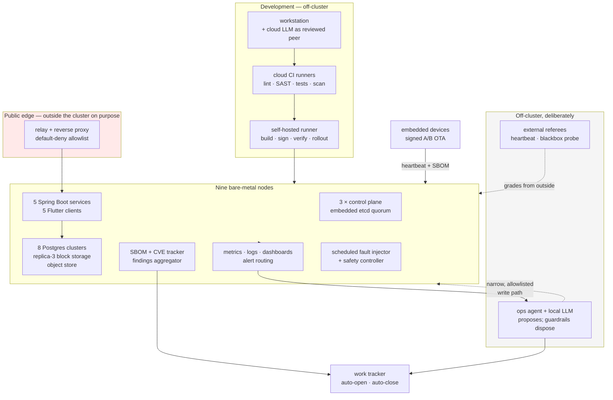

# Retired laptops running production-grade Kubernetes with HA storage, a signed supply chain, deliberate fault injection, inline AI from commit to cluster, and a discipline that treats a green status line as a question, not an answer.

**None of this is a plan, a wish, or a diagram of an intention. All of it is running, right
now.** Nine machines, live services with real users behind real identity, and every chain
described on these pages firing on its own schedule whether or not anyone is watching it.
That includes the AI, on both ends: a frontier model helped **build** it, and a local model
that never leaves the network helps **run** it. The evidence is
[further down](#none-of-this-is-a-demo) and it is all queried live rather than remembered.

The three badges below are graded by referees that sit outside the system they are grading.

*Those are live.* The first is a dead-man's-switch: the alert pipeline proves itself end to
end on a schedule, and the badge stops being green if the heartbeat stops. The others are an
off-site probe of the public entrance, run from outside the house entirely — so they still
report when the power or the internet is what failed. Between them they are the estate's
**referees**: none of them lives inside the system it is grading, which is the entire point of
a referee.

> **Three notes on that badge wall, because badges are where honesty usually goes to die.**
>
> **Uptime is not a design goal of this site, and these numbers are deliberately depressed.**
> Nodes get powered off mid-afternoon to see what happens. The cluster has been wiped and
> rebuilt from nothing. A scheduled fault injector removes things on purpose, and patching
> reboots every node on a rolling basis. All of that lands in the uptime figure. **This is a
> learning platform operated to production standards, not a product carrying an availability
> commitment** — availability is a design parameter in the architecture, but it has never
> been the objective of the site itself. A perfect score here would mean the experiments had
> stopped, which is the only result that would genuinely be bad news. The numbers are
> published because they are interesting, not because they are a target.
>
> **The first badge is labelled *scheduled jobs*, not *alerting*, because that is what it
> measures.** It is a project-wide badge: it reports the worst status of **every** check in
> the account, not the alert heartbeat alone. A badge whose label is narrower than its scope
> will eventually be believed.
>
> **It also read `late` while the alert pipeline was provably healthy** — hundreds of
> heartbeat deliveries, zero failures. The first explanation offered here was that some
> other, unrelated check was overdue. That was wrong, and checking it properly produced a
> better answer: the heartbeat check's **expected period was set to exactly the interval the
> sender uses**, five minutes against five minutes, with no headroom at all. A ping arriving
> a second or two late is therefore *by construction* late, and the badge flips amber on
> ordinary jitter. Nothing was broken; the monitor was measuring with a ruler the same length
> as the thing it measured.
>
> That one is worth sitting with, because it inverts the usual worry: **the monitoring was
> the least reliable component in the story.** The thing being watched was fine; the thing
> doing the watching was wrong. Which is the whole question — *what is the point of a monitor
> that produces false positives?* A false negative manufactures confidence, and a false
> positive gets the alarm muted, which manufactures the same blindness more slowly. It is
> also why there is deliberately more than one referee up there, none of them inside the
> system they grade: not because one would be unavailable, but because one can be **wrong**,
> and a single monitor gives you no way to find out which.
>
> **And there is deliberately no six-month uptime figure, even though the provider will
> happily render one.** Asking for progressively longer windows returned 99.874% at 90 days,
> 99.937% at 180 and 99.969% at 365 — which reads as a steadily improving record and is not.
> Multiply each back out and every one of those windows contains *the same 2.72 hours* of
> downtime: the monitor has less history than the window, so the numerator is fixed and only
> the denominator grows. The 7- and 30-day figures move independently of each other, so those
> are measurements. The longer ones are arithmetic wearing a measurement's clothes, and
> publishing them would be inventing a track record this platform has not earned.

One thing that number *does* demonstrate, though, and it is not the obvious one. The measured
figure is **99.62% over thirty days — about 164 minutes of downtime** — achieved across a
period that included nodes being powered off on purpose, a scheduled fault injector removing
things, and every machine in the fleet rebooting for patching. Nothing was held back to
protect the number. **That availability is a property of the architecture, not of restraint:**
the components being killed are replicated, so killing them is invisible to a probe of the
public entrance. Deliberate destruction of a redundant thing does not register as downtime —
which is precisely what redundancy is *for*, and the only way to know it works is to do it.

And the residual is the interesting half. The outages behind those 164 minutes that have
actually been diagnosed were failures of the **public edge** — a single small machine and a
single relay, both outside the cluster — rather than of the nine-node cluster itself. **The
downtime is concentrated in the one part of the path that is not redundant**, exactly where
the single-point analysis predicted it would be. The chaos does not show up in the number;
the unredundant hop does. A figure like this is therefore not evidence of caution, and it
would be misread as such — it is evidence that the expensive architectural decisions are
load-bearing, and a live indicator of where the next one is owed.

**Structural facts, current as of 2026-08-19:**

**A runtime snapshot, queried 2026-08-10** — a moment in time, not a claim of steady state.
It is here because every figure is one query away from being re-checked, which is the only
reason to publish a number at all:

One alert was firing at that moment: the watchdog that is *supposed* to fire, continuously,
because its silence is what proves the alert pipeline has died.

## None of this is a demo

Everything on this site is running right now, and has been running continuously for **eight
months** — across a full change of orchestrator and a deliberate from-scratch rebuild of the
cluster. Nothing here is a preserved snapshot, a stack brought up to be screenshotted, or a
diagram of something that was true once. Every chain described on these pages — commit to
signed image to SBOM to CVE to ticket; alert to agent to notification; backup to off-site to
restore drill; fault injection to blast radius to recovery — is wired end to end and fires on
its own schedule, whether or not anyone is watching it.

Verified at the time of writing by query, not from memory:

| | |
|---|---|
| Project history | **1,346 commits** over **136 active days**, first commit 21 Dec 2025 |
| Live workload | **179 pods** across **15 namespaces** on 9 nodes |
| Scheduled chains | **7 of 7** fired within the last 24 hours, none suspended |
| Most recent runs | off-site backup 02:30, SBOM scan 01:30, capacity check 04:50 — this morning |

**And the uptime figures here are deliberately unimpressive.** The hosts have been up one to
three days; the cluster's oldest object is four weeks old. That is not a hole in the record —
it *is* the record. Nodes reboot because unattended patching reboots them, and the cluster is
young because it was wiped and rebuilt on purpose, to prove that a wrong foundational decision
costs an afternoon here rather than a migration project. **A machine with a year of uptime is
a machine that hasn't been patched in a year.** What has run continuously is the *distributed*
service and the practice around it — never any individual part of it. The core has been
constant for eight months; the deployments of it have been many. Every component is meant to
be disposable, and is regularly disposed of.

This is a home-built platform that is run like a production one: nine bare-metal
Kubernetes nodes assembled from retired laptops and small-form-factor desktops, the
services that run on them, the embedded devices that talk to them, and the delivery
chain that ties the lot together.

## A testing ground that is also load-bearing

Both halves of that are true at once, and holding them together is the whole exercise.

The applications are real, serve real users and run around the clock. But this remains a
place to **take chances** — on setups, on tools, on flows, on everything. These pages
describe *a* way through. They do not claim it is *the* way. Every choice here is written
down alongside the alternatives that were considered and passed over, and each rejection
names the condition that would change the answer — because a rejection without a
reopen-trigger is just an opinion.

So the stack is not fixed. It can deviate, pivot, or rotate out entirely, and none of that
counts as damage. **The damage would be getting stuck** — the point where the ugly face of
production and stability takes over and the platform can no longer learn anything.

That day may well come, and it would be good news, because it would mean something here
found enough users to deserve it. Until then the options stay deliberately open.

What keeps this from being mere restlessness is that switching is never casual. Every tool
in the stack is documented not only in how it is used, but in **which of its parts are
deliberately left unused** — so the cost of replacing it is a known quantity rather than a
discovery made halfway through. We do not shift often. We do not shift never. We shift to
grow.

## The whole thing, on one screen

The two dotted lines are the ones that matter. The agent's write path is deliberately narrow
and allowlisted; the referees are deliberately outside everything they grade — *a monitor
that dies with the thing it monitors is not a monitor.*

## Where to start, depending on how much time you have

| You have | Read |
|---|---|
| **5 minutes** | This page, then [the measurement traps](devsecops.md#6-measurement-traps-found-by-checking) — seven controls that were configured, green, and inert |
| **20 minutes** | Add [reliability, audited](reliability.md) — the honest single-fault inventory and the patching loop that never rebooted anything |
| **You want one story** | [One incident, in full](incident.md) — a SEV1 quorum loss nothing detected, published because omitting it would be more impressive and less true |
| **An hour** | Add [the delivery chain](platform.md) and [the operations agent](aiops.md) |
| **You want code** | [`examples/`](https://github.com/schultzzznet/schultzzznet/tree/main/examples) — four extracted, runnable, commented artifacts |
| **You'd argue about tooling** | [Why these tools, and what got rejected](choices.md) — including a CNI caveat and an archived upstream |
| **You're hiring** | [What I'd do differently](lessons.md) is probably the most informative page here |

**Why build it this way instead of stopping at a tutorial:** a system nobody has to
operate for real teaches a smaller, different skill than one that is actually running —
with real if modest usage, real incidents, and a real pager. Every page on this site is the
record of something that was *operated*, not something that was read about. The hard-won
scars — a nine-day silent outage, a drain that removed its own control surface, a reboot
daemon that quietly never rebooted anything — only exist because the thing they happened to
was live.

**And the honest version of that claim, since it is the one worth checking:** *the load is
synthetic; the incidents are not.* There is no organic user base. The sustained traffic is a
load generator hitting the public path from a single address, which is why it is described
as a soak and never as adoption. What is genuinely real is everything the platform did in
response to itself: power cuts, thermal throttling, disks reporting `FAILING_NOW`, a
carrier-grade-NAT boundary, an ISP, a public entrance that has actually been down, and
kernel upgrades rolling across nine machines unattended at four in the morning. **The
failures were never the part that needed simulating.**

And to be concrete about what "all of it" means, because the phrase does a lot of work above:
the cluster, the nightly SBOM
and CVE jobs, the ops agent correlating live metrics and proposing remediations, the chaos
provocateur injecting faults and the safety controller failing closed when it can't tell if the
cluster is healthy, the Yocto device posting its heartbeat and getting its bill of materials
re-evaluated against fresh vulnerability data overnight, the delivery pipeline signing and
verifying every image on every commit. If any of it has stopped, the referees at the top of this
page are the first to know.

## What it cost

Nobody publishes these, which is exactly why they are here.

| | |
|---|---|
| **Hardware** | Nine machines, all retired or second-hand — five laptops a decade old, two all-in-ones, two small desktops. Bought new, this cluster would be indefensible; the point is that it wasn't. |
| **Software licences** | **Zero.** Every tool running this platform is open source, a community edition, or a free tier — orchestration, storage, identity, the entire monitoring and security chain, the artifact proxy. Not one paid licence, in part or in full. That is a standing constraint, not an accident of budget, and it doubles as a filter: a tool that cannot be self-hosted for nothing does not get evaluated on features. |
| **Power** | Measured per-package with the CPUs' own energy counters, not estimated from a spec sheet. Fixing the frequency governor on the two busiest nodes alone cut **13.1 W continuously — about 120 kWh/year.** One node's fan went from 3610 RPM to zero, and fleet time-above-90 °C from 18.3% to 0.0%. |
| **Time** | Evenings and weekends, over months. The up-front cost was real and is not hidden: replicating storage on hardware that didn't deserve it, giving up packing density for hard failure isolation, thirty-odd decision records, saying no to shortcuts that would plainly have worked in the short term. |
| **Cloud spend** | Effectively zero, and that is a constraint rather than a boast — it is *why* the delivery chain is split across two kinds of runner, and why an inbound webhook is not an option anywhere in the estate. |

**The one thing that is not free is named, because an unqualified "it cost nothing" would be
false.** The frontier AI used as a development peer is a paid subscription. It writes and
reviews code and documentation; it has no access to the running system. The AI that *operates*
the platform is a local model on hardware already counted above, and costs nothing to run. So:
the platform is free, the help building it is not — and the two are deliberately kept on
opposite sides of the network boundary. See [AI, twice](#ai-twice).

The thing that cost the most was not any of the above. It was **re-deriving context** —
which is why the working agreement, the decision records and the rolling state note exist,
and why an AI peer is given persistent memory rather than a fresh session each time.

## Five repositories, three examined in depth

Five repositories, bound by hard dependencies rather than theme — three get a deep dive on this site.

| Repository | What it is | Bound to the platform by |
|---|---|---|
| **the-docker-swarm-ai** | The platform itself — k3s cluster, Spring Boot services, Flutter clients, the whole delivery chain | *is* the platform |
| **theSchultzYocto** | A custom embedded Linux image: signed over-the-air A/B updates, proven rollback on real hardware | Ships bills of materials into the platform's vulnerability tracking; devices report to a fleet service running on it |
| **post-app** | A **satellite** — its own repository, its own CI, deployed onto the platform from outside it | Calls the platform's published deploy contract: a Dockerfile and a conformant manifest, nothing more |

The third one is the interesting proof. **An application does not have to live in the
platform's repository to run on it.** The satellite brings two files; the platform supplies
the registry, signing chain, runtime, ingress, replicated storage, identity, metrics and
logs. If that contract is real, it can be exercised from outside — so it is.

It is also deliberately trivial: one endpoint, no database, no identity. The variable under
test is the *contract*, and a bigger application would only make it harder to see which half
broke. What it did surface is worth more than the deployment itself —
[the contract's silences are permissions](platform.md), and this one took every single one
of them.

The platform's name is a fossil: it began on Docker Swarm and has run on k3s for a long time
now. Renaming a repository breaks every link that points at it, so the name stayed.

This is not the whole portfolio, either. Two further product repositories — an autonomous
mowing robot and a drone-swarm project — share the same registry, signing keys and
vulnerability tracker, and one of them calls this platform's own deploy workflow the same
way the satellite above does. **Five repositories, not five hobbies.** They are out of scope
for the deep dives on this site; what's worth taking from their existence is the shape, not
the specifics: **the second and third products were mostly assembly, not invention**, because
the seams — a heartbeat contract, an SBOM format, an identity token — were made explicit the
first time.

---

## What is actually running

- **Nine nodes**, three of them control-plane with embedded etcd, on hardware spanning
  2011 laptops to modern small desktops. The heterogeneity is deliberate — it forces the
  scheduling and storage decisions to be explicit rather than accidental. Nodes carry
  labels for CPU class, disk class, sustained-load tolerance and **disk health**, and
  workloads are placed against those facts rather than against hope.
- **Replicated block storage**, three-way, host-level failure domain, as the sole storage
  class. The single-node storage provisioner is switched off on purpose so that an
  unqualified volume claim *cannot* silently pin itself to one machine's disk.
- **Eight Postgres clusters** under an operator — three at three instances, five at two. The
  application and identity databases run **synchronous** replication; every one of them
  archives continuously to object storage.
- **Five Spring Boot services** and **five Flutter clients**, plus identity, ingress,
  metrics, logs and dashboards. Two nodes are deliberately **tainted** — one has no wired
  network, one is a designated fault-injection target — so neither can quietly acquire
  production work.
- **A supply chain with teeth**: every image is signed, provenance-attested and scanned,
  and **62 distinct running images** — including all 56 third-party ones — have a bill of
  materials that is re-evaluated as new vulnerabilities are published.
- **Deliberate chaos**: a scheduled fault injector — think of it as the resident
  **provocateur** — with a safety controller that halts it when the system is not in steady
  state, and escalates when a fault does not self-heal inside its recovery budget.
- **An operations agent** that reads live cluster state, correlates it, and proposes
  remediations — permitted to apply only the *additive* ones on its own.
- **36 automated assertions** that documentation, inventory and reality still agree, run on
  demand and failing loudly when they diverge.

**Security here is structural, not a layer applied at the end.** Signing, bills of materials,
vulnerability re-analysis, default-deny at the edge, automated patching and a disclosure
channel are properties of the delivery chain itself rather than a review stage bolted on
before release — an image is signed, provenance-attested and verified as a *build step*, so a
verification failure fails the job before anything is applied to the cluster.

**With one honest qualification, since it is exactly the kind of thing this site refuses to
round up:** that enforcement lives in the pipeline, not at the cluster boundary. There is no
admission controller verifying signatures at the moment a workload is created, so the
guarantee is "the delivery path will not ship an unsigned image", not "the cluster will not
run one". Anything applied by hand bypasses it. Admission-time policy is a known, named gap
rather than a solved problem here.

The EU's Cyber Resilience Act sets a baseline for products with digital elements — which a
fleet of network-connected embedded devices and the services behind them squarely are.
**Nobody built this to satisfy it, and roughly seventy percent of its technical substance was
already in place before the regulation was opened**: the bill of materials, the
vulnerability-handling process, coordinated disclosure, integrity and provenance, a
security-update mechanism, secure defaults, an incident process. What is genuinely missing is
a clause-by-clause conformity mapping — a *document*, not more engineering — and it is named
as missing rather than quietly rounded up to "compliant". The full table, and the same
treatment of GDPR and app-store obligations, is on
**[the compliance page](compliance.md)**. Security is also the only one of twelve graded
domains to reach the top level in [the self-assessment](quality.md) — which says as much
about the eleven that did not as it does about this one.

> **Why these particular apps:** location sharing, hazard warnings and messaging were picked
> because together they force a complete **vertical slice** through every layer, more than
> once — a mobile client, OAuth2/OIDC identity, a REST API backed by a geospatial extension,
> replicated storage, ingress, and the full observability chain, end to end. **The apps are
> the load the platform proves itself against. The platform is the actual point.** None of
> the three is trying to be a product; each one exists to make sure every layer underneath it
> has something real to carry.

And, because the number that is never on a landing page is the one worth trusting:
**four of thirteen failure domains are genuinely single-fault tolerant.** The other nine are
named, ranked and tracked in the open rather than rounded up —
[the audit is here](reliability.md).

Concrete numbers, machines, addresses and topology stay in the private repository. What is
here is the shape of the thing and the reasoning behind it.

---

## AI, twice

Two separate AI deployments, at two different points in the lifecycle, held to the same bar
as everything else here: **assert the property, do not trust the report.**

**Development time — a cloud model, in the loop, always reviewed.** Every repository in the
estate — including the words on this page — is built with a cloud LLM as a first-class
engineering peer rather than autocomplete: architecture reasoning, code, and documentation.
It works from a written working agreement and a persistent memory of decisions already made,
because a session that re-derives context from scratch is a session that re-litigates
mistakes already paid for. **It gets no exemption:** an AI-assisted change goes through the
identical pull-request gates as any other —
[the same SAST, secret scan, tests and signing](devsecops.md) — and a human remains
accountable for reviewing what it produced.
[The fuller account is on its own page](ai-dev.md), including the time it confidently told a
reviewer two things about this platform that were not true.

**Run time — a separate, local, air-gapped model, with a narrow write path.** The cluster is
watched continuously by an on-prem operations agent, deliberately not the cloud model, so the
thing watching production has no dependency on someone else's API being reachable. It holds a
natural-language conversation over chat — but nothing it says is ever executed directly:
[**the model proposes; a fixed, allowlisted guardrail layer disposes**](aiops.md). Every
action is built from a small, closed vocabulary, shown as a dry run, and waits for a human's
explicit approval before anything runs against the cluster.

Which is the honest answer to the question this section exists to stop anyone rounding up:

- **A bounded, budgeted chaos-recovery loop runs unattended** — and escalates loudly if a
  fault does not self-heal inside its recovery budget.
- **Additive remediations run unattended, within configured limits** — scale up, restart a
  pod that has a survivor, clear a cache.
- **Anything that removes, reduces capacity, or reschedules always waits for a human's
  click.** No exceptions, regardless of how confident the model is.

**This is not a self-healing cluster.** It is a cluster where one narrow, budgeted case
heals itself and proves it, the additive case corrects itself within limits, and everything
else becomes a proposal a human has to approve. That is a smaller claim than the industry's
favourite phrase — and the one that is actually true today.

---

## The habit the whole thing is built on

> **Assert the property. Do not trust the report.**

The recurring defect class on this platform is not the crash. It is the thing that is
*configured, plausible-looking and quietly inert*. Real examples, all found by checking
rather than reading:

- A chaos schedule that had never once fired. Every dashboard was green. The field that
  would have revealed it — *when did this last run?* — was not on any of them.
- A kill switch that covered half the system, because it matched one hardcoded name while
  a second fault class had been added later.
- A safety controller that was never actually deployed to the machine whose only job was
  to hold it. Enabling it would have been a no-op that reported success.
- An automated reboot daemon that read the wrong path and therefore concluded, hourly on
  every node for weeks, that no machine needed restarting. Patches were applied to disk and
  never came into effect: **16,002 host findings, all of them already fixed upstream**, and
  four different kernel versions running at once.
- A documentation site workflow that ran **89 times and succeeded zero times** over three
  weeks, failing before its first step so there were no logs to look at. Nothing alerted.
- A workstation link that dropped **1,614 times in a day**, invisible to `ifconfig`
  because it recovered between samples. Only the system log could see it.
- A shared build cache that was populated, correct, and **bypassed on every single build**,
  because a prerequisite service that gives cache entries a stable identity was missing.

None of these errored. Each looked fine until something checked directly. So: run the
thing, read the value back off the live object, and make a test fail before trusting that
it passes. A green status line is a claim, not evidence.

---

## The stack

Everything is standard, widely-deployed, open-source tooling. No proprietary lock-in and no
vendor-specific magic — every choice maps cleanly onto what you would reach for in a cloud
datacentre, which is rather the point of building it on retired laptops.

**Platform & runtime**

**Data & identity**

**Supply chain & security**

**Observability & resilience**

**Applications & clients**

**Embedded**

> The stack badges above are statements of fact about what is deployed, not build status.
> **Workflow badges are deliberately absent**: the three project repositories are private, so
> their status badges return 404 to anyone but me — a broken image is worse than no image, and
> a badge nobody else can verify is decoration rather than evidence.

---

## Why go to this much trouble

> Quality isn't a tax on speed. Past a very early point, it is the only source of speed.

None of what follows is a projection — each happened on this fleet, and each is a thing that
would have been a project, an outage, or simply impossible on a stack built the faster way:

- Powered off two nodes on a whim to measure a change — the applications never went down.
- Deleted two node objects outright and watched them auto-rejoin and re-label themselves on
  power-on, because the cluster is a derivative of git, not a collection of hand-configured
  machines.
- Watched a database primary fail over **during** a planned drain, with no outage and no
  manual step, because that behaviour was decided once and never revisited.
- Wiped the entire cluster and rebuilt it from nothing — a wrong foundational decision is an
  afternoon here, not a migration project.
- Reversed a topology decision the same day it was proven wrong, because being wrong stopped
  being expensive once rebuilding was cheap.

The up-front cost was real, and it is not hidden here: replicating storage on hardware that
didn't deserve it, giving up packing density for hard failure isolation, writing thirty-odd
decision records, saying no to shortcuts that would plainly have worked in the short run.
**That cost is what makes the list above take minutes instead of weekends.** Doing it right
isn't the slow path. Past the first few weeks, it is the only path that stays fast.

### The counterfactual: same hardware, done the fast way

Every shortcut available here had a specific, foreseeable ending. This is not a hypothetical
list — each one was genuinely on the table, and the reason for refusing it was written down at
the time rather than reconstructed afterwards:

| The shortcut | Where it ends |
|---|---|
| Single-node volumes, because it's only a homelab | Every reboot risks data. You can't drain, so you can't patch. A dead disk is a dead application. |
| One database per app, no operator | Every upgrade is a maintenance window; failover is a human at 3am. |
| Backups configured but never restored | You find out they don't work on the day you need them. |
| No decision records | The same arguments recur forever, and you cannot tell a wrong decision from an unlucky one. |
| No contracts, no drills | The public edge silently widens; "it rebuilds from git" stays a belief. |
| Hand-configured nodes | Adding one is a day's work; the fleet diverges until nothing is reproducible. |

**The compounding cost isn't the outages.** It is that all the time goes to firefighting. A
stack in that state can't take a risk, can't try the new thing, can't be handed over, and
can't be sold. Invention dies first, then the business case, then trust — and the last thing
to go is your own respect for the thing you built.

### The things assumed expensive that weren't

Worth stating, because they are the reason "do it properly" was affordable at all:

- **High availability cost nothing in hardware.** Loopback-file storage daemons delivered real
  replication on a single-disk fleet; actual disks swap in later with no topology change.
- **An elite supply chain was mostly wiring, not invention.** Every component is open source.
  The work was connecting them once, correctly.
- **A lightweight distribution gave the same API** and every transferable skill, for a
  fraction of the operational surface.
- **Writing it down was faster than re-deciding it.** The decision records cost hours;
  re-litigating storage or the orchestrator would have cost weeks, repeatedly.

### The condition that made all of it possible: no pressure

This is the part most engineering write-ups leave out, and leaving it out is what makes them
annoying to read. **There was no commercial pressure here of any kind** — no runway, no
board, no launch date, no customer waiting, no competitor shipping first, nobody's salary
attached to the outcome. Every "we did it properly instead of quickly" decision on this site
was made in the total absence of the one force that normally makes that choice impossible.

The industry default is not stupidity, and it is worth saying so plainly. Under real
financial and organisational pressure the order genuinely inverts: **find product-market fit
first, ship whatever proves it, and pay for the engineering later — if there is a later.**
Jump the fence, cut the corner, get it in front of someone. That is a rational response to a
constraint this project simply does not have, because a company without a market dies of the
market, not of its architecture. Anyone reading the counterfactual table above and thinking
*"sure, but I have a deadline"* is not making excuses. They are describing the actual
problem, and this site is not evidence against them.

It does happen the other way round in industry — organisations that work from first
principles and let the engineering set the pace do exist, and when it works it is
formidable. It is also **rare**, and usually only where someone deliberately spent capital or
authority to buy the same freedom that this project got for free by not mattering to anyone.

So the honest reading of everything above is not *"this is how it should be done."* It is
**"this is what it looks like when the usual forcing function is absent"** — which is also
precisely why taking on real users would end it. Customers do not just add obligations; they
import the pressure, and the pressure is what closes this door.

It is also not a universal solvent. The same project that runs replicated storage, drilled
restores and a signed supply chain still has an open item for a proper secrets manager and an
open item for a hosted privacy policy — see [the honest gaps](reliability.md) and
[the honest legal posture](compliance.md). Rigor did not automatically transfer to every
domain at once. It had to be practised in each one, and it is stated plainly wherever it
hasn't been yet.

---

## So what happens to it now?

Four questions get asked as if they were one, and separating them is most of the answer:

| | | |
|---|---|---|
| **Can it?** | capability | The only one that has to be *earned*. Everything else is opinion until this is settled. |
| **Should it?** | judgement | Worth pondering, and answerable only once *can* is real. |
| **Want to?** | intent | A choice, not a constraint — and the easiest one to mistake for a plan. |
| **Done?** | past tense | Evidence. The rest of this site is the answer to this one. |

The order matters, because **an unearned *can* makes the whole chain weightless.** *Should*,
*want* and *done* asked about something that cannot actually run are not engineering, they
are daydreaming with a roadmap attached. So:

**Can it? — very nearly, and that word is doing honest work.** The hedge is deliberate: the
answer is *almost*, not *yes*. What has already been measured on these pages is real —
replicated block storage under every volume, three control-plane
members, databases that fail over during a drain without a human, backups with a
restored-from-scratch time that was timed rather than estimated, a supply chain where every
image is signed and every *running* image is checked against the signing key, automated OS
patching with coordinated reboots, and an incident practice with real postmortems behind it.
The deploy contract already works from outside this repository — other projects deploy into
this cluster today without knowing anything about its internals. That is the definition of a
platform rather than a configuration. What is still missing is not a mystery either: it is
written down, prioritised, and mostly unglamorous.

**Should it? — not yet, and the site's own numbers say why.** Legal
and regulatory sits at level one against a target of three, and that alone blocks a lawful
public launch. Secrets at rest are honestly sub-baseline. The public entrance is a single
small machine and a single relay — the one hop with no redundancy, and demonstrably where
all the measured downtime comes from. Nothing measures whether anyone uses the applications,
because product analytics is at zero. Any of those is a fair reason to say *not yet*; the
combination is decisive. **Nothing here is one weekend from being a business, and claiming
otherwise would undo the point of every honest number above.**

**And the plainest reason is the one least often admitted: there is no killer app.** The
applications running here were chosen to be a demanding, realistic load — a mobile client,
federated identity, a geospatial API, replicated storage, the full observability chain — and
they do that job well. None of them is a product anyone is waiting for. A platform without
something worth deploying on it is infrastructure looking for a reason, and no amount of
replication fixes that. It is a genuinely different problem from the engineering, it is not
solved by more engineering, and pretending the gap is technical would be the most
comfortable lie available on this page.

**Want to? — no, and that is a choice rather than a consolation.** The platform is portable
and the instance is not.
What could graduate is the *pattern* — the contract, the pipeline, the storage and identity
and observability decisions, the assertions, the gap register as a habit. What should stay
exactly as it is, is **this** cluster, doing what nothing in production is ever allowed to
do: get powered off on a whim, wiped and rebuilt to test a decision, deliberately broken on
a schedule to find out whether the recovery story is true.

That freedom is the actual asset, and it is the first thing real users take away. The moment
something here matters to someone else, two nodes can no longer be switched off to see what
happens — and the loop that produced every finding on this site quietly stops. So the honest
plan is the boring one: **let the pattern travel, and keep the laboratory a laboratory.**

---

## Never done, by design

Nothing on this site describes a finished artifact, and that is deliberate rather than
apologetic. Every page above ends the same way it started: a claim, checked, with the gaps
named instead of rounded off. The discipline is the same loop on every page, at every scale,
whether the subject is a nine-node cluster or a single Raspberry Pi:

> **ship → observe → learn → harden → prove → repeat.**

That loop has no last iteration, and this site does not claim one.

> *The best engineers are not there just to code. They are there to solve problems.*
> — Marty Cagan, [Empowered](https://www.svpg.com/books/empowered-ordinary-people-extraordinary-products/)

> *The age of agents has brought us endless execution. Every idea, every hunch, every
> experiment is now within immediate reach. Working with agents truly is magic — in the best
> possible sense of the word. What a time to be alive. Nay, what a blessing.*
> — DHH, [Endless execution](https://world.hey.com/dhh/endless-execution-4157e065) (August 2026)

---

## Read next

- **[How the platform builds and ships things](platform.md)** — the delivery chain, why it
  is split across two kinds of runner, what an application has to bring to be deployable —
  and what the contract pointedly does *not* require.
- **[DevSecOps, end to end](devsecops.md)** — every gate from commit to running pod, what
  each one actually proves, and the measurement traps that produced confident wrong numbers.
- **[High availability, audited](reliability.md)** — four of thirteen failure domains, the
  maintenance that removed the tools needed to perform it, and why the automated patching
  loop is the best chaos experiment on the platform.
- **[The operations agent](aiops.md)** — a local model with a write path to a production
  cluster, and the single question that decides what it may do without asking.
- **[AI in development](ai-dev.md)** — the cloud half of the AI story: a reviewed engineering
  peer with no gate exemption, and an honest account of what its effect has not been measured.
- **[Testing, quality gates, and grading our own maturity](quality.md)** — what actually
  blocks a merge, and a self-graded maturity score from a small purpose-built radar tool,
  weaknesses included.
- **[Legal, licensing, and the regulatory posture](compliance.md)** — CRA, GDPR, app-store
  privacy labels, and what an open-source licence actually obligates.
- **[The embedded side](yocto.md)** — a custom Linux image with signed over-the-air updates,
  the work required to make a vulnerability scanner tell the truth about it, and three traps
  that only real hardware finds.
- **[What I'd do differently](lessons.md)** — the wrong orchestrator, two nodes too many,
  three OSDs that look like resilience, six claims reversed on evidence, and the four things
  worth keeping.
- **[Why these tools, and what got rejected](choices.md)** — the alternatives that lost and
  why, the standing constraint that rules some out permanently, and the reopen-trigger that
  turns a rejection into a decision.
- **[One incident, in full](incident.md)** — a real SEV1 post-mortem, close to verbatim: nine
  minutes without quorum, nothing detected it, a design that turned out never to have existed,
  and two action items still open.
- **[`examples/`](https://github.com/schultzzznet/schultzzznet/tree/main/examples)** — four
  of these lessons extracted as runnable, commented artifacts. One ships with a self-test
  that demonstrates its own bug.

---

Written for this public site rather than copied from the private repository, and checked
on every commit by a guard that fails the build on hostnames, addresses and credential
paths. Starting clean is cheaper than scrubbing.

