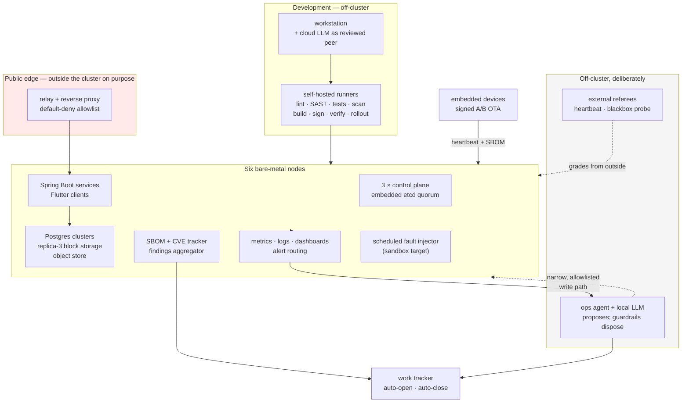











{% assign gen_date = s.generated_at | date: "%Y-%m-%d" %}

# Retired laptops running production-grade Kubernetes with HA storage, a signed supply chain, deliberate fault injection, inline AI from commit to cluster, and a discipline that treats a green status line as a question, not an answer.

**None of this is a plan or a diagram of an intention. It is running.** {{ c.nodes }} machines,
live services behind real identity flows, and scheduled chains that fire without anyone
watching. Which ones I have seen fire is dated further down; the restore drill and the
alert-to-agent chain I have not re-verified this month. A frontier model helped **build** it; a
local model helps **run** it.

**There is no organic user base.** The load is synthetic: a generator hitting the public path
from one address. What is real is what the platform did in response to itself (see
[the corrections](#corrections-2026-10-09)), and the figures below are measured, not remembered.

The three badges below are graded by referees that sit outside the system they grade.

Those are live. The first is a dead-man's-switch: the alert pipeline proves itself end to end
on a schedule, and the badge stops being green if the heartbeat stops. The others are an
off-site probe of the public entrance, so they still report when the power or the internet
is what failed. None of them lives inside the system it grades, which is the entire point of
a referee.

> **Three notes on that badge wall, because badges are where honesty usually goes to die.**
>
> **The uptime numbers are not the goal.** The cluster has been wiped and rebuilt, and
> patching reboots every node on a rolling basis. Powering nodes off mid-afternoon to see
> what happens was the practice earlier on; I have not verified that any node was powered
> off on purpose in the last 30 days. A scheduled fault injector also breaks
> things, but see the corrections: it works on a sandbox and cannot move this figure. This is
> a learning platform operated to production standards, not a product carrying an
> availability commitment.
>
> **The first badge says *scheduled jobs*, not *alerting*, because that is what it measures.**
> It reports the worst status of every check in the account. A badge whose label is narrower
> than its scope will eventually be believed. It also read `late` once while the alert
> pipeline was provably healthy. My first explanation (some other check was overdue) was
> wrong. The real cause was that the heartbeat check's expected period equalled the sender's
> interval, five minutes against five minutes, with no headroom, so a ping a second late was
> late by construction. Nothing was broken; the ruler was the same length as the thing
> measured. **The monitoring was the least reliable component in the story**, and a false
> positive gets the alarm muted, which manufactures the blindness of a false negative more
> slowly. That is why there is more than one referee: one can be wrong, and a single monitor
> gives you no way to find out.
>
> **There is deliberately no long-window uptime figure.** The provider will render 90, 180
> and 365 days, and the series reads as a steadily improving record. It is not. On 2026-10-09
> I read the monitor at 98.97% for 90 days, 99.485% for 180 and 99.746% for 365. Multiply each
> back out and every window holds the same 1,335 minutes of downtime: the monitor has less
> history than the window, so the numerator is fixed and only the denominator grows. The 7-
> and 30-day figures move independently, so those are measurements. The longer ones are
> arithmetic wearing a measurement's clothes.

The 30-day figure at the last generation was **{{ rf.uptimerobot_30d }}%**, which is roughly
{{ 100 | minus: rf.uptimerobot_30d | times: 432 | round }} minutes of downtime in a 30-day
window. The only outage I have on record in that window is five minutes on 2026-10-07 that
both monitors recorded, and its cause is not established. That leaves most of the downtime
unattributed: I have not worked out where the rest came from, and I will not claim it sits
in any particular part of the system. During the window the fleet also went through
patching reboot waves; whether they account for any of it I have not checked.

## Right now

Measured **{{ s.generated_at }}** by a script that queries the running estate, not typed in.
How each figure is counted is on [the status page](status.md). This is a snapshot: between
runs the numbers stand still while the estate does not.






Also in that run: {{ c.restarts_total }} container restarts, cumulative across the pods that
exist (reboot waves inflate it); {{ ob.series }} head series, an order of magnitude and not a
count to quote; {{ ob.firing_now }} alerts firing, of which {{ ob.firing_now_excl_meta }}
is not a meta-alert; {{ db.backups_24h }} database backups completed in the last 24 hours,
{{ db.backups_failed }} failed among {{ db.backups_total }} on record, and WAL archiving on
{{ db.archiving_clusters }} of {{ db.clusters }} clusters. Metric history held is only
{{ ob.data_span_days }} days, so I publish no weekly figure from it. Of {{ c.cronjobs }}
scheduled jobs one is suspended on purpose (the print job ships suspended), checked read-only
on 2026-10-09.

**The scrape figure used to be the interesting one.** In September I published **67 of 70**
and explained it: the three down were the etcd metrics endpoints, because a rebuild had not
restored the drop-in that exposes them. etcd was fine; what had broken was the ability to
*see* it. Rounding it up would have removed the only pressure that closed it. The same arc
applies to alerts: an earlier snapshot listed eight, two of them firing on **absent data
rather than on a sick database**, which is the more dangerous failure because an alert that
fires for the wrong reason cannot tell you anything when the right reason arrives. Those were
fixed, not silenced. Alerts are listed rather than waited out, because a snapshot published
only when everything is green is a marketing asset, not a measurement.

**The Postgres version count has a cost.** The clusters went from 8 to {{ db.clusters }}
because the application databases were migrated from PostgreSQL 16 to 18 with no maintenance
window: a parallel cluster kept in sync by logical replication, then a cut-over by *pausing*
the connection pooler so clients blocked for a few seconds instead of erroring. Measured per
database: 87 to 142 seconds, zero errors, at the time. {{ db.pg16_clusters }} PostgreSQL 16
predecessors are still running as the rollback path and the soak has not ended; the
operator is what made this a scripted procedure instead of a project.

### A correction on those databases, 2026-10-09

Until 2026-10-09 the page said the application and identity databases ran synchronous
replication. **They did not.** The 18 cutover on 2026-09-16 silently dropped the synchronous
setting, along with resource limits, the connection cap and failover tolerations, so for
23 days the live databases were asynchronous while the documentation said an RPO of zero. I
found it with an audit, not an alert. At about 09:21 CEST on 2026-10-09 quorum-synchronous
commit (any one of two standbys) was restored on the four three-instance application and
identity clusters, and `sync_state=quorum` was read back on each primary. The two-instance
clusters (the fleet service and the security tools' databases) are asynchronous by design. A
guard now fails when a successor cluster does not mirror its predecessor's settings.

The same day, a replica that had silently diverged at a failover on 2026-09-25 sat 14 days
not streaming and crash-looped on its first restart. Alerts for that class (a replica not
streaming, a container crash-looping, an instance not ready) now exist. The account is in
[the reliability page](reliability.md) and
[the lessons page](lessons.md#11-three-wrong-claims-in-one-diagnosis).

## Corrections, 2026-10-09

A fact audit measured the live system against this page. Some claims were wrong, and they
are retracted here rather than quietly edited:

- **"Real users."** The earlier headline and a later section said the services serve real
  users. There is no organic user base. Product analytics is at zero, so nobody measures use.
- **"Every image is signed."** {{ sc.first_party_signed_verified }} of {{ sc.images_first_party }} running first-party images
  verify against the release key. The {{ sc.images_third_party }} third-party images are
  scanned and have a bill of materials, but are not signed by this platform.
- **"A scheduled fault injector removes things."** There are two schedules, a pod kill and a
  25% network loss for five minutes, on weekdays hourly, aimed at a two-replica sandbox
  workload. They exercise the recovery loop and cannot move the public-endpoint figure.
- **Operations agent autonomy and "air-gapped".** The agent has five alert rules; only two
  may run unattended, both on-demand database backups, and even those only if auto-apply is
  switched on, which it is not by default. The model is local, but the agent is not
  air-gapped: it posts to chat and syncs findings with a ticket tracker.
- **A cloud and self-hosted runner split.** It no longer exists. See the cost table.
- **Four of thirteen failure domains** was stale. See below.
- **A licence and a security policy.** The compliance page carried an MIT badge while this
  repository had no licence file, and the only security policy lived in a private repository.
  As of 2026-10-09 both exist here: [MIT for the code and CC BY 4.0 for the
  writing](https://github.com/schultzzznet/schultzzznet/blob/main/LICENSE-docs), and a
  [security policy](https://github.com/schultzzznet/schultzzznet/blob/main/SECURITY.md) with
  private reporting switched on. See [compliance](compliance.html).

## None of this is a demo

The repository is {{ rp.age_days }} days old, with {{ rp.commits }} commits and
{{ rp.commits_30d }} of them in the last 30 days. The **current cluster is {{ c.age_days }}
days old**: the one before it ran for weeks and was torn down on purpose. That is not a hole
in the record, it is the record. Nodes reboot because unattended patching reboots them, and
the cluster is young because it was wiped and rebuilt to prove that a wrong foundational
decision costs an afternoon here, not a migration project. **A machine with a year of uptime
is a machine that has not been patched in a year.** What has persisted is the practice around the cluster, not the cluster: it was wiped, so
neither the service nor its parts ran unbroken. Components are meant to be disposable, and
several have been disposed of.

The chains here (commit to signed image to SBOM to CVE to ticket; alert to agent to
notification; backup to off-site to restore drill) are wired end to end by design. I have
verified, as of {{ gen_date }}, that backups are taken and archived (see the figures above)
and that the patching reboot waves ran on 2026-09-24 and 2026-10-09. I have not re-verified
the restore drill or the alert-to-agent chain, and the satellite is not running. It is a home-built platform run like a production one: {{ c.nodes }}
bare-metal Kubernetes nodes from retired laptops and small desktops, the services on them,
the embedded devices that talk to them, and the delivery chain that ties it together.

## A testing ground that is also load-bearing

Both are true at once. The applications run around the clock behind real identity, but this
is a place to **take chances**. These pages describe *a* way through, written down with the
alternatives passed over, and each rejection names the condition that would change the
answer, because a rejection without a reopen-trigger is just an opinion. The damage would
be getting stuck, the point where production's ugly face takes over and nothing can be learned.

## The whole thing, on one screen

```mermaid
flowchart TB
  subgraph DEV["Development — off-cluster"]
    WS["workstation<br/>+ cloud LLM as reviewed peer"]
    CI["self-hosted runners<br/>lint · SAST · tests · scan<br/>build · sign · verify · rollout"]
  end

  subgraph EDGE["Public edge — outside the cluster on purpose"]
    FUN["relay + reverse proxy<br/>default-deny allowlist"]
  end

  subgraph K3S["Six bare-metal nodes"]
    CP["3 × control plane<br/>embedded etcd quorum"]
    APPS["Spring Boot services<br/>Flutter clients"]
    DATA["Postgres clusters<br/>replica-3 block storage<br/>object store"]
    OBS["metrics · logs · dashboards<br/>alert routing"]
    SEC["SBOM + CVE tracker<br/>findings aggregator"]
    CHAOS["scheduled fault injector<br/>(sandbox target)"]
  end

  subgraph OFF["Off-cluster, deliberately"]
    AGENT["ops agent + local LLM<br/>proposes; guardrails dispose"]
    REF["external referees<br/>heartbeat · blackbox probe"]
  end

  DEV_DEVICES["embedded devices<br/>signed A/B OTA"]

  WS --> CI --> K3S
  FUN --> APPS
  DEV_DEVICES -->|"heartbeat + SBOM"| K3S
  APPS --> DATA
  K3S --> OBS
  OBS --> AGENT
  SEC --> TRACK["work tracker<br/>auto-open · auto-close"]
  AGENT --> TRACK
  AGENT -.->|"narrow, allowlisted<br/>write path"| K3S
  REF -.->|"grades from outside"| K3S

  style OFF fill:#f5f5f5
  style EDGE fill:#ffe9e9
```

The two dotted lines are the ones that matter. The agent's write path is deliberately narrow
and allowlisted; the referees are deliberately outside everything they grade. *A monitor
that dies with the thing it monitors is not a monitor.*

## Where to start

| You have | Read |
|---|---|
| **5 minutes** | This page, then [the measurement traps](devsecops.md#6-measurement-traps-found-by-checking), seven controls that were configured, green, and inert |
| **20 minutes** | Add [reliability, audited](reliability.md), the single-fault inventory and the patching loop that never rebooted anything |
| **One story** | [One incident, in full](incident.md), a SEV1 quorum loss nothing detected, published because omitting it would be more impressive and less true |
| **An hour** | Add [the delivery chain](platform.md) and [the operations agent](aiops.md); [AI in development](ai-dev.md) is the cloud half of the AI story |
| **Code** | [`examples/`](https://github.com/schultzzznet/schultzzznet/tree/main/examples), four extracted, runnable, commented artifacts, one with a self-test that demonstrates its own bug |
| **Tooling arguments** | [Why these tools, and what got rejected](choices.md) |
| **Hiring** | [What I'd do differently](lessons.md) is probably the most informative page here |
| **The rest** | [Quality and self-graded maturity](quality.md), [legal and regulatory posture](compliance.md), [the embedded side](yocto.md), [the mechanical side](printing.md), [live status](status.md) |

**Why build it this way instead of stopping at a tutorial:** a system nobody has to operate
teaches a smaller skill than one that is running, with real incidents and a real pager. The
scars (a nine-day silent outage, a drain that removed its own control surface, a reboot
daemon that quietly never rebooted anything) exist only because the thing they happened to
was live. **The load is synthetic; the incidents are not.** Power cuts, thermal throttling,
disks reporting `FAILING_NOW`, a carrier-grade-NAT boundary, an ISP, a public entrance that
has actually been down, and kernel upgrades rolling across the machines unattended, one node
at a time, at whatever hour the kernel lands. The failures were never the part that needed
simulating.

## What it cost

| | |
|---|---|
| **Hardware** | {{ c.nodes }} machines, all retired or second-hand: laptops and small desktops. It was nine once; two were retired for [reasons written down before they left](lessons.md#2-nine-nodes-was-two-too-many), the two all-in-ones followed them, and one small desktop joined. Bought new, this cluster would be indefensible; the point is that it wasn't. |
| **Software licences** | **Zero.** Every tool is open source, a community edition, or a free tier. That is a standing constraint, and a filter: a tool that cannot be self-hosted for nothing does not get evaluated on features. |
| **Power** | Measured per package with the CPUs' own energy counters, not a spec sheet. Fixing the frequency governor on the two busiest nodes cut **13.1 W continuously, about 115 kWh/year** (13.1 W × 8,760 h = 114.8 kWh; an earlier version of this page said 120, which rounded up). Measured at the time, not re-measured since. |
| **Time** | Evenings and weekends, over months. The up-front cost was real: replicating storage on hardware that didn't deserve it, giving up packing density for failure isolation, {{ rp.adrs }} decision records, refusing shortcuts that would have worked in the short run. |
| **Cloud spend** | Effectively zero, and that is a constraint. GitHub-hosted runners were refused when Actions billing lapsed, so all {{ ci.runs_on_self_hosted }} CI jobs that declare a runner ({{ ci.jobs }} in {{ ci.workflows }} workflows; the rest call a reusable workflow) run on the estate's own runners, {{ ci.runs_on_github_hosted }} on GitHub's. The earlier cloud/self-hosted split no longer exists. The price is that CI and delivery share the fate of one LAN. No inbound webhook is allowed anywhere. |

**One thing is not free.** The frontier AI used as a development peer is a paid
subscription; it has no access to the running system. The AI that *operates* the platform is
a local model on hardware already counted, and costs nothing to run. The two are kept on
opposite sides of the network boundary; see [AI, twice](#ai-twice). The largest cost of all
was **re-deriving context**, which is why the working agreement, the decision records and the
rolling state note exist.

## The apps

The load the platform proves itself against is three of the repository's five Flutter clients: **Loc8** shares location
inside invite-only groups, **Warn** maps road hazards people report, and **Talk** is a
messenger with live events. They are at {{ rp.app_loc8_version }}, {{ rp.app_warn_version }}
and {{ rp.app_talk_version }}. They are not a product: not in any app store, built to talk to a
private homelab, with the unfinished parts listed. [The apps page](apps.md) has
screenshots, how they sign in, and the bug that signed people out for the wrong reason.

## Repositories

Nine repositories show active work. The platform itself, the embedded Linux layer, a
satellite application and the mechanical repository get attention on this site; the rest are
a mowing robot, a drone swarm, a rover platform, a video rover and an i.MX8 layer. Commit
counts, as of {{ gen_date }}: platform {{ rp.commits }}, embedded Linux {{ hw.yocto_commits }},
mechanical {{ hw.printing_commits }}, mower {{ hw.mower_commits }}, rover platform
{{ hw.rover_platform_commits }}, video rover {{ hw.video_rover_commits }}, i.MX8
{{ hw.imx8_commits }}. They share the registry, signing keys and vulnerability tracker.
**The second and third products were mostly assembly, not invention**, because the seams
(a heartbeat contract, an SBOM format, an identity token) were made explicit the first time.

The satellite is the interesting proof that **an application does not have to live in the
platform's repository to run on it.** It brings two files, a Dockerfile and a conformant
manifest, and the platform supplies registry, signing chain, runtime, ingress, storage,
identity, metrics and logs. It is deliberately trivial (one endpoint, no database, no
identity) because the variable under test is the *contract*. What it surfaced is worth more
than the deployment: [the contract's silences are permissions](platform.md), and this one
took every single one. **As of 2026-10-09 it is not running**: the cluster was rebuilt on
2026-09-04 and I have not redeployed it, so "deploys from outside" is a statement about
the past until I do. A second repository, the drone swarm, also calls the platform's deploy
workflow.

The platform's repository name is a fossil: it began on Docker Swarm and has run on k3s
since. Renaming breaks every inbound link, so the name stayed.

---

## What is actually running

- **{{ c.nodes }} nodes**, {{ c.control_plane }} of them control-plane with embedded etcd, on
  hardware spanning old laptops to newer small desktops. The heterogeneity is deliberate; it
  forces scheduling and storage decisions to be explicit. Nodes carry labels for CPU class,
  disk class and **disk health**, and workloads are placed against those facts. No node
  carries a taint any more: the two that did left the cluster, and their fault-injection
  role is now performed in software.
- **Replicated block storage**, {{ st.replica_size }}-way, host-level failure domain, as the
  sole storage class. The single-node provisioner is off on purpose so an unqualified claim
  cannot silently pin itself to one machine's disk.
- **{{ db.clusters }} Postgres clusters** under an operator, {{ db.pg18_clusters }} on
  PostgreSQL 18 and {{ db.pg16_clusters }} on 16 (the rollback predecessors). All archive
  continuously to object storage. The guarantee I claim is
  quorum-synchronous commit on the four three-instance application and identity clusters,
  verified on 2026-10-09; the two-instance clusters are asynchronous by design. The generated
  synchronous-cluster count on the [status page](status.md) is higher than that claim on
  purpose: it also counts the four PostgreSQL 16 rollback predecessors, which have always been
  synchronous and no longer serve traffic. See the correction above.
- **Spring Boot services and Flutter clients.** Five of each exist in the repository; four
  Spring Boot services are deployed, because the fifth has no deployment. Beside them run a
  Python service and a web portal, plus identity, ingress, metrics, logs and dashboards.
  The apps (location sharing, hazard warnings, messaging) were picked because together they
  force a complete vertical slice through every layer more than once. **The apps are the load
  the platform proves itself against. The platform is the point.**
- **A supply chain with teeth, and the qualification.** Of {{ sc.images_running }} distinct
  running images, {{ sc.images_first_party }} are first-party and
  {{ sc.first_party_signed_verified }} of those verify against the release key. The
  {{ sc.images_third_party }} third-party images are not signed by the platform; they are
  covered by bills of materials ({{ sc.sbom_projects }} accepted by the tracker in the latest
  nightly run, which measures acceptance, not analysis) that are re-evaluated as
  vulnerabilities are published. Signing and verification are build steps, so a failure stops
  the job before anything is applied. **But that enforcement lives in the pipeline, not at
  the cluster boundary.** There is no admission controller verifying signatures at creation
  time, so the guarantee is "the delivery path will not ship an unsigned image", not "the
  cluster will not run one". Anything applied by hand bypasses it. That is a named gap, not a
  solved problem. The regulatory picture (CRA, GDPR, app-store labels) is on
  [the compliance page](compliance.md).
- **Deliberate chaos, small by design.** Two Chaos Mesh schedules against a two-replica
  sandbox workload, described in the corrections. The safety controller that halts them is
  real code in the off-cluster agent; I did not read its runtime on/off flag, so I do not
  claim it is active.
- **An operations agent** that reads cluster state, correlates it and proposes remediations.
  See [AI, twice](#ai-twice) for what it may do alone.
- **Automated assertions** that documentation, inventory and reality agree. The audit run on
  2026-10-09 had 49 checks, 48 passing; the one that did not was Ceph not being `HEALTH_OK`,
  which is the check working.
- **{{ ob.alert_rules }} alert rules loaded** ({{ ob.alert_rules_custom }} written here),
  {{ ob.dashboards }} dashboards ({{ ob.dashboards_custom }} written here).

**Failure domains:** the self-graded maturity assessment of 2026-09-09 puts **seven of
thirteen** single-fault tolerant, up from four in early July. That is a self-grade I did not
re-derive, and it contradicts the four on other pages dated earlier; the later number is
this one. The other six are named, ranked and tracked in [the audit](reliability.md).

**Security is structural, not a layer at the end,** but not magic either: branch protection
cannot be enforced on a private repository under GitHub's free plan, so "gates" here are CI
workflows and pre-commit hooks that one maintainer is bound to follow, and GitHub-native
code scanning and secret scanning are off. Details are in [DevSecOps](devsecops.md).

Concrete addresses, machines and topology stay in the private repository. What is here is
the shape and the reasoning.

---

## AI, twice

Two separate AI deployments, held to the same bar as everything else:
**assert the property, do not trust the report.**

**Development time: a cloud model, in the loop.** Every repository,
including the words on this page, is built with a cloud LLM as an engineering peer, working
from a written agreement and persistent memory of decisions made. It gets no exemption: its
changes go through the same CI workflows and hooks as any other, enforced by convention
rather than branch protection (see above), and I have not audited that every change was
reviewed.
[The fuller account is on its own page](ai-dev.md), including the time it confidently told a
reviewer two things about this platform that were not true.

**Run time: a separate, local model, with a narrow write path.** An operations agent
off-cluster watches the cluster, deliberately not the cloud model, so the thing watching
production has no dependency on someone else's API. The model runs locally, so cluster data
is not sent to a model vendor; the agent is **not air-gapped**, as it posts to chat and syncs
findings with a ticket tracker. Nothing the model says is executed directly:
[**the model proposes; a fixed, allowlisted guardrail layer disposes**](aiops.md). Every
action except the two auto-apply backup rules below is a small closed vocabulary, shown as
a dry run, and waits for a human's approval.

The honest answer to "what does it do on its own":

- **Two rules may run unattended, both on-demand database backups**, and only when auto-apply
  is switched on, which it is not by default (read from the agent's code on 2026-10-09; I did
  not read its runtime flags).
- **Everything else is a proposal.** Restarts, removals, anything that reduces capacity or
  reschedules waits for a human's click, however confident the model is.
- **A bounded chaos-recovery loop** exists in the agent's code and is meant to escalate if a
  fault does not self-heal inside its budget; I have not read its runtime state, so I do not
  claim it is active.

**This is not a self-healing cluster.** It is a cluster where one narrow case is automated
and everything else becomes a proposal. That is a smaller claim than the industry's favourite
phrase, and the one that is true.

---

## The habit the whole thing is built on

> **Assert the property. Do not trust the report.**

The recurring defect is not the crash. It is the thing *configured, plausible-looking and
quietly inert*. All found by checking rather than reading:

- A chaos schedule that had never once fired. Every dashboard was green; the field that
  would have revealed it, *when did this last run?*, was on none of them.
- An automated reboot daemon that read the wrong path and concluded, hourly on every node
  for weeks, that nothing needed restarting. Patches were applied to disk and never took
  effect: **16,002 host findings, all fixed upstream**, and four kernel versions running at
  once. That story is closed. A reboot daemon now runs on every node and rebooted in waves
  on 2026-09-24 and 2026-10-09, and the audit found no known CVEs against the kernels
  actually running on any node.
- A shared build cache that was populated, correct, and **bypassed on every build**, because
  a prerequisite that gives cache entries a stable identity was missing.
- Most recently, this page: a synchronous-replication setting that every document said was
  there and the live databases did not have.

Four more, including a kill switch that covered half the system and a documentation workflow
that ran 89 times and never succeeded, are in
[the measurement traps](devsecops.md#6-measurement-traps-found-by-checking). None of them
errored. So: run the thing, read the value back off the live object, and make a test fail
before trusting that it passes. A green status line is a claim, not evidence.

---

## The stack

Standard, open-source tooling, so each choice maps onto what you would reach for in a
datacentre. Deliberately a table, not a badge wall: badges overclaim, and several that used
to be here did.

| Layer | What runs | Qualification |
|---|---|---|
| Platform | k3s {{ c.k3s }}, containerd, embedded etcd, CoreDNS, Traefik, Helm, Ansible | The "retired laptops" part is literal |
| Data and identity | Rook-Ceph (replica {{ st.replica_size }}), CloudNativePG, MinIO object store, Keycloak | Postgres on 16 and 18 during the soak |
| Supply chain | cosign, SLSA provenance, Syft (CycloneDX 1.6), Trivy, Dependency-Track, DefectDojo, gitleaks, ZAP, Renovate, Dependabot, {{ ci.precommit_hooks }} pre-commit hooks | CodeQL's last push run failed on 2026-10-08, cause not read. SonarQube is advisory, not a gate. GitHub-native scanning is off |
| Observability | Prometheus, Grafana, Loki, Alertmanager, Chaos Mesh, kured | Retention is a ceiling, history held is {{ ob.data_span_days }} days |
| Applications | Java 17, Spring Boot 3.5, Flutter, OpenAPI, Schemathesis, k6 | Load is synthetic |
| Embedded | Yocto, RAUC signed A/B OTA, Raspberry Pi | |
| Deliberately absent | Admission-time policy | A named gap |

Workflow-status badges are deliberately absent: the project repositories are private, so
their badges return 404 to anyone but me, and a badge nobody else can verify is decoration.

---

## Why go to this much trouble

> Quality isn't a tax on speed. Past a very early point, it is the only source of speed.

Each of these happened on this fleet: two nodes powered off on a whim with the applications
staying up; a database primary failing over **during** a planned drain; node objects deleted
and rejoining on their own because the cluster is a derivative of git; the whole cluster
wiped and rebuilt; a topology decision reversed the same day it proved wrong.

**That up-front cost is what makes the list take minutes instead of weekends.** It is also
what the shortcuts cost, each with a foreseeable ending:

| The shortcut | Where it ends |
|---|---|
| Single-node volumes, because it's only a homelab | Every reboot risks data. You can't drain, so you can't patch. |
| One database per app, no operator | Every upgrade is a maintenance window; failover is a human at 3am. |
| Backups configured but never restored | You find out they don't work on the day you need them. |
| No decision records | The same arguments recur forever. |
| No contracts, no drills | The public edge silently widens; "it rebuilds from git" stays a belief. |
| Hand-configured nodes | The fleet diverges until nothing is reproducible. |

The second row stopped being hypothetical: in September the application databases moved from
PostgreSQL 16 to 18 while serving, between 87 and 142 seconds each, no errors, nobody woken.
Then the same migration dropped the replication guarantee and I found out three weeks late.
Both facts belong together. The operator made the migration a script; it did not make the
script right.

Two things assumed expensive were not: **high availability cost nothing in hardware**
(loopback-file storage daemons gave real replication on a single-disk fleet), and **an elite
supply chain was mostly wiring**, since every component is open source and the work was
connecting them once.

### The condition that made it possible: no pressure

There was no commercial pressure of any kind: no runway, no board, no launch date, no
customer waiting. Every "properly instead of quickly" decision was made in the absence of the
force that normally makes that choice impossible. The industry default is not stupidity.
Under real pressure the order inverts: find product-market fit first, ship what proves it,
pay for the engineering later if there is a later. Anyone reading the table above and
thinking *"sure, but I have a deadline"* is describing the actual problem, and this site is
not evidence against them. So the honest reading is not "this is how it should be done". It
is **"this is what it looks like when the usual forcing function is absent"**, which is also
why taking on real users would end it. Customers import the pressure, and the pressure is
what closes this door.

Rigor did not transfer to every domain at once: open items remain for a secrets manager and a hosted privacy policy ([gaps](reliability.md), [legal posture](compliance.md)).

---

## So what happens to it now?

| | | |
|---|---|---|
| **Can it?** | capability | The only one that has to be *earned*. |
| **Should it?** | judgement | Answerable only once *can* is real. |
| **Want to?** | intent | A choice, and the easiest one to mistake for a plan. |
| **Done?** | past tense | Evidence. The rest of this site is the answer. |

An unearned *can* makes the whole chain weightless.

**Can it? Very nearly.** Replicated storage under every volume, three control-plane
members, databases that fail over during a drain, backups with a timed restore, automated
patching with coordinated reboots, an incident practice with real postmortems. What is
missing is written down and mostly unglamorous.

**Should it? Not yet.** Legal and regulatory sits well below its target in the
[self-assessment](quality.md), secrets at rest are sub-baseline, the public entrance is one
small machine and one relay, and product analytics is at zero. Nothing here is one weekend
from being a business.

**And the plainest reason is the least often admitted: there is no killer app.** The
applications were chosen to be a demanding, realistic load, and none is a product anyone is
waiting for. A platform without something worth deploying on it is infrastructure looking for
a reason, and that gap is not solved by more engineering.

**Want to? No, and that is a choice.** The platform is portable and the instance is not. The
*pattern* can travel: the contract, the pipeline, the assertions, the gap register as a
habit. This cluster should stay what it is, doing what nothing in production is allowed to
do: get powered off on a whim, wiped, deliberately broken. The moment something here matters
to someone else, two nodes can no longer be switched off to see what happens, and the loop
that produced every finding here stops. **Let the pattern travel, and keep the laboratory a
laboratory.**

---

## Never done, by design

Nothing here describes a finished artifact. The loop is the same on every page:

> **ship → observe → learn → harden → prove → repeat.**

It has no last iteration, and this site does not claim one.

> *The age of agents has brought us endless execution. Every idea, every hunch, every
> experiment is now within immediate reach. Working with agents truly is magic — in the best
> possible sense of the word. What a time to be alive. Nay, what a blessing.*
> — DHH, [Endless execution](https://world.hey.com/dhh/endless-execution-4157e065) (August 2026)

Written for this public site rather than copied from the private repository, and checked
on every commit by a guard that fails the build on hostnames, addresses and credential
paths. Starting clean is cheaper than scrubbing.

