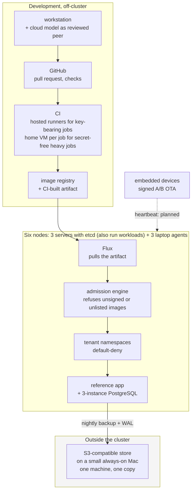











{% assign gen_date = s.generated_at | date: "%Y-%m-%d" %}

# A training system, on purpose: the latest platform technology on the weakest hardware I could put to use, AI on every side, to learn as much as possible before the day a killer app needs it.

**Not measured yet (2026-11-11):** SBOM projects, alerts reaching a person, and electricity cost.

**What it is for.** Training: principles, technologies and everything around them, learned as
deeply and as hands-on as possible, on a system that is actually running. **The hardware is
the handicap, chosen on purpose:** retired laptops and small desktops (the ones audited date from 2011
to 2020), running the current stack. If it runs here, it runs anywhere, and any other hardware is an upgrade. **AI is
involved on purpose:** a frontier cloud model helps build it, with a person approving what is merged. The
small local model that helped run V1.0 is not part of this one.

**Why: two things at once.** Learn as much as possible until the day a killer app appears, and be
ready to take that opportunity when it does. Until then everything here is learning, and nothing
is protected for uptime's sake. On that day the direction changes on purpose: production becomes
the main line and the experiments move to a branch.

**It is running, and it is new.** On 2026-11-10 V1.0 was torn down, and the same
six machines were rebuilt as a new K3s cluster that day and the next. As of 2026-11-11 it is about
{{ c.age_days }} days old by the count below, so no uptime is claimed. One of the three reference apps (the hazard-warning
one) is deployed on it. Admission control and default-deny between tenant namespaces are live. A restore
drill passed on 2026-11-10, with limits. Everything V1.0 measured, and every
correction it made, is kept further down under a dated heading and is not a claim about this cluster.

**There are no paying customers, no users and no load at all.** The synthetic load generator went
with V1.0. There is no public entrance and no public name. **Monitoring is running and has been read**: the
metrics, alert and dashboard stack was merged on 2026-11-11. Its first live run failed on a missing-namespace defect in the node exporter manifests; the fix landed the same day, and at 07:00 UTC all 18 Kustomizations were Ready and its pods were Running. On the same day it was read: 18 of 18 scrape targets up, 12 alert rules, no dashboards. No alert is known to reach a person today. Where a figure below cannot be measured yet, it says *not measured yet*.



## Where to start

| You have | Read |
|---|---|
| **2 minutes** | The *In short* block above, then *Recently* below |
| **What changed since V1.0** | [V1.0 and V2.0: what changed](versions.html): the diff list, area by area, with a status word on every V2.0 row |
| **How it works today** | [How we work](how-we-work.html): changes, secrets, admission, approvals, home CI, and the restore drill, each dated and marked proven or not |
| **5 minutes** | Add [the measurement traps](devsecops.html#6-measurement-traps-found-by-checking), seven controls that were configured, green, and inert (found on V1.0, retired 2026-11-10; the habit carries over) |
| **20 minutes** | Add [reliability](reliability.html), which describes the new platform as of 2026-11-11 (no uptime, no machine switched off yet), and [what outside reviews found](lessons.html#13-what-outside-reviews-found), which is about V1.0 (retired 2026-11-10) |
| **One story** | [One incident, in full](incident.html), from 2026-08-20 on V1.0 (retired 2026-11-10): a SEV1 quorum loss nothing detected, published because omitting it would be more impressive and less true |
| **An hour** | Add [the delivery chain](platform.html), which describes the new platform (its V1.0 parts are labelled), and [the operations agent](aiops.html), which is V1.0 (retired 2026-11-10); [AI in development](ai-dev.html) is the cloud half of the AI story |
| **Code** | [`examples/`](https://github.com/schultzzznet/schultzzznet/tree/main/examples), four extracted, runnable, commented artifacts, one with a self-test that demonstrates its own bug |
| **Tooling arguments** | [Why these tools, and what got rejected](choices.html) |
| **Hiring** | [What I'd do differently](lessons.html) is probably the most informative page here |
| **The rest** | [Quality and self-graded maturity](quality.html), [legal and regulatory posture](compliance.html), [the embedded side](yocto.html), [the mechanical side](printing.html), [live status](status.html). Pages that still describe V1.0 (retired 2026-11-10) say so at the top or carry its dates |

## Recently

What changed, newest first. Each line is dated, the full account is on the page it links to, and
a check fails the build if this list stops being recent.

<ul class="recently">

  <li><strong>{{ r.date | date: "%-d %b" }}.</strong> {{ r.text | markdownify | replace: "
", "" | replace: "
", "" | strip }}</li>

</ul>

## Right now

Measured **{{ s.generated_at }}** by a script that queries the running cluster, not typed in.
How each figure is counted is on [the status page](status.html). This is a snapshot of a cluster that
is about a day old: it says what exists, never how long it has stayed up.




Also in that run: {{ c.namespaces }} namespaces, {{ c.restarts_total }} container restarts since the
cluster was built (the reference app's two pods restarted ten times each during the bring-up, one control-plane server's virtual-address pod twice and the tracing pod once; none has restarted in the last seven hours of 2026-11-11, and no cause was verified),
{{ ad.network_policies }} network policies across {{ ad.tenant_namespaces }} tenant namespaces,
{{ db.backups_24h }} database backups completed in the last 24 hours, {{ db.backups_failed }} failed among
{{ db.backups_total }} on record, and WAL archiving on {{ db.archiving_clusters }} of {{ db.clusters }}
database cluster. Both the 2026-11-10 restore drill (last recorded {{ ev.restore_drill_home_last }}, result
{{ ev.restore_drill_home_result }}) and the default-deny probe ({{ ev.default_deny_probe_home_date }}, result
{{ ev.default_deny_probe_home_result }}) are recorded results, not live checks.

| Measured on the new cluster | State on 2026-11-11 |
|---|---|
| Metric scrape targets up | 18 of 18 (read 2026-11-11) |
| Alert rules loaded | 12 alerting rules and 0 recording rules (read 2026-11-11); alerts reaching a person are **not measured yet** |
| Dashboards | 0 (none committed to git; the dashboard service has none provisioned) |
| Metric history held | about 0.04 days, roughly an hour (the stack is new) |
| Storage replication | none: node-local volumes only (open; a reviewed trade) |
| Off-site backup copy | none (open) |
| First-party images that verify against the release key | admission checks this at creation; a count is **not measured yet** |

**The three outside-referee badges are retired.** The scheduled-jobs heartbeat and the two public-endpoint
uptime probes graded V1.0 from outside it. Their monitors were paused when V1.0 was torn down on 2026-11-10, and there is no public endpoint for a probe to watch. There is no external referee on the new cluster
yet (open). Until there is one, the figures above are the cluster describing itself, and the page says so.

V1.0 material follows after the new-platform sections.

## None of this is a demo

The repository for the platform is {{ rp.age_days }} days old, with {{ rp.commits }} commits, and it is a **new,
private repository started on 2026-11-05**; the old one is kept as a record. The **current cluster is {{ c.age_days }}
days old** and has no uptime to boast about. The one before it ran for weeks and was torn down on purpose. That is not a hole
in the record, it is the record. Components are meant to be disposable, and
several have been disposed of. What has persisted is the practice around the cluster, not the cluster.

The chains here are meant to be wired end to end: commit, CI-built artifact, signed image, admission, and a reconciler
that pulls the result in; backup, then restore drill. As of 2026-11-11 I have seen the first of these
run on the new cluster ({{ rc.kustomizations_ready }} of {{ rc.kustomizations }} Kustomizations Ready), a nightly backup complete, and one
restore drill pass (2026-11-10, with limits, described in [how we work](how-we-work.html)). I have **not** seen alert-to-person, a device heartbeat, a second backup
copy, or a failover under load on this cluster. The satellite application is not running. It is a home-built platform
with {{ c.nodes }} bare-metal nodes from retired laptops and small desktops, run with production habits and with no production duties.

**V1.0 (retired 2026-11-10).** V1.0 was torn down in stages after a base backup of every database; the
machines were kept and now run the new cluster. Eight restore drills that were due were waived by the owner, because V1.0
was by then being treated as a test. Of V1.0's 257 alerts, 74 mechanisms and 16 power-off proofs (as of 2026-10), **none is carried
over**, and the cutover gate (the checklist that must pass before this cluster is treated as the platform) has **not** been passed.
The status register generated on 2026-11-10 counts 12 steps (2 done, 2 done only on a local test cluster, 5 partly done,
2 not started, 1 gated) and 109 rules (3 built, 19 partly built, 87 not built). Those numbers, not the old self-grades, are the
current maturity claim.

## A testing ground, not yet load-bearing

On V1.0 this was both a testing ground and load-bearing. Today only the first is true: nobody depends on
the new cluster. These pages describe *a* way through, written down with the
alternatives passed over, and each rejection names the condition that would change the
answer, because a rejection without a reopen-trigger is just an opinion. The damage would
be getting stuck: settling into caution before there is a reason to, so that nothing more is learned. The reason, when it comes, is a killer app; on that day production becomes the main line on purpose.

## The whole thing, on one screen

Status as of 2026-11-11. Solid boxes exist and are running; the dotted line is planned.

```mermaid
flowchart TB
  subgraph DEV["Development, off-cluster"]
    WS["workstation<br/>+ cloud model as reviewed peer"]
    GH["GitHub<br/>pull request, checks"]
    CI["CI<br/>hosted runners for key-bearing jobs<br/>home VM per job for secret-free heavy jobs"]
    REG["image registry<br/>+ CI-built artifact"]
  end

  subgraph K3S["Six nodes: 3 servers with etcd (also run workloads) + 3 laptop agents"]
    FLUX["Flux<br/>pulls the artifact"]
    ADM["admission engine<br/>refuses unsigned or unlisted images"]
    TEN["tenant namespaces<br/>default-deny"]
    APP["reference app<br/>+ 3-instance PostgreSQL"]
  end

  subgraph OFF["Outside the cluster"]
    S3["S3-compatible store<br/>on a small always-on Mac<br/>one machine, one copy"]
  end

  DEVICES["embedded devices<br/>signed A/B OTA"]

  WS --> GH --> CI --> REG
  REG --> FLUX
  FLUX --> ADM --> TEN
  TEN --> APP
  APP -->|"nightly backup + WAL"| S3
  DEVICES -.->|"heartbeat: planned"| K3S

  style OFF fill:#f5f5f5
```

No public edge, no metrics stack read from (merged 2026-11-11, pods Running at 07:00 UTC), no tracker, no fault injector, no outside referee and no operations agent
appear above because none of them exists on the new cluster today. V1.0 had all of them; its picture is
described in words in [V1.0 section](#v10-retired-2026-11-10) below.

## What it costs

| | |
|---|---|
| **Hardware** | The same {{ c.nodes }} machines, all retired or second-hand: laptops and small desktops. Old on purpose: the handicap is the point, because if it runs here it runs on anything better. It also cost next to nothing. |
| **Software licences** | **Zero.** Every tool is open source, a community edition, or a free tier. That is a standing constraint, and a filter: a tool that cannot be self-hosted for nothing does not get evaluated on features. |
| **Power** | One measurement exists. V1.0 (retired 2026-11-10), 2026-10: fixing the frequency governor on the two busiest nodes cut about 13.1 W continuously (about 115 kWh/year). It was measured with the CPUs' own energy counters, **not re-measured** on the new cluster, so no power figure is claimed for it. |
| **Time** | Evenings and weekends, over months. The up-front cost is real: {{ rp.adrs }} decision records so far in the new repository, refusing shortcuts that would have worked in the short run. |
| **Cloud spend** | Not zero any more. The included hosted CI minutes ran out on 2026-11-09 and a $20 budget is being spent, at about $0.15 per hosted gate. The Mac runners were retired on 2026-11-10. Heavy CI that holds no secrets now runs on a fresh virtual machine per job on a Linux host at home; jobs that carry keys stay hosted. Two builder hosts run one job VM at a time each. Both took jobs in parallel for the first time on 2026-11-11; those gates had started, not passed, when this was written. Status: built; the saving is not measured. |

**One thing is not free.** The frontier AI used as a development peer is a paid
subscription; it has no access to the running cluster. The largest cost of all
was **re-deriving context**, which is why the working agreement, the decision records and the
rolling state note exist.

## The apps

The load the platform is meant to prove itself against is three of the repository's five Flutter clients: **Loc8** shares location
inside invite-only groups, **Warn** maps road hazards people report, and **Talk** is a
messenger with live events. **As of 2026-11-11 only Warn is deployed on the new cluster.** Loc8 and Talk are not, so this page quotes no
version for them. The Warn pods restarted ten times each during the bring-up on 2026-11-10 (cause not verified) and had not restarted in the seven hours before the read on 2026-11-11. They are not a product: not in any app store, built to talk to a
private homelab, with the unfinished parts listed. [The apps page](apps.html) has
screenshots, how they sign in, and the bug that signed people out for the wrong reason (written when all three ran).

## Repositories

Nine repositories show active work. **The platform is now a new private repository** ({{ rp.commits }} commits since it
was started on 2026-11-05, as of {{ gen_date }}); the old one is kept as a record and receives no platform changes. The embedded Linux layer, a
satellite application and the mechanical repository also get attention on this site; the rest are
a mowing robot, a drone swarm, a rover platform, a video rover and an i.MX8 layer. Commit
counts, as of {{ gen_date }}: embedded Linux {{ hw.yocto_commits }},
mechanical {{ hw.printing_commits }}, mower {{ hw.mower_commits }}, rover platform
{{ hw.rover_platform_commits }}, video rover {{ hw.video_rover_commits }}, i.MX8
{{ hw.imx8_commits }}. They shared a registry, signing keys and a vulnerability tracker on V1.0; on the new
one the registry and signing exist and the tracker does not (planned).

The satellite was the proof, on V1.0, that **an application does not have to live in the
platform's repository to run on it.** It brought two files, a Dockerfile and a conformant
manifest. **It is not running on the new cluster** (as of 2026-11-11: not redeployed, open), so "deploys from outside" is a statement about
the past until it is. *History:* V1.0's repository name was a fossil: it began on Docker Swarm and ran on k3s
from some point on, and renaming would have broken every inbound link.

---

## What is actually running

All of this was read from the cluster or its records on 2026-11-11 unless it says otherwise.

- **{{ c.nodes }} nodes**: three control-plane servers with embedded etcd, and three laptop agents. The servers carry **no
  taint**, so they also run workloads. The hardware spans old laptops to newer small desktops; the
  heterogeneity is deliberate. Placement labels (CPU class, disk class, disk health) existed on the previous
  platform; I have *not re-read* them on this one and claim nothing about them. (proven 2026-11-11: nodes, roles)
- **Storage: node-local volumes are the only storage class.** Replicated storage is deferred (open). That is
  a reviewed trade: replication is left to the database layer, which keeps three copies of its own data. The cost is that a
  volume dies with its machine. (proven 2026-11-11: one default class, read back)
- **Databases: {{ db.clusters }} PostgreSQL cluster, {{ db.instances }} instances on 3 nodes, PostgreSQL {{ db.postgres_major }}**, behind a
  connection pooler. Quorum-synchronous commit is **built but not read back** on this cluster (built; the spec asks for one synchronous standby with required durability, and the failover-quorum safety check is off), unlike the
  V1.0, where it was read back on 2026-10-09. Backups go through the barman-cloud plugin to an S3-compatible store
  on a small always-on Mac outside the cluster: one machine, one copy, no off-site copy (open). The nightly backup completed at 02:00 UTC
  on 2026-11-11 (proven 2026-11-11: the backup object reads completed). One restore drill passed on 2026-11-10 with limits (proven 2026-11-10, with limits; see [how we work](how-we-work.html)).
- **Identity: one Keycloak pod in development mode on an in-memory database** (open). Users and sessions do not survive a restart.
  It is a placeholder, not an identity system.
- **Tracing: one Tempo pod, running, restarted once (cause not verified).** Whether anything sends traces to it is **not verified**: I have not read its logs or run a trace query (built).
- **A supply chain with teeth, and the qualification.** The admission engine, in refuse mode, rejects unsigned CI-built images and
  vendor images that are not on a list or not pinned by digest. Unsigned CI-built images were refused on a local test cluster on 2026-11-07, and one
  off-list refusal on the real cluster is recorded in the history of 2026-11-10 (proven 2026-11-10, one case). On 2026-11-11 two policies read as Ready on the cluster: that is a state read, not a new refusal. **Vendor images are not
  signature-checked** (open): the list and the digest pin are the control, not a signature. **The Flux artifact is unsigned**
  (open). **There is no SBOM or vulnerability tracker** on the new cluster (planned). The regulatory picture (CRA, GDPR,
  app-store labels) is on [the compliance page](compliance.html).
- **Not live on 2026-11-11:** dashboards and any alert that reaches a person (monitoring itself runs and was read on 2026-11-11), any public name or HTTPS, replicated storage, durable
  identity, an off-site backup copy, a second Linux distribution in the host rehearsal, the host pull timer, any input to the
  operations agent, fault injection, a vulnerability tracker, and two of the three reference apps.
- **Retired from the present tense:** the chaos schedules, the operations agent, the reboot daemon and the 49-assertion audit were
  features of V1.0. Their history is in the dated section below.

**Failure domains and maturity:** the 7-of-13 self-grade of 2026-09-09 is V1.0 (retired 2026-11-10) material and is not a claim about
this one. For the new platform, use the status register of 2026-11-10 quoted above (12 steps, 109 rules, 3 rules built).

**Security is structural, not a layer at the end,** and on the new repository some of it is now enforced. As of 2026-11-11 `main` is
protected: a pull request and the checks run are required, history stays linear, force pushes are blocked, and the rules bind
administrators (proven 2026-11-11, setting read back). Required checks on `main` are two: the main check and the objectives line. The aggregate gate is deliberately not required yet: a red result from a cancelled run beat a green re-run in a test, and the fix is open. **Review is not enforced.** Required approvals are 0. A proposal for an owner's approval on
important changes and a reviewer agent's on the rest is written down (the decision record is still Proposed) and the reviewer identity does not
exist yet. A single person authors and merges. 76 of the first 77 commits, over the first six days, came through a pull request. On the
V1.0 the repository was private on the free plan and nothing could be enforced.
Details are in [DevSecOps](devsecops.html) and [how we work](how-we-work.html).

Concrete addresses, machines and topology stay in the private repository. What is here is
the shape and the reasoning.

---

## AI, and where it stands

AI on every side was the plan, held to the same bar as everything else: **assert the property, do not trust the report.** As of 2026-11-11,
one of the three roles exists.

**Development time: a cloud model, in the loop (present).** Every repository,
including the words on this page, is built with a cloud LLM as an engineering peer, working
from a written agreement and persistent memory of decisions made. Its changes go through the same pull requests and checks as any other.
On the new repository that is enforced for the pull request and the checks, not for approval (see above), and I have not audited that every change was
reviewed. [The fuller account is on its own page](ai-dev.html), including the time it confidently told a
reviewer two things about this platform that were not true.

**Run time: nothing, today (V1.0 only).** The operations agent and its local model, and the cloud reader that graded the
agent's posts, were off-cluster pieces of V1.0. The alert-to-agent chain has **no inputs** on the new cluster because there is
no monitoring to feed it. They are described, dated, under V1.0 below and in [the agent's page](aiops.html); none of it is a present claim.

---

## The stack

Standard, open-source tooling, so each choice maps onto what you would reach for in a
datacentre. Deliberately a table, not a badge wall: badges overclaim, and several that used
to be here did. Status as of 2026-11-11.

| Layer | What runs | Qualification |
|---|---|---|
| Platform | K3s (containerd, embedded etcd, flannel with the WireGuard backend, CoreDNS, Traefik, kube-vip), Ansible for the hosts, local VMs for rehearsal | The "retired laptops" part is literal. Rehearsal covers one distribution; a second is not live |
| Data and identity | Node-local storage (no Ceph), CloudNativePG with the barman-cloud plugin, an S3-compatible store (Garage) on a small Mac outside the cluster, Keycloak in dev mode | One copy of the backups; identity is not durable |
| Change and secrets | Flux from a CI-built artifact, SOPS with age | The artifact is unsigned. Restoring secrets from the recovery key has not been tested (open) |
| Supply chain | cosign, Kyverno admission (Deny), gitleaks, Renovate, pre-commit | Renovate is configured and not yet seen acting. Vendor images are not signature-checked. No tracker |
| Observability | Tempo only | Built: merged 2026-11-11, first live run failed on a manifest defect, fixed the same day, pods Running at 07:00 UTC, 18 of 18 targets up when read |
| Applications | Java 25, Spring Boot 4 for the reference app | No load |
| Embedded | Yocto, RAUC signed A/B OTA, Raspberry Pi | Unchanged; the heartbeat to the cluster is planned |

Workflow-status badges are deliberately absent: the project repositories are private, so
their badges return 404 to anyone but me, and a badge nobody else can verify is decoration.

---

## V1.0 (retired 2026-11-10)

Everything from here down was measured on, or says something about, the cluster that ran until it was torn down on 2026-11-10. It
is kept because the record is the point, with the dates it was true on. **None of it is a claim about the new cluster.** Where a
sentence names a figure, it was read on the date given and not re-measured since.

### V1.0 (retired 2026-11-10): what the page said and what it measured, as of 2026-10-27

V1.0 was a running estate of six nodes with a public entrance, real identity flows, a synthetic load generator, scheduled
chains, and a local model that helped run it. The figures in this section are hand-typed from the last generated run of
2026-10-27: 186 of 216 pods running, 22 namespaces, 124 of 124 scrape targets up, 227 alert rules loaded (78 written here), 31 dashboards,
replica-3 block storage with Ceph health at warn, 13 PostgreSQL clusters (5 on 16, 8 on 18), 7 first-party images of which 6 verified against the release key, and 1,943 commits in
the old repository. None of those is a current number.

The three badges below were graded by referees that sat outside the system they graded. As of 2026-11-10 their monitors are paused (see above);
they are described here as history, not shown:

- *scheduled jobs*: a dead-man's-switch, where the alert pipeline proved itself end to end on a schedule;
- *public endpoint 7d and 30d*: an off-site probe of the public entrance (99.95% over 7 days and 85.004% over 30 days on 2026-10-27).

**The uptime numbers were not the goal, and the 30-day one showed why.** I shut the whole
estate down on purpose from 2026-10-14 to 2026-10-18, while I was away (a planned holiday shutdown), so that window carried roughly
four and a half days of "downtime" in the 30-day figure. The badges could not be told
that a shutdown was planned. [Three more notes on reading these badges, and the arithmetic of why there was no
90-, 180- or 365-day figure, are on the status page](status.html#notes-on-the-badge-wall).

**The scrape figure used to be the interesting one.** In September I published **67 of 70**
and explained it: the three down were the etcd metrics endpoints, because a rebuild had not
restored the drop-in that exposes them. etcd was fine; what had broken was the ability to
*see* it. Rounding it up would have removed the only pressure that closed it. The same arc
applied to alerts: an earlier snapshot listed eight, two of them firing on **absent data
rather than on a sick database**, which is the more dangerous failure because an alert that
fires for the wrong reason cannot tell you anything when the right reason arrives. Those were
fixed, not silenced.

**The Postgres version count had a cost (September 2026).** The clusters went from 8 to 13
because the application databases were migrated from PostgreSQL 16 to 18 with no maintenance
window: a parallel cluster kept in sync by logical replication, then a cut-over by *pausing*
the connection pooler so clients blocked for a few seconds instead of erroring. Measured per
database: 87 to 142 seconds, zero errors, at the time. Five PostgreSQL 16
predecessors were still running as the rollback path on 2026-10-27; the operator is what made this a scripted procedure instead of a project.

### V1.0 (retired 2026-11-10): a correction on those databases, 2026-10-09

Until 2026-10-09 the page said the application and identity databases ran synchronous
replication. **They did not.** The 18 cutover on 2026-09-16 silently dropped the synchronous
setting, along with resource limits, the connection cap and failover tolerations, so for
23 days the live databases were asynchronous while the documentation said an RPO of zero. I
found it with an audit, not an alert. At about 09:21 CEST on 2026-10-09 quorum-synchronous
commit (any one of two standbys) was restored on the four three-instance application and
identity clusters, and `sync_state=quorum` was read back on each primary. The two-instance
clusters (the fleet service and the security tools' databases) were asynchronous by design. A
guard failed when a successor cluster did not mirror its predecessor's settings.
The lesson carries to the new cluster, where quorum-synchronous commit is built and **not yet read back**.

The same day, a replica that had silently diverged at a failover on 2026-09-25 sat 14 days
not streaming and crash-looped on its first restart. Alerts for that class (a replica not
streaming, a container crash-looping, an instance not ready) were added. The account is in
[the reliability page](reliability.html) and
[the lessons page](lessons.html#11-three-wrong-claims-in-one-diagnosis).

## V1.0 (retired 2026-11-10): corrections, 2026-10-27

*These corrections were made on 2026-10-27 about V1.0. They are kept as written, with that date.*
A second read of this site against the estate, nine days after the first, found statements that
had turned stale in the *pessimistic* direction (things that had since been fixed) and two that
were false the whole time. They are retracted here rather than quietly edited:

- **"Almost nothing goes through a pull request."** True until 2026-10-18; since then 112 of the
  133 commits to the platform repository carry a pull request number. They are still merged by
  the one person who wrote them, and the plan still cannot enforce review. See
  [AI in development](ai-dev.html#who-reviews-honestly).
- **"Secrets at rest are plaintext", "there is no secrets manager".** In git, no longer: since
  2026-10-25 every Secret in the manifests is encrypted with SOPS and age. Inside the cluster
  they are ordinary Kubernetes Secrets and encryption at rest is not switched on (read back
  2026-10-27), and the old values are still in git history until they are rotated. See
  [choices](choices.html#deferred--needed-eventually-not-yet).
- **"Drift is checked on demand; neither runs."** A daily read-only diff of every plain manifest
  against the live cluster has run since 2026-10-24, after the reopen-trigger written down for
  exactly this fired. See [how a change reaches the cluster](platform.html#how-a-change-reaches-the-cluster).
- **The operations agent page** described the agent as of 2026-10-09. It has since had its tool
  arguments validated, an approver allowlist, an audit file, deployment from git, and a quality
  loop that measures what it says. See [the agent](aiops.html).
- **The embedded page** said a daily job keeps the bill of materials current in the tracker and
  that devices report back. **Neither was true:** the upload was refused every night from at
  least 2026-09-24 until it was fixed on 2026-10-27 (the first scheduled run since is the test),
  and no device has reported since 2026-09-01. See [the embedded side](yocto.html#two-claims-on-this-page-were-false-on-27-october).
- **"I have not worked out where the downtime came from."** It was the four days from
  2026-10-14 to 2026-10-18, when I had shut the whole estate down on purpose while I was away. See [the status page](status.html#notes-on-the-badge-wall).
- **Fault injection** was described as running hourly on weekdays. It last fired on 2026-10-13. See
  [reliability](reliability.html#fault-injection-is-paused-by-its-own-safety-gate).

## V1.0 (retired 2026-11-10): corrections, 2026-10-09

*These corrections were made on 2026-10-09 about V1.0, and are kept as written.*
A fact audit measured the live system against this page. Some claims were wrong, and they
are retracted here rather than quietly edited:

- **"Real users."** The earlier headline and a later section said the services serve real
  users. There is no organic user base. Product analytics is at zero, so nobody measures use.
- **"Every image is signed."** 6 of 7 running first-party images
  verified against the release key (read 2026-10-27). The 61 third-party images were
  scanned and had a bill of materials, but were not signed by this platform.
- **"A scheduled fault injector removes things."** There were two schedules, a pod kill and a
  25% network loss for five minutes, on weekdays hourly, aimed at a two-replica sandbox
  workload. They exercised the recovery loop and could not move the public-endpoint figure.
- **Operations agent autonomy and "air-gapped".** The agent had five alert rules; only two
  could run unattended, both on-demand database backups, and even those only if auto-apply
  was switched on, which it was not by default. The model was local, but the agent was not
  air-gapped: it posted to chat and synced findings with a ticket tracker.
- **A cloud and self-hosted runner split.** On 2026-10-09 it did not exist: all CI ran on the estate's own runners. *Update, 2026-11-11:* a split exists
  again, by role, since 2026-11-10: hosted runners for jobs that carry keys, a fresh virtual machine per job on a Linux host at home for
  heavy secret-free jobs. See the cost table above.
- **Four of thirteen failure domains** was stale at the time (the self-grade of 2026-09-09 said seven of thirteen).
- **A licence and a security policy.** The compliance page carried an MIT badge while this
  repository had no licence file, and the only security policy lived in a private repository.
  As of 2026-10-09 both exist here: [MIT for the code and CC BY 4.0 for the
  writing](https://github.com/schultzzznet/schultzzznet/blob/main/LICENSE-docs), and a
  [security policy](https://github.com/schultzzznet/schultzzznet/blob/main/SECURITY.md) with
  private reporting switched on. See [compliance](compliance.html).

### V1.0 (retired 2026-11-10): what it ran, as of 2026-10-27

- **Six nodes with placement labels** for CPU class, disk class and disk health; no node carried a taint.
- **Replicated block storage**, 3-way, host-level failure domain, as the sole storage class. All of it is gone: the machines now run
  node-local volumes (see above).
- **13 Postgres clusters** under an operator, 8 on PostgreSQL 18 and 5 on 16 (the rollback predecessors), all archiving continuously to object storage. The
  guarantee claimed was quorum-synchronous commit on the four three-instance application and identity clusters, verified on 2026-10-09.
- **Spring Boot services and Flutter clients.** Five of each existed in the repository; four Spring Boot services were deployed. Beside them ran a Python
  service and a web portal, plus identity, ingress, metrics, logs and dashboards.
- **A supply chain with teeth, and the qualification (2026-10-27).** Of 68 distinct running images, 7 were first-party and 6 of those verified
  against the release key; 71 bills of materials were accepted by the tracker in the latest nightly run (which measures acceptance, not
  analysis). Signing and verification were build steps. **That enforcement lived in the pipeline, not at the cluster boundary:** there was no
  admission controller, so the guarantee was "the delivery path will not ship an unsigned image", not "the cluster will not run one". Admission now exists on the
  new cluster (see above).
- **Deliberate chaos, small by design.** Two Chaos Mesh schedules against a two-replica sandbox workload. As of 2026-10-27 both were
  paused by their own safety gate and had last fired on 2026-10-13. [The account is on the reliability page](reliability.html#fault-injection-is-paused-by-its-own-safety-gate).
- **An operations agent** that read cluster state, correlated it and proposed remediations.
- **Automated assertions** that documentation, inventory and reality agreed. The audit run on 2026-10-09 had 49 checks, 48 passing; the
  one that did not was Ceph not being `HEALTH_OK`, which was the check working.
- **227 alert rules loaded** (78 written here) and 31 dashboards (5 written here), on 2026-10-27.

**Failure domains (self-grade of 2026-09-09):** seven of thirteen single-fault tolerant, up from four in early July. That was a self-grade I did not re-derive, and
it contradicted the four on other pages dated earlier. It is not carried over to the new platform.

**Security on V1.0:** branch protection could not be enforced on a private repository under GitHub's free plan, so "gates" were CI
workflows and pre-commit hooks that one maintainer was bound to follow, and GitHub-native code scanning and secret scanning were off.

### V1.0 (retired 2026-11-10): its diagram and two dotted lines, 2026-10-27

V1.0's picture had a development side (workstation, self-hosted runners, a daily cloud reader), a public edge outside the
cluster on purpose (a relay and a reverse proxy with a default-deny allowlist), six nodes (three-member control plane, Spring Boot services,
Postgres clusters, replica-3 block storage, metrics and dashboards, a vulnerability tracker, a scheduled fault injector), and two things
outside it: the operations agent with its local model, and the external referees. The two dotted lines that mattered were the agent's narrow,
allowlisted write path and the referees grading from outside. *A monitor that dies with the thing it monitors is not a monitor.*

## V1.0 (retired 2026-11-10): why build it this way

**Why build it this way instead of stopping at a tutorial:** a system nobody has to operate
teaches a smaller skill than one that is running, with real incidents and a real pager. The
scars (a nine-day silent outage, a drain that removed its own control surface, a reboot
daemon that quietly never rebooted anything) exist only because the thing they happened to
was live. **On V1.0 the load was synthetic; the incidents were not.** Power cuts, thermal throttling,
disks reporting `FAILING_NOW`, a carrier-grade-NAT boundary, an ISP, a public entrance that
had actually been down, and kernel upgrades rolling across the machines unattended, one node
at a time, at whatever hour the kernel lands. The failures were never the part that needed
simulating.

### V1.0 (retired 2026-11-10): AI

AI was in three roles: a cloud model that helped build it, a small local model that helped run it, and a cloud model that graded the local one.

**Run time: a separate, local model, with a narrow write path.** An operations agent
off-cluster watched the cluster, deliberately not the cloud model, so the thing watching
the cluster had no dependency on someone else's API. The live work ran on a local model, so
no cluster data went to a model vendor *in the alert path*; the agent was **not air-gapped**, as
it posted to chat and synced findings with a ticket tracker. Nothing the model said was executed
directly:
[**the model proposes; a fixed, allowlisted guardrail layer disposes**](aiops.html). Every
action except the two auto-apply backup rules was a small closed vocabulary, shown as
a dry run, and waited for a human's approval.

**A reader between them (from 2026-10-28): the cloud model graded the local one.** Once a
day a cloud model read up to twelve of the agent's recent posts and drafted a grade for each,
on whether it was right and whether it was usable. It was outside the alert path, had no
tools, and its grades were drafts a person adopted or ignored. What it was sent was alert text and node names, trimmed,
so the statement that no cluster data leaves the house was true until that date and not after. [The whole loop, with the numbers](aiops.html#the-loop-two-models-one-human).

What it did on its own, as read on 2026-10-09: two rules could run unattended, both on-demand database backups, and only when auto-apply
was switched on, which it was not by default. Everything else was a proposal. A bounded chaos-recovery loop existed in the agent's
code, and I had not read its runtime state.

**That was not a self-healing cluster.** It was a cluster where one narrow case was automated
and everything else became a proposal.

**What changed on 2026-10-26, because it had been measured.** A review of the agent's first 96
hourly summaries found "critical" in 79 of them with no critical alert firing in 69, and a
data source that had been blind for fourteen days without one mention. The same review found that
a model-supplied name was being placed into a command run as root. Both were fixed: arguments were
validated, only named people could approve, every executed action was written to an audit file, the
severity line was written by code and not by the model, and every call was recorded so a monthly
graded sample and a set of golden test cases could say whether a change helped. The account, with
the numbers, is on [the agent's page](aiops.html#the-agent-since-2026-10-26).

### The habit the whole thing is built on (examples from V1.0, retired 2026-11-10)

> **Assert the property. Do not trust the report.**

The recurring defect is not the crash. It is the thing *configured, plausible-looking and
quietly inert*. All found on V1.0 by checking rather than reading:

- A chaos schedule that had never once fired. Every dashboard was green; the field that
  would have revealed it, *when did this last run?*, was on none of them.
- An automated reboot daemon that read the wrong path and concluded, hourly on every node
  for weeks, that nothing needed restarting. Patches were applied to disk and never took
  effect: **16,002 host findings, all fixed upstream**, and four kernel versions running at
  once. That story was closed on 2026-10-09 after reboot waves on 2026-09-24 and 2026-10-09.
- A shared build cache that was populated, correct, and **bypassed on every build**, because
  a prerequisite that gives cache entries a stable identity was missing.
- Most recently, this page: a synchronous-replication setting that every document said was
  there and the live databases did not have.

Four more, including a kill switch that covered half the system and a documentation workflow
that ran 89 times and never succeeded, are in
[the measurement traps](devsecops.html#6-measurement-traps-found-by-checking). None of them
errored. So: run the thing, read the value back off the live object, and make a test fail
before trusting that it passes. A green status line is a claim, not evidence. The new cluster has its own entry already: the default-deny probe
of 2026-11-10 recorded a fail (a one-to-three-second gap at start), and it stays a fail on this page until it is re-run and passes.

---

## V1.0 (retired 2026-11-10): why go to this much trouble

> Quality isn't a tax on speed. Past a very early point, it is the only source of speed.

Each of these happened on the previous fleet: two nodes powered off on a whim with the applications
staying up; a database primary failing over **during** a planned drain; node objects deleted
and rejoining on their own because the cluster is a derivative of git; the whole cluster
wiped and rebuilt; a topology decision reversed the same day it proved wrong. The sixteen power-off proofs and seventy-four mechanisms behind
that are **not carried over** to the new cluster.

**That up-front cost is what makes the list take minutes instead of weekends.** It is also
what the shortcuts cost, each with a foreseeable ending:

| The shortcut | Where it ends |
|---|---|
| Single-node volumes, because it's only a homelab | Every reboot risks data. You can't drain, so you can't patch. |
| One database per app, no operator | Every upgrade is a maintenance window; failover is a human at 3am. |
| Backups configured but never restored | You find out they don't work on the day you need them. |
| No decision records | The same arguments recur forever. |
| No contracts, no drills | The public edge silently widens; "it rebuilds from git" stays a belief. |
| Hand-configured nodes | The fleet diverges until nothing is reproducible. |

The second row stopped being hypothetical: in September 2026 the application databases moved from
PostgreSQL 16 to 18 while serving, between 87 and 142 seconds each, no errors, nobody woken.
Then the same migration dropped the replication guarantee and I found out three weeks late.
Both facts belong together. The operator made the migration a script; it did not make the
script right.

Two things assumed expensive were not, on V1.0: **high availability cost nothing in hardware**
(loopback-file storage daemons gave real replication on a single-disk fleet; the new cluster has dropped replicated storage on purpose), and **an elite
supply chain was mostly wiring**, since every component is open source and the work was
connecting them once.

### The condition that made it possible: no pressure (V1.0, retired 2026-11-10)

There was no commercial pressure of any kind: no runway, no board, no launch date, no
customer waiting. Every "properly instead of quickly" decision was made in the absence of the
force that normally makes that choice impossible. The industry default is not stupidity.
Under real pressure the order inverts: find product-market fit first, ship what proves it,
pay for the engineering later if there is a later. Anyone reading the table above and
thinking *"sure, but I have a deadline"* is describing the actual problem, and this site is
not evidence against them. So the reading is not "this is how it should be done". It
is **"this is what it looks like when the usual forcing function is absent"**. Customers
import the pressure, and that is why the order here is deliberate: learn it the expensive way
while nothing forces the shortcut, so that on the day a killer app arrives the platform, the
patterns and the habits are already in place, and a shortcut is a choice rather than the only
option.

Rigor did not transfer to every domain at once. V1.0 (retired 2026-11-10), as of 2026-10-27: open items remained for rotating the secrets that sat in git in plaintext, encryption at rest in the cluster, and a hosted privacy policy ([gaps](reliability.html), [legal posture](compliance.html)).

---

## V1.0 (retired 2026-11-10): so what happens to it now? (assessed 2026-10)

| | | |
|---|---|---|
| **Can it?** | capability | The only one that has to be *earned*. |
| **Should it?** | judgement | Answerable only once *can* is real. |
| **Want to?** | intent | A choice, and the easiest one to mistake for a plan. |
| **Done?** | past tense | Evidence. The rest of this site is the answer. |

An unearned *can* makes the whole chain weightless.

**Can it? Very nearly, on V1.0 (retired 2026-11-10).** Replicated storage under every volume, three control-plane
members, databases that fail over during a drain, backups with a timed restore, automated
patching with coordinated reboots, an incident practice with real postmortems. What is
missing is written down and mostly unglamorous.

**Should it? Not yet** (V1.0, as of 2026-10-27). Legal and regulatory sits well below its target in the
[self-assessment](quality.html), secrets are encrypted in git but not yet rotated or encrypted at rest in the cluster, the public entrance is one
small machine and one relay, and product analytics is at zero. Nothing here is one weekend
from being a business.

**And the plainest reason is the least often admitted: there is no killer app.** The
applications were chosen to be a demanding, realistic load, and none is a product anyone is
waiting for. A platform without something worth deploying on it is infrastructure looking for
a reason, and that gap is not solved by more engineering. Being ready when one appears is the
other half of what the training is for.

**Want to? Not yet, and that is a choice.** The platform is portable and the instance is not. The
*pattern* can travel: the contract, the pipeline, the assertions, the gap register as a
habit. Without a killer app this cluster stays a laboratory, doing what nothing in production
is allowed to do: get powered off on a whim, wiped, deliberately broken. On the day one is
chosen the direction changes on purpose: production becomes the main line and the experiments
move to a branch. The moment something here matters
to someone else, two nodes can no longer be switched off to see what happens, and the loop
that produced every finding here stops. **Let the pattern travel, and keep the laboratory a
laboratory.**

On the new platform the answer to *can it* is lower than that, on purpose and in the open: the status register of 2026-11-10 counts 3 of 109 rules built, and
the cutover decision is gated and not made.

---

## Open owner items (2026-11-11)

- Restoring secrets from the recovery key has not been tested.
- A fixed address reservation for the backup-store Mac.
- The monitoring webhook and password.
- A deploy key and age identity for the host pull timer.
- A second backup copy, off the one machine.
- The cutover decision (gated).

---

## Never done, by design

Nothing here describes a finished artifact. The loop is the same on every page:

> **ship → observe → learn → harden → prove → repeat.**

It has no last iteration, and this site does not claim one.

> *The age of agents has brought us endless execution. Every idea, every hunch, every
> experiment is now within immediate reach. Working with agents truly is magic — in the best
> possible sense of the word. What a time to be alive. Nay, what a blessing.*
> — DHH, [Endless execution](https://world.hey.com/dhh/endless-execution-4157e065) (August 2026)

Written for this public site rather than copied from the private repository, and checked
on every commit by a guard that fails the build on hostnames, addresses and credential
paths. Starting clean is cheaper than scrubbing.

