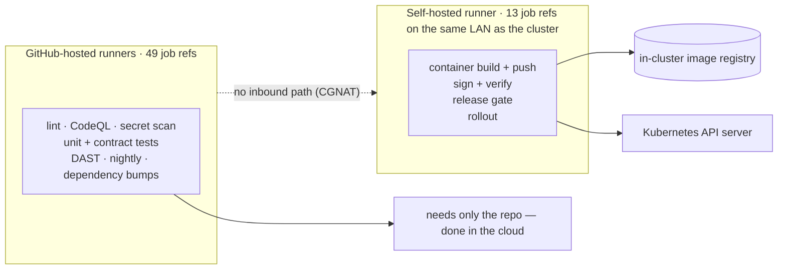
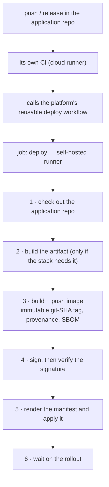
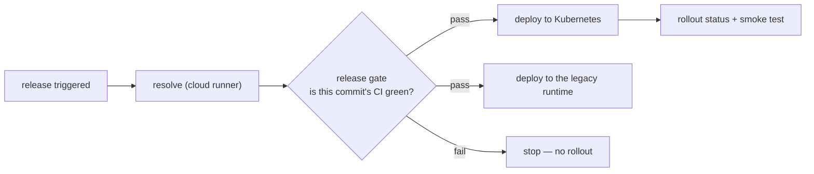

# The delivery chain

An application does not have to live in the platform's repository to run on it. It can sit
in its own repo and deploy over a small published contract. This is how that works, and why
it is shaped the way it is.

---

## Why the pipeline is split across two kinds of runner

This is the single most load-bearing fact about the whole chain, and it is invisible unless
you read every `runs-on:` line.

**The house internet connection is behind carrier-grade NAT.** There is no inbound path
from the internet to the cluster and no port forward to open. So GitHub's own hosted
runners — which live in the cloud — *cannot reach the cluster at all*.

Everything that only needs the source code runs in the cloud. Everything that touches the
image registry, the signing key or the Kubernetes API server has to run on a self-hosted
runner sitting on the same LAN as the cluster.

Measured split: **49 job references on cloud runners, 13 on the self-hosted one.**

There is an honest weakness here worth stating plainly: that self-hosted runner is a single
machine. Every deploy — including the satellite repositories that call in — stops when it is
off. It is the one part of the delivery path with no redundancy.

---

## The contract an application has to meet

The platform provides the registry, the signing chain, the reusable deploy workflow, the
runtime, ingress, replicated storage, identity, metrics and logs.

The application brings exactly two things:

1. **A `Dockerfile`** that builds for `linux/amd64`.
2. **A Kubernetes manifest** with resource requests and limits, health probes, a disruption
   budget and topology spread.

A signed image plus a conformant manifest is the entire handoff. Everything else is
convention.

---

## What a deploy actually does

Two details that matter more than they look:

**The image tag is the git SHA, never a floating `latest`.** A floating tag means a rollout
can quietly pull a cached older layer and report success. Immutable tags make "what is
actually running" answerable.

**The signature is verified, not just created.** Signing something and never checking the
signature is a ceremony, not a control. The verify step is what makes it a control.

---

## The gate, and who it does not protect

Applications that live inside the platform repository go through a policy gate between
resolving the release and deploying it:

**Satellite repositories do not pass through that gate.** The reusable deploy workflow is a
single job with no policy step, so a satellite's own CI is the only thing between a commit
and a rollout.

That is a deliberate consequence of keeping the contract small — but it is an asymmetry
worth knowing when deciding what belongs in a satellite repository versus the platform
itself.

---

## Supply chain

Every image carries a signature, build provenance and an SBOM. The SBOMs are continuously
re-evaluated against new vulnerability data, so a component that was clean at build time
gets flagged when the world changes rather than at the next release.

One lesson from doing this in anger: **a vulnerability scanner only matches what it can
identify.** An SBOM whose components carry only generic package identifiers produces zero
findings even when real vulnerabilities exist — not because the software is clean, but
because nothing matched. Zero findings and "nothing was evaluated" look identical on a
dashboard. Check that components resolve to real ecosystem identifiers before believing a
clean report.

---

Machines, addresses, hostnames and topology are deliberately absent. This page was
written for publication, not scrubbed after the fact.

