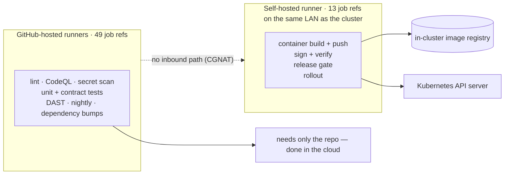
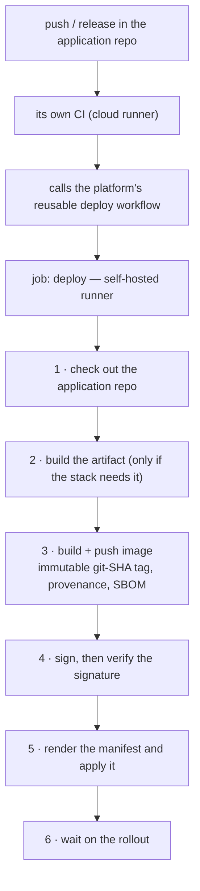
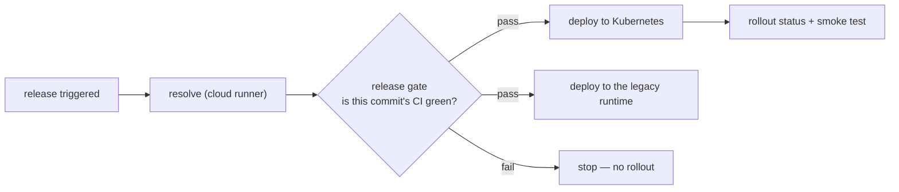

# The delivery chain

An application does not have to live in the platform's repository to run on it. It can sit
in its own repo and deploy over a small published contract. This is how that works, and why
it is shaped the way it is.

---

## Why the pipeline is split across two kinds of runner

This is the single most load-bearing fact about the whole chain, and it is invisible unless
you read every `runs-on:` line.

**The house internet connection is behind carrier-grade NAT.** There is no inbound path
from the internet to the cluster and no port forward to open. So GitHub's own hosted
runners — which live in the cloud — *cannot reach the cluster at all*.

Everything that only needs the source code runs in the cloud. Everything that touches the
image registry, the signing key or the Kubernetes API server has to run on a self-hosted
runner sitting on the same LAN as the cluster.

Measured split: **49 job references on cloud runners, 13 on the self-hosted one.**



**Design for Kubernetes, run on k3s.** Every manifest, Helm chart and operator here is plain,
conformant Kubernetes — nothing in the workload layer is aware that the control plane
underneath it happens to be a lightweight distribution rather than a managed cloud one. The
same manifests would lift onto a managed Kubernetes service unchanged; k3s was chosen for
operational simplicity and cost on nine machines in a house, not because anything here
depends on it. Portability runs the other way too: the workloads were first proven on Docker
Swarm, and the designs remain Swarm-compatible, so a shift back would be a configuration
choice, not a rewrite. No managed control plane, no proprietary APIs, nothing that only runs
here.

There is an honest weakness here worth stating plainly: that self-hosted runner is a single
machine. Every deploy — including the satellite repositories that call in — stops when it is
off. It is the one part of the delivery path with no redundancy.

---

## The contract an application has to meet

The platform provides the registry, the signing chain, the reusable deploy workflow, the
runtime, ingress, replicated storage, identity, metrics and logs.

The application brings exactly two things:

1. **A `Dockerfile`** that builds for `linux/amd64`.
2. **A Kubernetes manifest** with resource requests and limits, health probes, a disruption
   budget and topology spread.

A signed image plus a conformant manifest is the entire handoff. Everything else is
convention.

In full, the caller's side of it:

```yaml
# .github/workflows/deploy.yml in the satellite repository — this is all of it
jobs:
  deploy:
    uses: <platform-org>/<platform-repo>/.github/workflows/deploy-app.yml@master
    with:
      app_name: my-app
      manifest: k8s/my-app.yml
    secrets: inherit
```

And the part of the manifest the platform actually requires — a placeholder the deploy
substitutes, plus the four things that make a rollout safe rather than merely successful:

```yaml
spec:
  replicas: 2
  template:
    spec:
      containers:
        - name: my-app
          # Substituted at deploy time with the immutable git-SHA tag.
          # A floating tag would let a rollout pull a cached older layer and
          # report success, which is precisely when you need it not to.
          image: ${REGISTRY}/my-app:${IMAGE_TAG}
          resources:                        # required — without limits one app can starve a node
            requests: { cpu: 100m, memory: 256Mi }
            limits:   { cpu: "1",  memory: 512Mi }
          readinessProbe:                   # required — otherwise "rolled out" means "container started"
            httpGet: { path: /actuator/health, port: 8080 }
---
apiVersion: policy/v1
kind: PodDisruptionBudget                   # required — or a node drain takes the whole app
spec:
  minAvailable: 1
  selector:
    matchLabels: { app: my-app }
```

**What the contract pointedly does *not* require** is the interesting half: no language, no
framework, no test suite, no minimum coverage, no policy gate, no approval. Those silences
are deliberate — and they are permissions, which is the subject of the next section.

---

## The satellite: proving the contract from outside

A contract that has only ever been exercised from inside the repository that defines it is
not a contract, it is a coincidence. So one application lives in **its own repository, with
its own CI**, and deploys onto the platform by calling the published workflow.

It is deliberately tiny — a single endpoint that returns a line of text, no database, no
identity integration. **That is the design.** The variable under test is the contract, not
the application; anything more would only make it harder to tell which half broke. Its entire
deploy definition is a call to the platform's reusable workflow naming the app and the path
to its manifest.

What it declares in that manifest is not tiny, though, and that is the interesting part:

| Declared | Value |
|---|---|
| Replicas | 2 |
| Topology spread | `maxSkew: 1` over hostname, **`DoNotSchedule`** — a hard constraint, so one node cannot hold both |
| Disruption budget | at least one replica always available |
| Resources | CPU, memory **and ephemeral storage**, requests and limits both |
| Probes | liveness and readiness on separate schedules, with distinct initial delays |
| Shutdown | a pre-stop delay so the load balancer drains first, then a framework-level graceful shutdown, inside a termination grace period long enough for both |
| API access | service account token mounting **switched off** — it never talks to the cluster API |

The shutdown chain is the detail most often missed. Removing a pod from a Service and killing
it are asynchronous events, so a pod that exits *promptly* on the signal drops the in-flight
requests still being routed to it. The delay is not politeness; it is the difference between
a rolling update being invisible and being a small burst of errors every deploy.

### What the contract does **not** require — and why that matters

This is the honest finding, and it is a design lesson rather than a bug report.

The satellite's manifest is fully conformant, and it declares **no pod-level security
context**: no explicit non-root assertion, no read-only root filesystem, no
`allowPrivilegeEscalation: false`, no dropped capabilities. It inherits a non-root user from
its base image and is fine in practice — but nothing *checked*, because the contract never
asked.

There is a second asymmetry in the same direction. [The release policy gate](#the-gate-and-who-it-does-not-protect)
does not apply to satellites; the reusable deploy workflow is a single job with no policy
step. Everything the *platform* owns still applies — the image is built, scanned, signed and
**verified**, the SBOM is generated and ingested — but everything the *repository* owns is
whatever that repository chose. This one has no tests and no dependency automation of its
own, so its own CI is not a brake at all.

> **A platform contract silently defines the floor for everything built on it.** What it
> omits is not neutral — it is a permission, and it will be taken.

Both gaps are stated rather than papered over, because the fix is a genuine trade-off:
tightening the contract raises the floor for every satellite and simultaneously raises the
cost of being one. The current position is a deliberate choice for a small estate, and it
would be the wrong one at ten teams.

---

## What a deploy actually does



Two details that matter more than they look:

**The image tag is the git SHA, never a floating `latest`.** A floating tag means a rollout
can quietly pull a cached older layer and report success. Immutable tags make "what is
actually running" answerable.

**The signature is verified, not just created.** Signing something and never checking the
signature is a ceremony, not a control. The verify step is what makes it a control.

---

## The gate, and who it does not protect

Applications that live inside the platform repository go through a policy gate between
resolving the release and deploying it:



**Satellite repositories do not pass through that gate.** The reusable deploy workflow is a
single job with no policy step, so a satellite's own CI is the only thing between a commit
and a rollout.

That is a deliberate consequence of keeping the contract small — but it is an asymmetry
worth knowing when deciding what belongs in a satellite repository versus the platform
itself.

---

## Supply chain

Every image carries a signature, build provenance and an SBOM. The SBOMs are continuously
re-evaluated against new vulnerability data, so a component that was clean at build time
gets flagged when the world changes rather than at the next release.

One lesson from doing this in anger: **a vulnerability scanner only matches what it can
identify.** An SBOM whose components carry only generic package identifiers produces zero
findings even when real vulnerabilities exist — not because the software is clean, but
because nothing matched. Zero findings and "nothing was evaluated" look identical on a
dashboard. Check that components resolve to real ecosystem identifiers before believing a
clean report.

---

## Read next

- **[DevSecOps, end to end](devsecops.md)** — every gate from commit to running pod, what
  each one actually proves, how scan scope and triage priority are *derived* rather than
  maintained by hand, and the measurement traps that produced confident wrong numbers.
- **[High availability, audited](reliability.md)** — which failure domains actually survive
  losing a machine, which deliberately do not, and the maintenance that removed the tools
  needed to perform it.
- **[The operations agent](aiops.md)** — what a local model is permitted to change on a
  running cluster without asking.
- **[The embedded side](yocto.md)** — where that "generic identifiers match nothing" lesson
  came from, and what it took to go from zero findings to a hundred real ones on the same
  image.

---

<sub>Machines, addresses, hostnames and topology are deliberately absent. This page was
written for publication, not scrubbed after the fact.</sub>

<script type="module">
  import mermaid from 'https://cdn.jsdelivr.net/npm/mermaid@11/dist/mermaid.esm.min.mjs';
  mermaid.initialize({ startOnLoad: false, theme: 'neutral' });
  document.querySelectorAll('pre > code.language-mermaid').forEach((el) => {
    const div = document.createElement('div');
    div.className = 'mermaid';
    div.textContent = el.textContent;
    el.parentElement.replaceWith(div);
  });
  mermaid.run();
</script>
