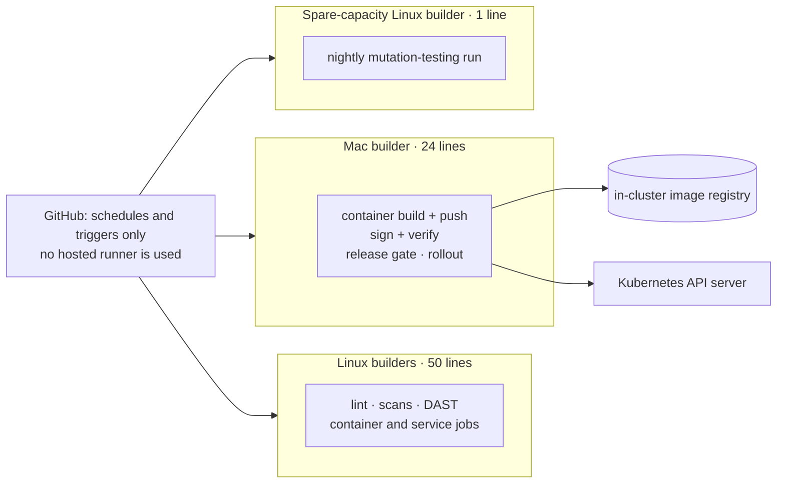
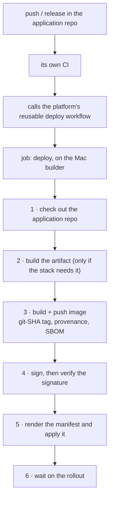
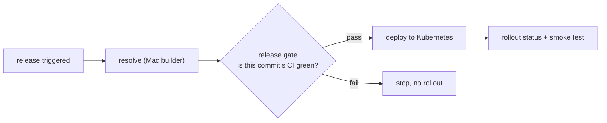


{% assign asof = s.generated_at | date: "%Y-%m-%d" %}

# The delivery chain

An application does not have to live in the platform's repository to run on it. It can sit
in its own repo and deploy over a small published contract. This is how that works, and why
it is shaped the way it is. Figures marked *as of* come from the
[generated stats](status.md), measured {{ asof }}.

---

## Why every job runs on my own machines

The house internet connection is behind carrier-grade NAT: no port forward, and no inbound
path for GitHub to reach the image registry or the Kubernetes API server. So GitHub's own
hosted runners, which live in the cloud, cannot deploy to the cluster. The public apps are
reached through a separate edge; that is not a way in for a build.

The first version of this page said the pipeline was split in two: source-only work in the
cloud, anything touching the registry, signing key or API server on a self-hosted runner.
The workflow files were split that way until 2026-08-26, but hosted jobs had been refused
since 2026-08-15 because the account has no payment method, so the cloud half was already
not running when I wrote that. On 2026-08-26 the last hosted job moved to a self-hosted
runner. The cloud half was ended by a billing gap, not by a design decision; the CGNAT
story is true, but the billing gap is what made it total.

As of {{ asof }}: **{{ s.ci.runs_on_self_hosted }} of the {{ s.ci.runs_on_self_hosted | plus: s.ci.runs_on_github_hosted }} `runs-on:` lines
in {{ s.ci.workflows }} workflow files are self-hosted, {{ s.ci.runs_on_github_hosted }} are GitHub-hosted.** The
split that exists now is by role, and the label counts below I re-counted from the workflow
files on 2026-10-09:

| Runner label | `runs-on:` lines | What runs there |
|---|---|---|
| Linux builders | 50 | most CI, scans, DAST and jobs that need containers or service sidecars |
| Mac builder | 24 | the deploy, the release gate, image scans and the registry/signing/`kubectl` work, plus the mobile and some application CI |
| One Linux builder with a spare-capacity label | 1 | the nightly mutation-testing run that the other Linux builder cannot finish |


```mermaid
flowchart LR
  GH["GitHub: schedules and triggers only<br/>no hosted runner is used"]
  subgraph LIN["Linux builders · 50 lines"]
    A["lint · scans · DAST<br/>container and service jobs"]
  end
  subgraph MAC["Mac builder · 24 lines"]
    B["container build + push<br/>sign + verify<br/>release gate · rollout"]
  end
  subgraph WIFI["Spare-capacity Linux builder · 1 line"]
    W["nightly mutation-testing run"]
  end
  GH --> LIN
  GH --> MAC
  GH --> WIFI
  B --> REG[("in-cluster image registry")]
  B --> API["Kubernetes API server"]
```

**Plain conformant Kubernetes, on k3s.** Chosen for cost and simplicity on {{ s.cluster.nodes }} machines in
a house. Portability is a design aim, not something exercised: the workloads were first run
on Docker Swarm, which is retired, and a move to a managed Kubernetes service has not been
attempted, so I make no promise that the manifests would lift over unchanged.

The weakness is plain: the deploy runs on a single Mac builder. Every deploy, including the
satellite repositories that call in, stops when it is off. It is the one part of the
delivery path with no redundancy.

---

## The contract an application has to meet

The platform provides the registry, the signing chain, the reusable deploy workflow, the
runtime, ingress, replicated storage, identity, metrics and logs.

The application brings two things:

1. **A `Dockerfile`** that builds for `linux/amd64`.
2. **A Kubernetes manifest**, whose image line is a placeholder the deploy fills in.

A signed image plus a manifest is the entire handoff. The caller's side of it:

```yaml
# .github/workflows/deploy.yml in the satellite repository
jobs:
  deploy:
    uses: <platform-org>/<platform-repo>/.github/workflows/deploy-app.yml@master
    with:
      app: my-app
      manifest: deploy/app.yml
    # secrets: inherit    # only if the manifest needs any
```

That is the workflow. It is not the whole setup: there are three one-time steps, which are
registering a runner to the satellite repository, setting one repository variable, and
allowing cross-repository access to the platform's Actions.

The deploy substitutes exactly three variables into the manifest, `${IMAGE}`, `${APP}` and
`${NS}`, and nothing else. My earlier example used `${REGISTRY}` and `${IMAGE_TAG}`, which
would have been applied literally and failed to pull. The line that matters:

```yaml
image: ${IMAGE}   # the deploy injects <registry>/<app>:git-<sha>
```

**What the contract does not require** is the interesting half: no language, no framework,
no test suite, no minimum coverage, no policy gate, no approval. The template ships
resource limits, a readiness probe and a disruption budget, but the deploy only runs
`envsubst` and `kubectl apply` and then waits on the rollout. It checks none of them. An
earlier version of this page called them "required"; they are expected, and nothing
enforces them.

---

## The satellite: proving the contract from outside

A contract that has only ever been exercised from inside the repository that defines it is
not a contract, it is a coincidence. So one application lives in **its own repository**
and deploys onto the platform by calling the published workflow.

It is deliberately tiny: a single endpoint that returns a line of text, no database, no
identity integration. **That is the design.** The variable under test is the contract, not
the application. Its own CI is only the call to the platform's workflow; it has no tests and
no dependency automation.

It was validated end to end on 2026-08-11, 1 minute 46 seconds from push to two healthy pods. As of
2026-10-09 it is **not running**: it has no deployment in the cluster. Nothing in the
platform repository calls the published contract (`deploy-app.yml`) any more, so the
contract has no live caller. The three reference apps deploy through a separate, gated
workflow, `cd-deploy.yml`. I have not redeployed the satellite since.

What it declares in its manifest is not tiny, and that is the interesting part. None of this
is checked by the platform (verified 2026-10-09 by reading the deploy workflow):

| Declared | Value |
|---|---|
| Replicas | 2 |
| Topology spread | `maxSkew: 1` over hostname, **`DoNotSchedule`**, so one node cannot hold both |
| Disruption budget | at least one replica always available |
| Resources | CPU, memory **and ephemeral storage**, requests and limits both |
| Probes | liveness and readiness on separate schedules, with distinct initial delays |
| Shutdown | a pre-stop delay so the load balancer drains first, then a framework-level graceful shutdown, inside a termination grace period long enough for both |
| API access | service account token mounting **switched off**; it never talks to the cluster API |

The shutdown chain is the detail most often missed. Removing a pod from a Service and killing
it are asynchronous events, so a pod that exits *promptly* on the signal drops the in-flight
requests still being routed to it. The delay is the difference between a rolling update being
invisible and being a small burst of errors every deploy.

### What the contract does not ask, and why that matters

This is a design lesson rather than a bug report. The satellite's manifest declares **no
pod-level security context**: no non-root assertion, no read-only root filesystem, no
`allowPrivilegeEscalation: false`, no dropped capabilities.

I used to write that it "inherits a non-root user from its base image and is fine in
practice". **That was wrong.** Its Dockerfile has no `USER` line, and as far as I could tell
(I did not re-check the base image's published config today) the base image sets none
either, so the container runs as root. Nothing checked, because the contract never asked.

The gate below does not apply to satellites either. Everything the *platform* owns still
applies at deploy: the image is built with provenance and an SBOM, signed, and the
signature is verified. Scanning is not part of the deploy; it happens afterwards in the
nightly SBOM run, and only while the application is running. Everything the *repository*
owns is whatever that repository chose.

> **A platform contract silently defines the floor for everything built on it.** What it
> omits is not neutral. It is a permission, and it will be taken.

Both gaps are stated rather than papered over, because the fix is a genuine trade-off:
tightening the contract raises the floor for every satellite and simultaneously raises the
cost of being one. The current position is a deliberate choice for a small estate, and it
would be the wrong one at ten teams.

---

## What a deploy actually does

Two deploy workflows exist, and this page used to blur them. The **ungated** one,
`deploy-app.yml`, is the published contract for satellites, and the diagram below is its
path. The **gated** one, `cd-deploy.yml`, is used by the three reference apps and is
described in the next section.


```mermaid
flowchart TD
  P["push / release in the application repo"] --> C["its own CI"]
  C --> U["calls the platform's reusable deploy workflow"]
  U --> D["job: deploy, on the Mac builder"]
  D --> S1["1 · check out the application repo"]
  S1 --> S2["2 · build the artifact (only if the stack needs it)"]
  S2 --> S3["3 · build + push image<br/>git-SHA tag, provenance, SBOM"]
  S3 --> S4["4 · sign, then verify the signature"]
  S4 --> S5["5 · render the manifest and apply it"]
  S5 --> S6["6 · wait on the rollout"]
```

Step 3: **the deployed tag is the git SHA.** A floating tag would let a rollout pull a cached
older layer and report success. A `:latest` alias is pushed next to it, but nothing deploys
it, so "what is actually running" stays answerable.

Step 4: **the signature is verified, not just created.** Signing something and never
checking the signature is a ceremony, not a control.

---

## The gate, and who it does not protect

Three applications, the reference apps, go through a release gate between resolving the
release and deploying it. That gate lives in the gated workflow, `cd-deploy.yml`, and exactly
three workflows call it, counted 2026-10-09. The platform's other apps do not pass through
it, and none of them use the ungated satellite contract either.


```mermaid
flowchart LR
  T["release triggered"] --> R["resolve (Mac builder)"]
  R --> G{"release gate<br/>is this commit's CI green?"}
  G -- pass --> K["deploy to Kubernetes"]
  G -- fail --> X["stop, no rollout"]
  K --> V["rollout status + smoke test"]
```

The gate blocks on a red test suite. Health, vulnerability and code-quality signals are
reported but advisory, by decision rather than by omission. The old Swarm branch still
exists, but Swarm is retired and it runs only on a manual dispatch.

**Satellite repositories do not pass through the gate at all.** The ungated satellite
workflow (`deploy-app.yml`) is a single job with no policy step, so a satellite's own CI is the only thing
between a commit and a rollout. That is a deliberate consequence of keeping the contract
small, and an asymmetry worth knowing when deciding what belongs in a satellite versus the
platform itself.

---

## Supply chain

As of {{ asof }}, **{{ s.supply_chain.first_party_signed_verified }} of {{ s.supply_chain.images_first_party }} first-party running
images have a signature that verifies**; the other {{ s.supply_chain.images_first_party | minus: s.supply_chain.first_party_signed_verified }} does not.
The deploy workflow builds with provenance and an SBOM, and the nightly run uploads SBOMs to
the vulnerability tracker ({{ s.supply_chain.sbom_projects }} projects), where they are re-analysed against new
vulnerability data on the tracker's own schedule, about daily. The {{ s.supply_chain.images_third_party }} third-party images
of the {{ s.supply_chain.images_running }} running are not signed by this platform, and nothing at admission refuses an unsigned image.

I used to write that every image carries a signature, provenance and an SBOM. That was an
overclaim: it holds for what the deploy workflow builds, not for the estate.

One lesson from doing this in anger: **a vulnerability scanner only matches what it can
identify.** An SBOM whose components carry only generic package identifiers produces zero
findings even when real vulnerabilities exist. Zero findings and "nothing was evaluated" look
identical on a dashboard. Check that components resolve to real ecosystem identifiers before
believing a clean report. The [embedded side](yocto.md) is where that was learned.

---

## Read next

- **[DevSecOps, end to end](devsecops.md)**: every gate from commit to running pod, and what each proves.
- **[High availability, audited](reliability.md)**: which failure domains survive losing a machine.
- **[The operations agent](aiops.md)**: what a local model may change on a cluster without asking.
- **[The embedded side](yocto.md)**: from zero findings to a hundred raw matches on one image.

---

<sub>Machines, addresses, hostnames and topology are deliberately absent. This page was
written for publication, not scrubbed after the fact.</sub>

<script type="module">
  import mermaid from 'https://cdn.jsdelivr.net/npm/mermaid@11/dist/mermaid.esm.min.mjs';
  mermaid.initialize({ startOnLoad: false, theme: 'neutral' });
  document.querySelectorAll('pre > code.language-mermaid').forEach((el) => {
    const div = document.createElement('div');
    div.className = 'mermaid';
    div.textContent = el.textContent;
    el.parentElement.replaceWith(div);
  });
  mermaid.run();
</script>
