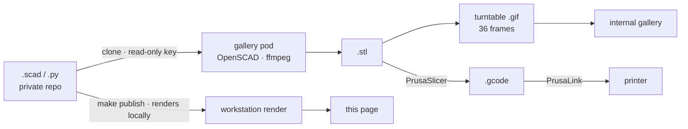

# Parts as code: from a parameter to a spinning preview

The mechanical layer of the estate. Every part is **source**: an OpenSCAD file or a
standard-library Python generator, with its bolt patterns and clearances as named
parameters. The mesh, the G-code and the previews are **build output**, rebuilt from the
source. The G-code is never committed. The rover's meshes and previews are, since
2026-10-07, so they are available offline, and the previews on this page are copies
committed to this public site repository. The source repository, {{ site.data.stats.hardware.printing_commits }} commits as of
{{ site.data.stats.generated_at | slice: 0, 10 }}, is private. This page is published from it by one command that
renders the previews on the workstation, not on the cluster. Only the internal gallery
renders on the cluster, in a pod.

The design idea is the one in the first decision record: **buy the interfaces, print
everything between them**. Motors, boards and batteries come off a shelf; the brackets,
decks and docks that join them are a parameter change and a few hours away. That moves
mechanics into the same fast-iteration loop as the software.

## The chain

```mermaid
flowchart LR
  SRC[".scad / .py<br/>private repo"] -->|"clone · read-only key"| POD["gallery pod<br/>OpenSCAD · ffmpeg"]
  POD --> STL[".stl"]
  STL --> GIF["turntable .gif<br/>36 frames"]
  GIF --> WEB["internal gallery"]
  STL -->|PrusaSlicer| GC[".gcode"]
  GC -->|PrusaLink| PR["printer"]
  SRC -->|"make publish · renders locally"| WS["workstation render"]
  WS --> PAGES["this page"]
```

- **One toolchain image**: OpenSCAD, PrusaSlicer, ffmpeg and a virtual X server. Its tag
  is the content hash of its own Containerfile, so the tag changes exactly when the
  toolchain does. The parts are *not* baked in; the pod clones the repository at run time,
  so a push changes what gets rendered without a rebuild.
- **The gallery** is a Deployment that re-clones the repository every fifteen minutes,
  re-renders every part only when the commit has changed, and serves the result behind the
  cluster's ingress. That is the design; lesson 7 says what it does today. The **print job**
  is a CronJob running the same chain through slicing and upload. It is suspended, and was
  when I checked on 2026-10-09.
- Both run as non-root on a **read-only root filesystem**, with every capability dropped.
- **Everything is a make target.** `make deploy` gates on the unit tests, the real renderer
  in the real image under the pod's limits, the access test and strict server-side
  validation, then applies. `make smoke` fetches the gallery through the ingress and
  compares its part count with the parts on disk, because "the API server accepted the
  objects" and "the page is served" are different claims. As of 2026-10-09 that comparison
  cannot pass; see lesson 8.
- **`make fit`** checks that the rover's printed parts do not occupy the same space. As of
  2026-10-09 it **fails with 3 problems**: the Pi tray, the battery tray and the camera mast
  overlap each other. The rover does not go together yet, and that list is the design's
  to-do list. A failing fit puts DRAFT on the booklet's cover rather than stopping it.

## What was wrong first

Most of the work here was finding out that the first answer was wrong. In order:

**1. The renderer's animation mode could not animate.** The Debian OpenSCAD (2021.01, the version the pod ran when I checked on 2026-10-09)
fails under a virtual display once asked for eight or more animation frames, and its
viewport variables are ignored outside animation mode. Every one of the 19 parts failed in
the container while all of them worked on the workstation, which runs a newer build. The fix
is dull: render **one process per frame** with an explicit camera, in parallel.

**2. You cannot judge a GIF by looking at its frames.** The first guard against a broken
render counted distinct frames in the GIF. Palette dithering makes that meaningless:
**one** input image became **four** distinct GIF frames, and a camera that never moved
scored *more* frame-to-frame difference (3.9) than a part that was spinning (2.5). A
threshold on top of that then failed genuine parts for being symmetric. A round pencil pot
turning on its axis looks exactly like a still picture of one. The guard that survived
works on the **raw PNG frames by exact hash**:

- a render is **blank** if frame 0 is byte-identical to a render of an empty scene from the
  same camera;
- a render is **still** if it has fewer than two distinct frames.

It has a unit test that feeds it a still sequence and a blank one and **requires it to
refuse both**. A guard that has only ever passed tells you nothing.

**3. "It clones fine", on a machine that was logged in.** The repository is private.
The workstation cloned it without complaint because the workstation had credentials. From a
clean container, the same clone failed. The fix is a **deploy key scoped to this one
repository**: generated by a make target, registered through the API, and then **asserted
read-only by reading it back**, rather than assumed from the flag that was passed. The
pod checks the host key against a **pinned** copy of GitHub's published keys, and the access
test proves two things: the key can read the repository, **and** a connection to a host
with an unknown key is refused. A pinning configuration that has never refused anything
looks exactly like no pinning at all.

**4. `No user exists for uid 1000`.** The image ran as a numeric non-root user with no
entry in `/etc/passwd`. HTTPS never cared. SSH refuses to start. The access test found it
before the pod did, which is the only reason that test exists.

**5. Two gates that could not fail.** The lint step and the manifest validation both ended
in `|| true`. They printed their findings and let the build continue, which is worse than
having no gate, because it looks like one. Both are real now, and the lint gate has since
caught a sourced script that declared no shell.

**6. A push that logged an error and worked.** The image push reported a timeout against
the registry, retried, and succeeded. Neither the error line nor the exit code settles
which of the two happened; the registry's own tag list and a manifest fetch did. This one
is from memory: I cannot point to a record of it, so it is the only lesson here you cannot
check.

**7. A poll loop that worked exactly once.** The gallery built its first render at
2026-10-09 04:59 UTC and has not managed a clone since: every fifteen-minute poll logs
`clone FAILED; still serving cab74a3`, with `getcwd() failed` among the errors. It is
serving a correct but frozen gallery. My reading of the script, not yet a fix, is that
the loop deletes its working directory while standing in it. The container test runs a
single pass, so it could not see a second one. The fix needs a test that runs two
iterations first.

**8. A gate broken by the file it protects.** Tracking the rover's meshes made the smoke
test's expected count wrong: it counts every `.stl` under `models`, which is 28 files here
(7 of them build output, plus one untracked third-party model), while the gallery serves
20 parts. A check that cannot pass is as useless as one that cannot fail. I have not run
`make smoke` to watch it say so; that is from reading the script and counting the files.

## The parts

Every part in the repository, rendered from the committed source. As of 2026-10-09 the
source holds 20 parts in 12 models at `cab74a3`; the generated list below was last
published from `18c726b`, so it is four commits behind and lacks `technic_baseplate`.
Regenerating it is the source repository's `make publish`, which I have not run. The drone frame and its
floats are **finished work, not roadmap**: a later decision narrowed the scope to ground
machines, because an aircraft is a different platform rather than another profile of the
same one.

<!-- parts:begin - generated by thePrintingIn3D publish_pages.py -->

**19 parts in 11 models**, rendered from `18c726b`.

### bracket — gusseted L-bracket

<figure style="display:inline-block;margin:0 .6em 1em 0;text-align:center"><figcaption><code>bracket</code></figcaption></figure><figure style="display:inline-block;margin:0 .6em 1em 0;text-align:center"><figcaption><code>l_bracket</code></figcaption></figure>

### cube — 20 mm calibration cube

<figure style="display:inline-block;margin:0 .6em 1em 0;text-align:center"><figcaption><code>calibration_cube_20mm</code></figcaption></figure>

### cupholder — boat / bulkhead cup holder

<figure style="display:inline-block;margin:0 .6em 1em 0;text-align:center"><figcaption><code>cupholder</code></figcaption></figure>

### drone_frame — printable 5" quad frame

<figure style="display:inline-block;margin:0 .6em 1em 0;text-align:center"><figcaption><code>arm</code></figcaption></figure><figure style="display:inline-block;margin:0 .6em 1em 0;text-align:center"><figcaption><code>frame_plate</code></figcaption></figure><figure style="display:inline-block;margin:0 .6em 1em 0;text-align:center"><figcaption><code>motor_mount</code></figcaption></figure>

### keychain_tag — custom name tag

<figure style="display:inline-block;margin:0 .6em 1em 0;text-align:center"><figcaption><code>keychain_tag</code></figcaption></figure>

### pencil_pot — round cup / small plant pot

<figure style="display:inline-block;margin:0 .6em 1em 0;text-align:center"><figcaption><code>pencil_pot</code></figcaption></figure>

### phone_stand — angled phone / tablet stand

<figure style="display:inline-block;margin:0 .6em 1em 0;text-align:center"><figcaption><code>phone_stand</code></figcaption></figure>

### quad_floats — bolt-on water landing gear

<figure style="display:inline-block;margin:0 .6em 1em 0;text-align:center"><figcaption><code>float_lid</code></figcaption></figure><figure style="display:inline-block;margin:0 .6em 1em 0;text-align:center"><figcaption><code>float_pod</code></figcaption></figure>

### rover_deck — printable payload deck for theVideoRover

<figure style="display:inline-block;margin:0 .6em 1em 0;text-align:center"><figcaption><code>battery_tray</code></figcaption></figure><figure style="display:inline-block;margin:0 .6em 1em 0;text-align:center"><figcaption><code>bumper</code></figcaption></figure><figure style="display:inline-block;margin:0 .6em 1em 0;text-align:center"><figcaption><code>camera_mast</code></figcaption></figure><figure style="display:inline-block;margin:0 .6em 1em 0;text-align:center"><figcaption><code>deck</code></figcaption></figure><figure style="display:inline-block;margin:0 .6em 1em 0;text-align:center"><figcaption><code>pi_tray</code></figcaption></figure>

### rover_dock — charge + alignment dock for theVideoRover

<figure style="display:inline-block;margin:0 .6em 1em 0;text-align:center"><figcaption><code>dock</code></figcaption></figure>

### split_demo — when the part is bigger than the printer

<figure style="display:inline-block;margin:0 .6em 1em 0;text-align:center"><figcaption><code>split_beam</code></figcaption></figure>

<!-- parts:end -->

---

Written for publication. No hostnames, addresses or credential locations appear here,
and a guard fails the build if they ever do. The parts section is regenerated by the
source repository's `make publish`, which runs that same guard before it commits.

