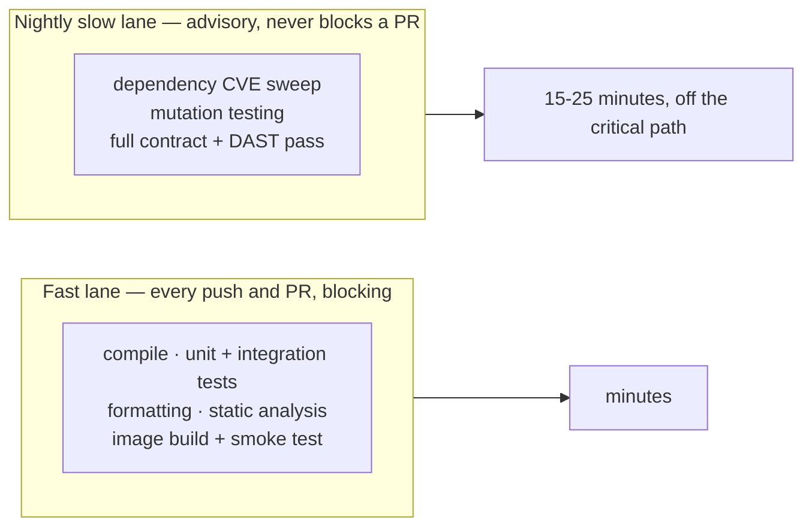
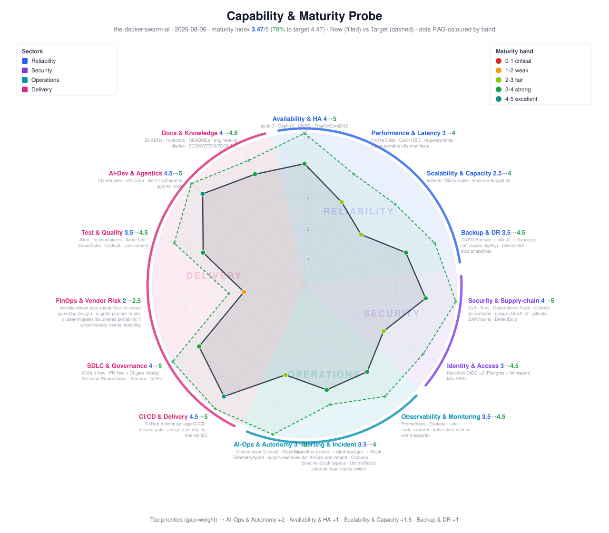
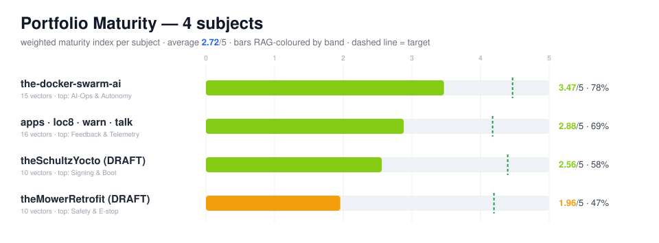

# What actually gates a merge, and how the platform scores itself

A gate nobody can fail is decoration. This page is the other side of
[the security gate table](devsecops.md): what actually stops a merge for a *quality* reason,
what only advises,
and — because a platform that measures everything else and exempts itself would be worth
less than one that doesn't — how it scores its own maturity, weaknesses included.

---

## Two speeds, on purpose

The split exists because the honest, thorough version of some checks is too slow to run on
every commit without destroying the feedback loop that makes small, frequent changes safe.
Splitting speed from thoroughness keeps both properties instead of trading one for the other.

**Per-app delivery is independent, too.** One application ships without waiting for its
neighbours to be ready — a slow or failing check on one app has never once blocked another
from shipping the fix it needed.

---

## Coverage, mutation testing, and where the floor actually is

Java services run JUnit 5 with Testcontainers-backed integration tests — real database
containers, not mocks, so a coupling defect shows up in CI rather than at 3am.

**Coverage has a floor, and the floor catches something a percentage alone would miss:** the
house rule is *the quality gate's own new-code rules, plus an overall floor* — because "100%
of new code covered" is a real gate that a project sitting at 0% overall would still pass. **On a dated read of the live dashboard (2026-08-10):** one service sat at 44.7%
coverage and cleared its gate; a second at 55.9% and also cleared; a third at 67.6% — the
highest number of the three — and *failed*, on new-code violations rather than the raw
percentage; two smaller services were not yet wired into the coverage dashboard at all.
**The highest percentage failing and the lowest passing is the gate working as designed** —
and not being onboarded is a worse state than a low score, because a low score is at least
visible.

**Mutation testing runs nightly, advisory, at a 50% kill-rate threshold.** It never blocks a
pull request — mutation testing is expensive and is exactly the kind of check the slow lane
exists for — but it is the one static-coverage numbers can't fake: a suite that asserts
nothing can still show 100% line coverage by merely executing every line.

---

## The contract-testing story, and the trap inside it

Every backend publishes an OpenAPI specification, and a property-based tester throws
generated, spec-legal inputs at the *running* service and checks the response actually
matches what the spec promises — not just that the endpoint returns something.

**The first real run: 122 documented operations, 496 conformance findings, 8 of them genuine
low-level failures.** That gap between "documented" and "conforming" is the entire value of
the exercise — a hand-written spec describes intent; a service under generated input reveals
what it actually does.

**The instructive part is *why* the number was so high.** Precisely zero of the documented
operations carried an explicit response-code annotation — every response type in the
specification had been auto-derived from a method signature, which only ever describes the
success path. The overwhelming majority of the findings were therefore the tool correctly
reporting *"you never told me this endpoint could return this,"* not defects in behaviour.

That is a trap with a wrong exit and a right one:

- **The wrong fix** is annotating every documented status code onto the specification until
  the tool stops complaining — which launders a handful of real defects into a sea of newly
  "documented" ones, and teaches the next reader that the noisy baseline was always normal.
- **The right fix** is annotating the small number of shared exception-handler classes that
  actually produce the error responses, which fixes the specification for every endpoint that
  flows through them at once and leaves the genuine defects visible.

**One of those genuine defects, found the same way:** one service produced three unhandled
server errors across a handful of endpoints; a sibling service with more than ten times as
many endpoints produced zero, because it already had the shared exception-handler pattern the
first was missing. Copying an existing pattern across, rather than inventing a new one, closed
the gap in about the time it takes to write one class.

---

## Load, autoscaling, and the difference between reacting and deciding

Load and soak testing runs against both the current and legacy runtimes with the same
scripts, so a regression shows up as a number, not a feeling.

**Autoscaling exists in three different registers today, and only the loudest one is
automatic:**

| Trigger | Mechanism | Status |
|---|---|---|
| CPU utilisation | Horizontal pod autoscaling, four services, floor of 2 replicas, ceiling of 4, target 70% | live, reacting continuously |
| A human decision | declarative replica count, or a conversational request through the ops agent | available on demand |
| **A traffic signal the platform already sees** | a specialist watcher flags a request-rate spike or a near-zero drop in the same metrics store the autoscaler reads | **surfaced, not yet wired to a decision** |

That third row is the honest gap. The platform already has the signal that would justify
scaling before CPU catches up — traffic leads CPU, not the other way round — and closing that
loop is a named, open piece of work rather than an implied capability.

**Progressive delivery is the other side of the same honesty.** Blue/green rollout with an
immutable image tag and a rollback that resolves to a single previous SHA is live today, and
a same-day rollback is a real, exercised property of the deploy path. **Canary rollout with
automatic analysis and auto-rollback on a live health signal is not yet built.** The
groundwork — a health check the rollout could gate on — already exists; wiring it to a
progressive-delivery controller is tracked as future leverage, not claimed early.

---

## A gap closed by refusing to close it

Not every open item on the roadmap is a thing waiting to be built. One of the more useful
entries is a **rejection**.

A cluster-state reconciler that continuously re-applies the git-declared state and corrects
live drift automatically was evaluated and turned down **on principle, not deferred for
later** — because the problems it solves (multiple teams stepping on each other's changes,
pull-based reconciliation across many operators) don't exist yet at a single-maintainer
scale, and the platform already has a plainer tool that both rebuilds the cluster from git
*and* proves that claim on a schedule.

The rejection carries its own reopen condition, written down rather than implied: **a second
maintainer arriving, or configuration observed drifting in practice** — not "reconsider
someday." A decision without a stated trigger to revisit it is just procrastination wearing
a decision's clothes.

---

## Grading our own maturity, weaknesses included

Two independent scoring systems run against this platform and its siblings, on purpose —
one gives depth, the other gives a comparable number:

- **A narrative ladder**, five levels from ad hoc to elite, scored per domain with the
  evidence written out in prose.
- **A weighted capability radar** — a small, purpose-built tool, not a third-party product —
  scored 0–5 against a stated target and rendered as a chart.

### The radar is a tool, not a one-off spreadsheet

The instrument that draws it is worth describing on its own, because it's the more
interesting artifact of the two. It's a few hundred lines of **dependency-free Python** —
nothing to install, it runs anywhere `python3` runs — that reads one assessment file (plain
JSON: a list of weighted capability *vectors*, each with a current score, a target, and the
evidence behind both) and renders it as an SVG radar, a Markdown scorecard, and — given two
dated assessments — a diff showing what moved and what didn't.

It borrows deliberately from the tools this space already has, rather than pretending to
invent scoring-on-a-radar from nothing: labelled sector arcs from the tech-radar format
popularised by Thoughtworks and Zalando, per-vector level anchors from CMMI, weighting and
evidence from the cloud providers' Well-Architected reviews. What makes it worth keeping
rather than reaching for a slide deck: **the output is generated from one file in git**, so a
scorecard six months old and one from today are diffable text, not two screenshots someone
has to eyeball.

**The live output, not a mock-up:**

**On this dated snapshot, the platform's weighted index sits at 3.47 of 5, against a target of
4.47 — 78% of the way there.** The point of publishing that number is the shape around it, not
the average:

| Strongest | Score | Weakest | Score |
|---|---|---|---|
| CI/CD & delivery | 4.5 | FinOps & vendor risk | 2.0 |
| AI-native development | 4.5 | Scalability & capacity | 2.5 |
| Security & supply chain | 4.0 | **AI operations & autonomy** | **3.0 — largest gap to target** |
| Availability & HA, SDLC, docs | 4.0 | Identity & access | 3.0 |

The single largest gap on the whole radar is the autonomy of [the ops agent](aiops.md) itself
— which is consistent with everything that page says about it: useful, supervised, and
deliberately not trusted further than that yet. A self-assessment that didn't put its own
weakest-scored capability exactly where the rest of the site already says it belongs would be
the one worth doubting.

**The same tool scores the wider portfolio, not just this repository** — the same JSON
schema pointed at a different subject, rolled up into one comparison:

The platform is — honestly — the strongest-scoring member of its own family today. That is stated
plainly rather than left implied: the scoring is deliberately conservative, crediting only
what is deployed and verified, never what is merely designed. Nothing on the whole radar sits
at a perfect score, on purpose.

The tool itself doesn't know or care what it's grading — the same schema has scored a
nine-node Kubernetes platform, the application layer running on it, an embedded Linux image
built from source, and an unrelated robotics safety system, each with its own vectors and its
own weights. **A capability-maturity tool that only works on the thing it was written for
isn't a tool, it's a spreadsheet with extra steps.**

---

## Honest gaps

- **Mutation testing and dependency-CVE sweeps are advisory, not blocking.** A regression in
  either is visible the next morning, not stopped at the gate — a deliberate throughput
  trade-off, tracked rather than hidden.
- **No distributed tracing.** Metrics and logs answer *what* and *how often*; nothing yet
  answers *why was this one request slow* across service boundaries.
- **No client-side crash reporting.** The backend's health is well instrumented; a crash on a
  device in someone's pocket is invisible until it's reported by hand.
- **Signing is verified in the pipeline, not enforced at admission.** The cluster will run an
  image that was never checked, if a manifest referencing it reaches `kubectl apply` by a
  path that skipped the pipeline.

---

## Read next

- **[DevSecOps, end to end](devsecops.md)** — the security half of the gate table this page's
  quality half sits beside.
- **[AI in development](ai-dev.md)** — the same no-exemption principle applied to who, or
  what, proposed the change in the first place.
- **[High availability, audited](reliability.md)** — where the rollout and failover claims in
  this page are exercised for real, not just described.

---

Written for publication. Machines, addresses, hostnames and credential locations are
absent by construction and enforced by a guard that fails the build.

