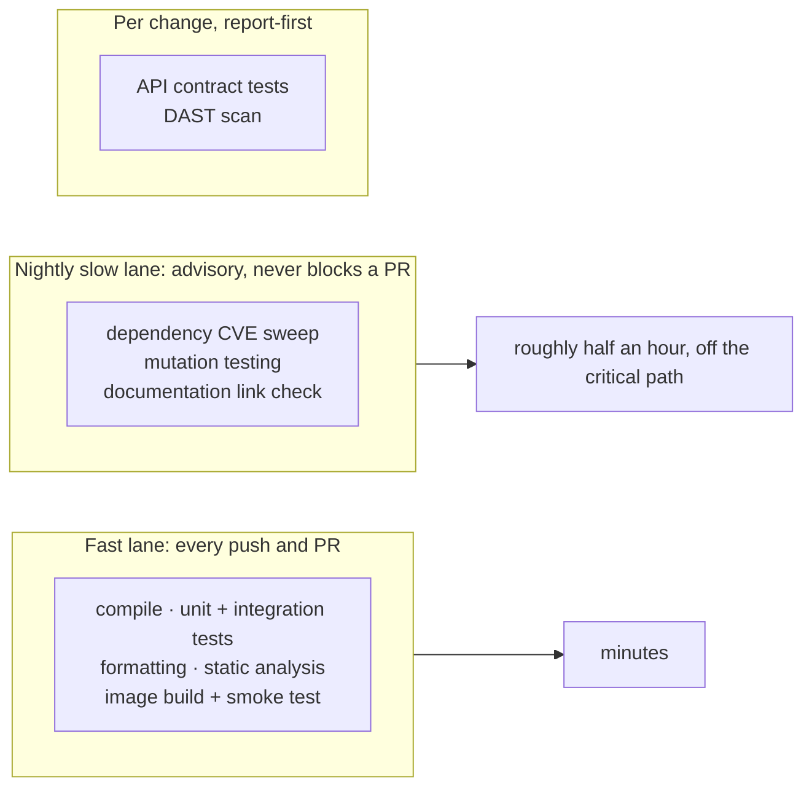
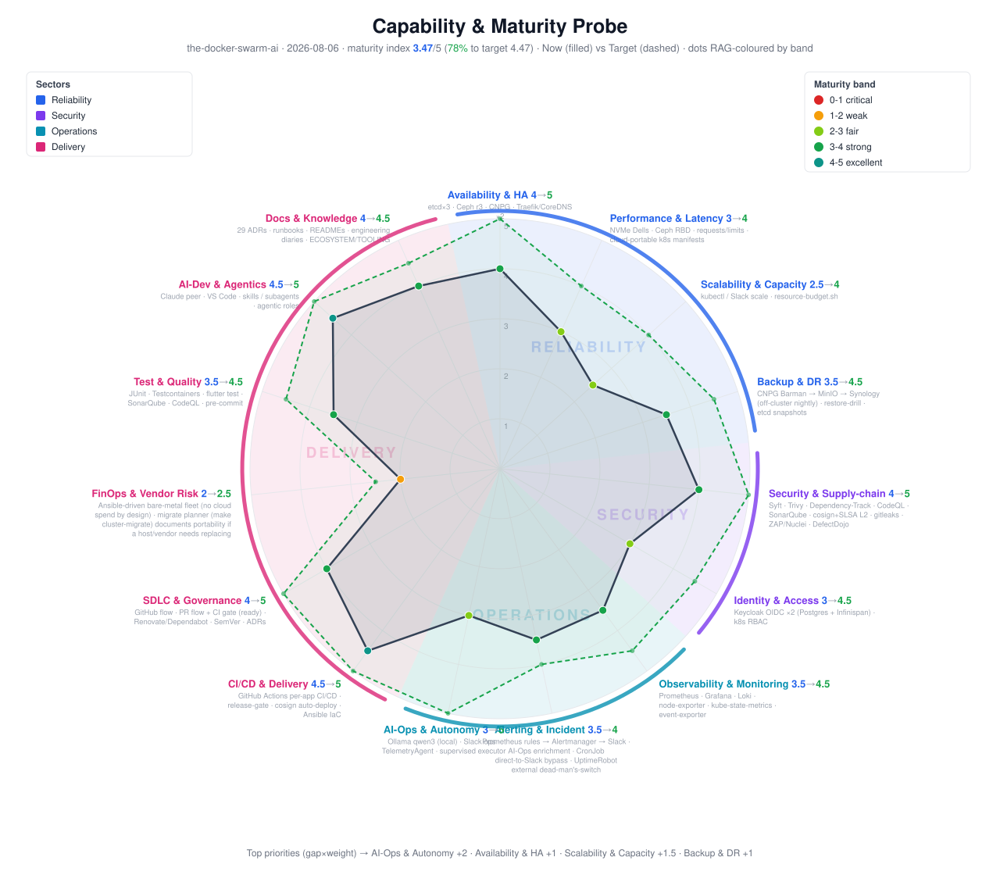
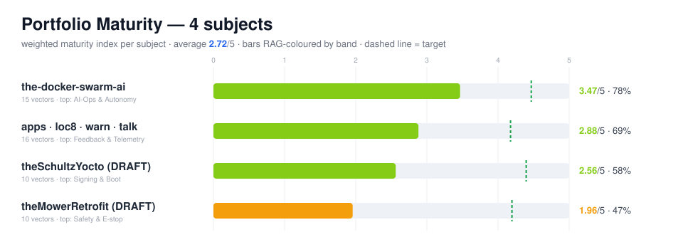



# What actually gates a merge, and how the platform scores itself

A gate nobody can fail is decoration. This page is the other side of
[the security gate table](devsecops.md): what stops a merge for a *quality* reason, what only
advises, and, because a platform that measures everything else and exempts itself would be
worth less than one that doesn't, how it scores its own maturity, weaknesses included.

For scale: the platform repository holds {{ s.repo.adrs }} decision records and
{{ s.ci.workflows }} workflow files, and its sources contain {{ s.repo.tests_java }} Java test
methods, {{ s.repo.tests_python }} Python test functions and {{ s.repo.tests_dart }} Dart tests
(counted statically, not run, so not a pass rate; [how each is measured](status.md)).

**Retraction, 2026-10-09.** An earlier version of this page said the fast lane "blocks" and
that rollout was "blue/green". It does not block by any server rule (see the first section),
and the rollout is a plain rolling update. It also gave a 50% mutation threshold, 122 operations
and a "rollback under 60s" badge. All four were wrong or never measured and have been
corrected or removed below.

---

## Two speeds, on purpose

```mermaid
flowchart LR
  subgraph FAST["Fast lane: every push and PR"]
    A["compile · unit + integration tests<br/>formatting · static analysis<br/>image build + smoke test"]
  end
  subgraph SLOW["Nightly slow lane: advisory, never blocks a PR"]
    B["dependency CVE sweep<br/>mutation testing<br/>documentation link check"]
  end
  subgraph CHG["Per change, report-first"]
    C["API contract tests<br/>DAST scan"]
  end
  FAST --> M["minutes"]
  SLOW --> N["roughly half an hour, off the critical path"]
```

The split exists because the honest, thorough version of some checks is too slow to run on
every commit without destroying the feedback loop that makes small, frequent changes safe.
Splitting speed from thoroughness keeps both properties instead of trading one for the other.
The contract and DAST scans are not nightly: they run when an app changes, and report without
failing the build yet.

**"Blocking" means red by convention, not by a server rule.** Branch protection cannot be
enforced on this repository's hosting plan (the API refuses the request, checked 2026-10-09),
so a direct push to the trunk is possible. The fast lane is a habit plus the delivery
pipeline, which will not ship a red build. That is a weaker thing than a gate, and the word
should not have been used unqualified.

**Nightly timing, as of 2026-10-09:** the last eight scheduled runs took between about 21 and
38 minutes where they finished normally; one was cancelled; one reported success only after a
single service's mutation job ran into the six-hour job limit. That job failed on six of
those eight nights. A slow lane that is red most nights is advisory in the worst sense.

**Per-app delivery is independent by design:** each app has its own delivery workflow and a
path-filtered CI run, so a failing check on one app does not sit in front of another. I have
not queried the full run history to say it has never happened.

---

## Coverage, mutation testing, and where the floor actually is

The three database-heavy Java services run JUnit 5 with Testcontainers-backed integration
tests: real database containers, not mocks, so a coupling defect shows up in CI rather than
at 3am. The two small services run on an in-memory database and have neither.

**Coverage has a floor, and the floor catches something a percentage alone would miss:** the
house rule is *the quality gate's own new-code rules, plus an overall floor*, because "100%
of new code covered" is a real gate that a project sitting at 0% overall would still pass.
**On a dated read of the live dashboard (2026-08-10, two months old):** one service sat at
44.7% coverage and cleared its gate; a second at 55.9% and also cleared; a third at 67.6%,
the highest of the three, and *failed*, on new-code violations rather than the raw
percentage; two smaller services were not yet wired into the dashboard. **The highest
percentage failing and the lowest passing is the gate working as designed**, and not being
onboarded is a worse state than a low score, because a low score is at least visible. Those
figures have moved (one service's build file records 51% on 2026-08-27) and the dashboard
needs a credential this page's generator does not hold, so I have not re-read it. The
two "not wired" services may no longer be true of both, and I have not checked.

**Mutation testing runs nightly against per-app floors of 25, 35 and 35%, and never blocks a
pull request.** The recorded scores, in the build files and dated 2026-08-26, are 28, 37 and
39%, so each sits only a little over its floor. An earlier "50%" on this page was not the setting; it survived in
comments. Mutation testing is expensive and exactly the kind of check the slow lane exists for, and
it is the one static-coverage numbers can't fake: a suite that asserts nothing can still show
100% line coverage by merely executing every line.

---

## The contract-testing story, and the trap inside it

Every backend publishes an OpenAPI specification, and a property-based tester throws
generated, spec-legal inputs at the *running* service and checks the response matches what
the spec promises, not just that the endpoint returns something.

**The first real run: 132 documented operations, 496 conformance findings, 8 of them server
errors (HTTP 500).** (This page said 122, an older count.) That gap between "documented" and
"conforming" is the value of the exercise: a hand-written spec describes intent; a service
under generated input shows what it does. The 8 are not the whole of the real defects, either;
more of them hide in the noise.

**The instructive part is *why* the number was so high.** Precisely zero of the documented
operations carried an explicit response-code annotation, so every response type had been
auto-derived from a method signature, which only describes the success path. Most findings
were the tool correctly saying *"you never told me this endpoint could return this,"* not
defects in behaviour.

That is a trap with a wrong exit and a right one:

- **The wrong fix** is annotating every documented status code onto the specification until
  the tool stops complaining, which launders a handful of real defects into a sea of newly
  "documented" ones and teaches the next reader that the noisy baseline was always normal.
- **The right fix** is annotating the small number of shared exception-handler classes that
  produce the error responses, which fixes the specification for every endpoint behind them
  at once and leaves the genuine defects visible. This is **not yet done**.

**One of those defects, found the same way:** one service produced three unhandled server
errors across its six endpoints; a sibling with more than ten times as many endpoints
produced none, because it already had the shared exception-handler pattern the first lacks.
Copying that handler across is a one-class fix. It is still open, and an earlier version of
this page wrongly said it was closed.

---

## Load, autoscaling, and the difference between reacting and deciding

Load and soak runs hit the apps from an in-cluster generator, so a regression shows up as a
number, not a feeling. (The Swarm runtime that once ran the same scripts was retired on
2026-05-23.)

**Autoscaling exists in three different registers today, and only the loudest one is
automatic:**

| Trigger | Mechanism | Status |
|---|---|---|
| CPU utilisation | Horizontal pod autoscaling: {{ s.cluster.hpas }} autoscalers, each between 2 and 4 replicas; four target 70% CPU, one 80% (read 2026-10-09) | live, reacting continuously |
| A human decision | declarative replica count, or a conversational request through the ops agent | available on demand |
| **A traffic signal the platform already sees** | a specialist watcher flags a request-rate spike or a near-zero drop in the same metrics store the autoscaler reads | **surfaced, not yet wired to a decision** |

That third row is the honest gap. The platform already has the signal that would justify
scaling before CPU catches up, because traffic leads CPU, and closing that loop is a named,
open piece of work rather than an implied capability.

**Progressive delivery is the other side of the same honesty.** Deployments use a plain
rolling update with an immutable git-SHA image tag. Rollback is `kubectl rollout undo`: it
has been drilled in a scratch namespace, but it is **not armed in the delivery pipeline**,
where the post-deploy health gate only reports, and a rollback does not touch git, so the
next deploy would reinstate the bad version. **Blue/green and canary rollout with automatic
analysis and auto-rollback are not built.** The groundwork, a health check a rollout could
gate on, exists; wiring it to a progressive-delivery controller is tracked as future
leverage, not claimed early.

---

## A gap closed by refusing to close it

Not every open item on the roadmap is a thing waiting to be built. One of the more useful
entries is a **rejection**.

A cluster-state reconciler that continuously re-applies the git-declared state and corrects
live drift automatically was evaluated and turned down on 2026-08-10 **on principle, not
deferred**, because the problems it solves (several teams stepping on each other's changes,
pull-based reconciliation across many operators) don't exist at single-maintainer scale, and
the platform already has a plainer tool that rebuilds the cluster from git and can prove it
**on demand**. It does not run on a schedule; an earlier version of this page said it did.

The rejection carries its own reopen condition, written down rather than implied: **a second
maintainer arriving, or configuration observed drifting in practice.** The second half has
arguably been met twice since: the delivery pipeline found pin drift on 2026-09-29, and on
2026-10-03 git and the live cluster disagreed about a DNS deployment. The rejection has not
been revisited yet, and I would rather say so here than let it sit. A decision without a
stated trigger to revisit it is just procrastination wearing a decision's clothes, and a
trigger that fires without anyone looking is not much better.

---

## Assertions that the documentation is not lying

Documentation rots silently. Nothing errors when a diagram describes a topology that changed
six weeks ago, and the person best placed to notice is the one who already believes the
diagram. So a single command re-derives the claims from the live system and fails if any has
stopped being true: inventory against the actual node list, pinned versions against what is
running, the public-edge allowlist against the two independent places it is declared, and four
named standing scheduled jobs against whether they exist *and are not suspended*. The backup
and prune jobs are not among the four; that is a gap. At the last count (2026-10-09) it ran 49
assertions: 48 held, and one reported drift, because the storage cluster was in a health
warning. A verifier that is red today is the verifier working.

One check in it is worth describing, because building it taught more than running it. The
delivery pipeline signs every image and verifies the signature before deploying. Nothing
checked whether the images **actually running right now** are signed, a different claim, and
the gap between them is where an unsigned image would live. Four things fell out of writing
that check, and they generalise:

**Verify the thing, not the label.** The obvious implementation verifies the image tag. A tag
can be overwritten, so that proves something about whatever it points to *now*, not about the
bytes in the running container. The check resolves each container's actual digest, what the
kubelet pulled, and verifies that.

**A check that has never failed is not known to work.** This one was mutation-tested:
deliberately pointed at the wrong signing key to confirm all images are reported unsigned,
then pointed back to confirm they verify. Both directions, or it is decoration.

**An inert check is worse than an absent one.** If the signing tool or the public key is
missing, the check *fails loudly* rather than skipping. A skipped check reports success, and a
green line that means "I didn't look" is indistinguishable from one that means "I looked and
it's fine", which is the failure mode this whole practice exists to prevent.

**The first result was wrong, and reporting it would have caused a fire drill.** The initial
run said every first-party image was unsigned. That was a tooling default: the verifier was
demanding a public transparency-log entry, and signing here is offline and key-based, so no
such entry exists or should. The signatures were valid the whole time. **Reading the actual
error instead of the exit code was the difference between a correct finding and an alarming
false one.**

Result, as of {{ s.generated_at | date: "%Y-%m-%d" }}: {{ s.supply_chain.first_party_signed_verified }} of
{{ s.supply_chain.images_first_party }} running first-party images verify against the release
key. One does not, and this page does not claim otherwise. Note also that this is
*detection*, not *enforcement* (see the gaps below).

---

## Grading our own maturity, weaknesses included

Two independent scoring systems run against this platform and its siblings, on purpose, one
for depth and the other for a comparable number:

- **A narrative ladder**, five levels from ad hoc to elite, scored per domain with the
  evidence written out in prose.
- **A weighted capability radar**, a small, purpose-built tool, not a third-party product,
  scored 0 to 5 against a stated target and rendered as a chart.

### The scoreboard, in full

Here is the narrative ladder's output, **graded 2026-09-09**: every domain, including the
four that sit on the floor. `L3` is the bar a paid public product must clear; `L4` is elite
and only worth reaching where the domain is core to the product's identity or risk. **The
target column is deliberately not `L4` everywhere**: a stack can be elite at security and
absent at analytics, and averaging that into a single headline number would hide exactly
what the grade exists to surface.

| # | Domain | Current | Target | Trend |
|---|---|:---:|:---:|:---:|
| 1 | Engineering foundations | **L3** | L3 | ↑ |
| 2 | CI/CD & delivery | **L3** | L4 | → |
| 3 | Reliability & SRE | **L3** | L4 | ↑ |
| 4 | Observability & telemetry | **L3** | L3 | ↑ |
| 5 | **Security & supply chain** | **L4** | L4 | → |
| 6 | Data & privacy engineering | **L1** | L3 | → |
| 7 | Legal & regulatory | **L1** | L3 | → |
| 8 | Mobile & app-store ops | **L2** | L3 | → |
| 9 | **Product analytics & feedback** | **L0** | L3 | → |
| 10 | **UX quality** (accessibility, i18n, performance) | **L0–L1** | L3 | → |
| 11 | Governance & org-scale | **L2** | L2 | → |
| 12 | Business continuity / FinOps / vendor risk | **L2** | L2 | ↑ |

Read honestly, that table says: **the infrastructure and operations half crossed the
baseline; the product-facing half has not.** Security is genuinely elite. Reliability moved a
full level between the 2026-06 and 2026-07 grades as backups, restore drills and host patching
landed, and has not moved in the 2026-09 one.

And then: **analytics is at zero.** Not "early": zero. Nothing measures whether anyone uses
these applications or what they do in them. UX quality is barely off the floor: no
accessibility audit, no internationalisation, no performance budget. Legal sits at `L1`
against a target of `L3` and is the reason a lawful public launch is blocked; its terms and
privacy policy are the one open top-priority gap.

Those four rows are the most useful thing on this page. A maturity model that grades you
green everywhere is measuring the wrong things, or is being read by its author.

> The grade is dated and old snapshots are never edited; a new file is added instead. It is
> re-scored every six to eight weeks (the three grades so far are 2026-06-05, 2026-07-31 and
> 2026-09-09), or when a top-priority gap closes. Corrections are dated in place. A score you
> can revise silently is not a measurement. The "quarterly" on an earlier version of this page
> was wrong.

### The radar is a tool, not a one-off spreadsheet

The instrument that draws it is worth describing on its own. It's a few hundred lines of
**dependency-free Python**, nothing to install, that reads one assessment file (plain JSON: a
list of weighted capability *vectors*, each with a current score, a target, and the evidence
behind both) and renders it as an SVG radar, a Markdown scorecard, and, given two dated
assessments, a diff showing what moved and what didn't.

It borrows deliberately from the tools this space already has: labelled sector arcs from the
tech-radar format popularised by Thoughtworks and Zalando, per-vector level anchors from
CMMI, weighting and evidence from the cloud providers' Well-Architected reviews. What makes it
worth keeping over a slide deck: **the output is generated from one file in git**, so a
scorecard six months old and one from today are diffable text, not two screenshots someone
has to eyeball.

**The live output, not a mock-up** (assessment dated 2026-08-06; the figures inside the image
are from that date and predate the September work):

**On that snapshot, the platform's weighted index is 3.47 of 5, against a target of 4.47, 78%
of the way there.** It has not been re-scored since, and the probe has not been re-run. The
point of publishing the number is the shape around it, not the average:

| Strongest | Score | Weakest | Score |
|---|---|---|---|
| CI/CD & delivery | 4.5 | FinOps & vendor risk | 2.0 |
| AI-native development | 4.5 | Scalability & capacity | 2.5 |
| Security & supply chain | 4.0 | **AI operations & autonomy** | **3.0, largest gap to target** |
| Availability & HA, SDLC, docs | 4.0 | Identity & access, performance | 3.0 |

The single largest gap on the whole radar is the autonomy of [the ops agent](aiops.md)
itself, which is consistent with everything that page says about it: useful, supervised, and
deliberately not trusted further than that yet. A self-assessment that didn't put its own
weakest-scored capability where the rest of the site already says it belongs would be the one
worth doubting.

**The same tool scores the wider portfolio, not just this repository**: the same JSON schema
pointed at a different subject, rolled up into one comparison (regenerated 2026-09-28):

The platform is, honestly, the strongest-scoring member of its own family. Two of the other
three assessments are still marked draft and date from July 2026, and those two have not been
refreshed since, so the comparison is less current than the average suggests. The scoring is
deliberately conservative, crediting only what is deployed and verified, never what is merely
designed. Nothing on the whole radar sits at a perfect score, on purpose.

The tool doesn't know or care what it's grading: the same schema has scored a
{{ s.cluster.nodes }}-node Kubernetes platform, the application layer running on it, an
embedded Linux image built from source, and an unrelated robotics safety system, each with its
own vectors and weights. **A capability-maturity tool that only works on the thing it was
written for isn't a tool, it's a spreadsheet with extra steps.**

---

## Honest gaps

- **Mutation testing and dependency-CVE sweeps are advisory, not blocking**, and the mutation
  job is red most nights. A regression in either is visible the next morning, not stopped at
  the gate: a deliberate throughput trade-off, tracked rather than hidden.
- **Nothing on the server stops a merge.** Branch protection is not enforceable on this plan,
  and the contract and DAST scans report without failing the build.
- **Rollback is drilled, not armed.** The post-deploy health gate reports only.
- **The cluster rebuild from git is proven on demand, not on a schedule.**
- **No distributed tracing.** Metrics and logs answer *what* and *how often*; nothing yet
  answers *why was this one request slow* across service boundaries.
- **No client-side crash reporting.** The backend's health is well instrumented; a crash on a
  device in someone's pocket is invisible until it's reported by hand.
- **Signing is verified in the pipeline, not enforced at admission.** The guarantee is "the
  delivery path will not ship an unsigned image", not "the cluster will not run one": an image
  that was never checked runs if a manifest reaches `kubectl apply` by a path that skipped the
  pipeline. Detection came first deliberately: a fail-closed admission webhook that breaks
  means nothing deploys, including the fix for the webhook.

---

## Read next

- **[DevSecOps, end to end](devsecops.md)**: the security half of the gate table this page's
  quality half sits beside.
- **[AI in development](ai-dev.md)**: the same no-exemption principle applied to who, or
  what, proposed the change in the first place.
- **[High availability, audited](reliability.md)**: where the rollout and failover claims in
  this page are exercised for real, not just described.
- **[Live status](status.md)**: the counted figures, with the command that produced each.

---

Written for publication. Machines, addresses, hostnames and credential locations are
absent by construction and enforced by a guard that fails the build.

