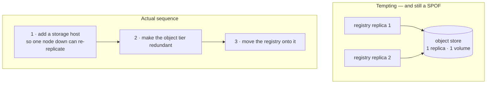
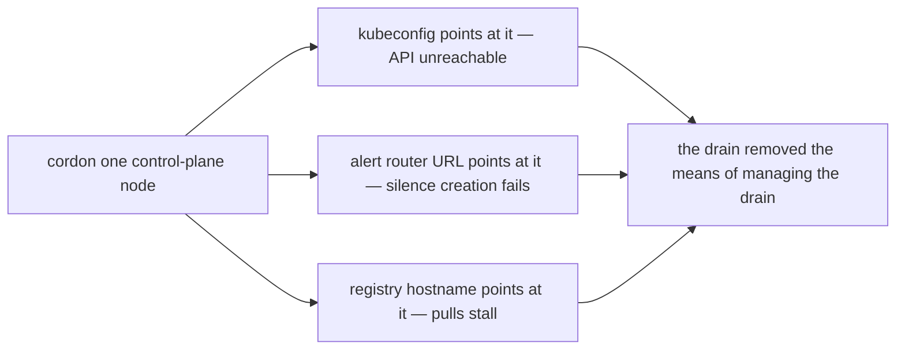
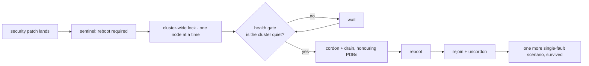

# Single-fault tolerance, measured rather than assumed

"Highly available" is the easiest claim in infrastructure to make and the hardest to keep
true. This page is the audit: which failure domains actually survive losing one machine,
which ones do not, which ones are *deliberately* not replicated, and what happened when the
untested assumptions were finally exercised in anger.

Every status below was read off the live cluster with a query, not off an architecture
diagram. The runtime figures in the badges are a dated snapshot (2026-08-10); the structural
ones are current.

---

## The inventory

Thirteen failure domains. **Four are genuinely single-fault tolerant today. Nine are not,
and all nine are tracked in the open.** A domain is only marked tolerant once the running
replica count and the anti-affinity rules have been read back from the live API — never from
the manifest that was supposed to produce them.

**Tolerant:**

| Domain | Shape |
|---|---|
| Cluster state store | 3-member embedded quorum; commits land on the two fastest disks |
| Relational data | 8 clusters under an operator — three at three instances, five at two; the application and identity databases replicate **synchronously**, and all of them archive continuously |
| Stateless applications | 2+ replicas with **hard** anti-affinity and a disruption budget |
| Identity | 2 replicas with database-backed cluster discovery, verified by a cross-pod login exchange |

**Not tolerant, and named:** ingress, the image registry, the whole monitoring stack, cluster
DNS, the public edge, the physical layer (one switch, one power feed), and the operations
agent itself.

The physical layer is an explicit *accept*, written down as such. One switch and one power
feed are genuinely hard problems at nine machines in a house, and pretending otherwise would
be the worst kind of documentation.

---

## Two things that are deliberately **not** replicated

Replication is not automatically an improvement, and a register that treats "1 replica" as a
defect everywhere teaches you nothing.

**The backup agent runs single-instance on purpose.** The database clusters it protects are
three-way replicated; the agent that ships their write-ahead logs to object storage is not.
Two agents writing to one backup destination would collide on log archiving and on which
base backup is current — the failure mode is a *corrupted recovery point*, which is strictly
worse than a backup agent that is briefly absent. High availability of the data and
concurrency of the backup are different properties, and only one of them is wanted here.

**A low-stakes internal dashboard runs one replica**, and the register says so rather than
quietly scoring it as a gap. Being honest about what does not need to be redundant is what
makes the rest of the register credible.

---

## The replication that would have been theatre

The image registry is the last stateful single point in the delivery path, and it cannot be
replicated as built: one pod, one read-write-once volume.

The obvious fix — run two registry replicas over shared object storage — was rejected after
being written down, because the object store underneath is *itself* a single replica on a
single volume:

Two replicas over one dependency is a **relocated** single point of failure wearing the
badge of a fixed one, and it is worse than the honest version because it stops anyone
looking. The register carries it as blocked-on-prerequisite rather than as done.

There is a live constraint driving the ordering, too: block storage runs three-way
replicated across exactly three hosts, so **planned maintenance currently consumes all
storage redundancy** — with no fourth host, a drained node cannot be re-replicated onto
anything. That is a capacity fact, and it dictates the sequence above.

---

## The monitoring stack was the single point that mattered most

Metrics, alerting, dashboards and logs all ran on one node, with their volumes pinned to
that host's disk. When that node was cordoned for planned maintenance, **alerting went dark
for about nine minutes** — the alert router was evicted mid-reschedule, and creating a
silence failed outright while it moved.

Nothing was lost. Quorum held, the databases recovered unattended, the workloads
rescheduled. The system did exactly what it was designed to do.

**The operator was blind while it did it** — during precisely the window that needed
visibility most.

> An observability stack that shares a failure domain with the thing it observes is not
> observability. It is a report that stops arriving at the moment it becomes interesting.

The staged mitigation is deliberately unglamorous: a retention cap so the metrics store
cannot fill its own disk, alert-router discovery instead of a hardcoded address, and — as a
failsafe — a scheduled capacity check that **bypasses the metrics stack entirely** and posts
into the alert router's own API. If the primary path is what broke, the check that finds it
must not run through the primary path.

---

## The drain that removed its own control surface

This is the incident worth the whole page.

The cluster's *data* had been redundant for months. Its **control surface had not**. Every
tool pointed at one machine by name: the API endpoint in every kubeconfig, the alert router
URL baked into scripts, the registry hostname, and a partially-populated set of local host
entries that were stale on most machines.

Cordoning that one node for maintenance therefore removed the tools required to manage the
cordon. What should have been a runbook became **forty minutes of improvisation.**

Four things came out of it, and only one is the obvious one:

- **A floating control-plane address** is the permanent fix — and it has a prerequisite that
  bites hard if missed: the virtual address must be present in the API server's certificate
  *before* it is announced, or every client fails certificate validation and you have
  converted a partial outage into a total one. The prerequisite is why it is still open
  rather than shipped in a hurry.
- **A pre-flight safety check** that, before cordoning anything, reports **what loses its
  last Ready pod** if this node goes. It answers the only question that matters at that
  moment, and it answers it from live state.
- **Address regeneration from the inventory**, because the hand-maintained entries had
  drifted to the point where the "failover" targets pointed at machines that were themselves
  degraded.
- **A non-destructive drain drill**, so the procedure is exercised on a schedule instead of
  being discovered during the emergency.

There is a general shape here. **Redundancy in the data plane does not imply redundancy in
the control plane, and the control plane is what you need during the failure.**

---

## The patching loop *is* the chaos experiment

Automated OS patching usually gets filed under hygiene. On a cluster designed to survive
losing any one machine, it is something considerably more valuable.

The design claim is: lose one node and nothing stops. A reboot **is** losing one node. So
every automated patch cycle — cordon, drain honouring disruption budgets, reboot, rejoin,
one machine at a time — is an unattended, supervised, production-workload single-fault
experiment that nobody had to schedule.

Two consequences follow, and both are the point:

**The reboot window was deleted.** It was originally restricted to the small hours. That was
replaced by a *health gate* — reboot whenever the cluster is quiet, not whenever the clock
says it is safe. A maintenance window is a claim that availability is conditional on nobody
watching. If the HA property is real, it does not need the cover of darkness. (And "night
here" is someone else's working day.)

**Pausing the reboot loop to run a chaos experiment would be backwards.** The moment you
pause patching because you are "in the middle of a resilience test," you have admitted the
resilience claim is conditional.

Dedicated fault injection still exists and is still worth having — it covers fault classes
the reboot loop never produces. But the *most representative* single-fault test on this
platform is the one that was already running.

---

## …except it had never rebooted anything

Which is the second half of the story, and the better half.

The reboot daemon's sentinel path was configured against the **host's** path, while inside
its container that path resolved to its own empty runtime directory — the chart mounts the
host filesystem somewhere else entirely. So the daemon read an empty directory, concluded
nothing needed rebooting, and **logged that conclusion, hourly, on every node, for weeks.**

Meanwhile the patching half worked perfectly.

| What was true | What was reported |
|---|---|
| four of nine nodes flagged as needing a reboot, one for over two weeks | "Reboot not required" |
| **16,002 host findings, every one of them with a fix already available** | patching automation: shipped ✅ |
| four different kernel series live simultaneously across nine nodes | no alert, no dashboard anomaly |

Every one of those findings was fixed *on disk*. None of them were fixed *in memory*,
because nothing had rebooted.

> The register entry for this now says: **"shipped" was recorded from *deployed*, never from
> *observed to have acted*.**

That sentence is the most expensive lesson on the platform, and it keeps recurring:

- the fault injector that had never fired
- the safety controller that was never on the machine whose only job was to hold it
- the documentation workflow that ran 89 times and succeeded zero times
- and this, the reboot daemon that never rebooted

None of them errored. Every one reported success. The correction is procedural, not
technical: **a cluster-privileged daemon is not done when it is deployed; it is done when it
has been observed to act.** Every one now has a non-destructive drill that exercises the
behaviour on demand.

Two smaller findings surfaced in the same sweep, both worth stating because they are the
kind of thing that only appears once the machinery genuinely runs:

- **The rolling-upgrade plan for the worker tier tolerated no taints** — including the very
  taint the reboot daemon applies while draining. So worker upgrades could not run during
  exactly the condition they were built for, and nodes sat cordoned after a reboot waiting
  for a human.
- **A health check died on a transient rate-limit response** from an API server that was
  itself gracefully shutting down. That response is *correct* — the server is draining — but
  a check without retry and backoff turns correct behaviour into a false alarm. Drain-heavy
  maintenance requires client-side resilience, not just server-side elegance.

---

## The gap register, and why closing things you will never do matters

Gaps are tracked in one register, ordered by **impact × leverage** rather than by technology
area:

| Tier | Meaning |
|---|---|
| **P0** | Launch gate, legal, or irreversible data loss |
| **P1** | Reliability and trust — material operational or user-trust risk |
| **P2** | Leverage — cash in an existing strength for disproportionate value |
| **P3** | Breadth and polish |

Each row carries what the gap actually is, why it matters, an effort estimate, and — when
closed — *how it was verified*, with the commit. Closed rows are struck through and kept,
never deleted, because the reasoning is the valuable part.

One backlog audit took **59 open items to 25**. The interesting part is the breakdown of the
34 that closed:

| Outcome | Count |
|---|---|
| verifiably **done**, checked against the live cluster or the repo | 17 |
| **obsolete** — superseded by an architecture change, or referring to something that no longer exists | 8 |
| **won't do** — deliberately declined, with the reason recorded | 9 |

Fewer than half of the closures were work. The rest was **admitting what was never going to
happen** — a backlog that only grows is not a plan, it is a wish list that quietly makes
every real item look less urgent.

A representative sample of what the register has caught, all of them found by operating the
system rather than by reading it:

- **Identity ran `0/2` ready for nine days with zero alerts**, while still serving logins. A
  cluster-internal race left the readiness probe reporting failure and nothing noticed,
  because the alert rule's namespace selector covered the application namespace and not the
  identity one. It surfaced only when an unrelated storage incident forced a crash loop.
  The fix was two lines. The blind spot was nine days wide. *An implicit contract — "if it
  serves traffic it is healthy" — is not monitoring.*
- **Licence data was generated correctly, then deliberately deleted** immediately before
  upload, by a single filter clause added months earlier for a reason that had since
  expired. The control existed, the data existed, and one clause between them made both
  useless. It was found by testing the assumption — *does the tracker actually reject this?*
  — rather than by trusting the comment that said it did. It did not. Four applications went
  from zero licences to a full set, and the copyleft policy started firing.
- **There is no secrets manager**, and it is written down as an open P1 rather than implied
  away. It is the recurring root cause behind a whole class of placeholder-credential bugs,
  and the register names it as such.

---

## What is still open, stated plainly

Because a reliability page that only lists wins is marketing:

- **Ingress, cluster DNS, the registry and the entire monitoring stack are single replicas.**
- **The public edge is a single small machine**, and automatic failover for it needs a DNS
  or tunnel-level answer that does not exist yet.
- **The deploy path has one self-hosted runner** and no redundancy.
- **The operations agent is a single instance.** Losing it degrades autonomy, not
  availability — which is why it is ranked where it is.
- **One switch, one power feed.** Accepted, deliberately, in writing.

Four of thirteen is not a good score. It is an *honest* one, and it is the number that makes
the other nine fixable.

---

## Read next

- **[DevSecOps, end to end](devsecops.md)** — the gates from commit to running pod, and the
  measurement traps that produced confident wrong numbers.
- **[The operations agent](aiops.md)** — what a local model is actually permitted to do to a
  running cluster, and the split that makes that safe.
- **[How the platform builds and ships things](platform.md)** — the delivery chain and the
  deploy contract.

---

Written for publication. Machines, addresses, hostnames and credential locations are
absent by construction and enforced by a guard that fails the build.

