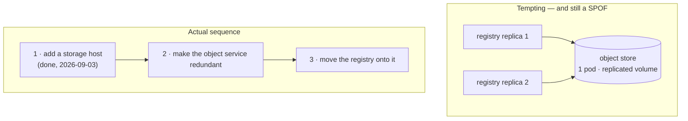
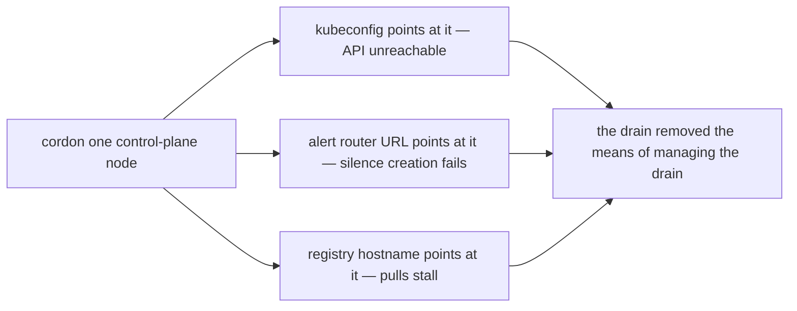
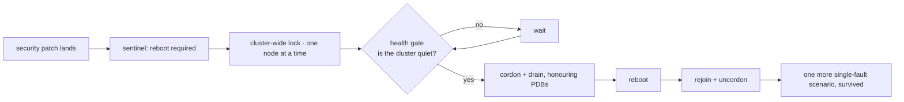


{% assign asof = s.generated_at | date: "%Y-%m-%d" %}

Control plane|ha|3-member embedded quorum with all three members on the fastest disks in the fleet, and a floating API address; the address-holding service runs on all three members and the address fails over between them (shipped 2026-08-16, below)~
Relational data|ha|{{ s.databases.clusters }} clusters under an operator, every one archiving its write-ahead log continuously ({{ s.databases.archiving_clusters }} of {{ s.databases.clusters }}). The four application and identity clusters commit with <strong>quorum-synchronous</strong> replication again since 2026-10-09 (<a href="#the-upgrade-that-kept-the-uptime-and-lost-the-guarantee">they had been asynchronous for 23 days</a>). The two-instance clusters are asynchronous by design~
Block storage|ha|Every block is stored {{ s.storage.replica_size }} times over {{ s.storage.osds }} disk daemons, one per host, read back from the live cluster~
Stateless applications|ha|2 replicas each, <strong>hard</strong> topology spread, and a disruption budget on all but one (the missing one is tracked)~
Identity|ha|2 replicas (read 2026-10-09) with database-backed cluster discovery. The cross-pod login exchange that proves it was last run 2026-07-03, not today~
Ingress|ha|2 of 2 replicas ready~
Cluster DNS|ha|2 of 2 replicas ready, with a disruption budget~
Object store|partial|One pod. Its volume sits on replicated block storage, so the data survives a node and the service does not~
Monitoring|partial|Alert routing has 2 replicas. The metrics store, the dashboards and the log store are one replica each~
Image registry|single|One pod on one read-write-once volume; see below~
Public edge|single|One small machine (not cluster-measured). Automatic failover needs a DNS or tunnel-level answer that does not exist yet~
Physical layer|single|One switch, one power feed (not cluster-measured). An explicit <em>accept</em>, written down as such~
Operations agent|single|One instance (not cluster-measured). Losing it degrades autonomy, not availability









# Single-fault tolerance, measured rather than assumed


"Highly available" is the easiest claim in infrastructure to make and the hardest to keep
true. This page is the audit: which failure domains survive losing one machine, which do not,
which are *deliberately* not replicated, and what happened when the untested assumptions were
exercised in anger. Every status below was read off the live cluster with a query where a cluster can answer, not off an
architecture diagram; the rows for the public edge, the switch and power, and the operations agent are not
cluster-measured and say so. The score today is **{{ n_ha }} of {{ n_all }}**, the badge figures are
rendered from the [measured snapshot](status.md) of {{ asof }}, and
the replica counts and spread rules in the table were read back from the cluster on 2026-10-09. Anything below with a date on it is
history, not a reading.

> **Retraction, 2026-10-09.** This page said four of thirteen failure domains were tolerant,
> and in one place nine gaps open against fifty-one in two others. Both were wrong. The
> platform's own roadmap and the estate page said seven of thirteen; this page was the one
> that had not been re-read. It also said the application databases replicate
> synchronously, which was untrue from 2026-09-16 to 2026-10-09 ([below](#the-upgrade-that-kept-the-uptime-and-lost-the-guarantee)).
> An audit page that is itself unaudited is the failure it describes.

---

## The inventory

Thirteen failure domains. **{{ n_ha }} are genuinely single-fault tolerant, {{ n_partial }} are partly so, and
{{ n_single }} are not, all of them tracked in the open.** A domain is only marked tolerant once the
running replica count and the placement rules have been read back from the live API, never
from the manifest that was supposed to produce them. The exceptions are the rows marked as not cluster-measured.

<table>
  <thead>
    <tr><th>Domain</th><th>Verdict</th><th>Shape (cluster replica counts read 2026-10-09)</th></tr>
  </thead>
  <tbody>



    <tr><td>{{ f[0] | strip }}</td><td><strong>Tolerant</strong>PartlySingle</td><td>{{ f[2] | strip }}</td></tr>

  </tbody>
</table>

The physical layer is an accepted gap, not an oversight. One switch and one power feed are
genuinely hard problems at {{ s.cluster.nodes }} machines in a house, and pretending otherwise would be the worst
kind of documentation. The honest score is {{ n_ha }} of {{ n_all }}, and it is the number that makes the rest
fixable.

### Two things that are deliberately **not** replicated

Replication is not automatically an improvement, and a register that treats "1 replica" as a
defect everywhere teaches you nothing.

**The backup agent runs single-instance on purpose.** The databases it protects are replicated
across two or three instances; the agent that ships their write-ahead logs to object storage is
not. Two agents writing to one backup destination would collide on log archiving and on which
base backup is current, and the failure mode is a *corrupted recovery point*, which is strictly
worse than a backup agent that is briefly absent. High availability of the data and concurrency
of the backup are different properties, and only one of them is wanted here.

**Low-stakes internal dashboards run one replica each**, and the register says so rather than
scoring them as gaps. Being honest about what does not need to be redundant is what makes the
rest of the register credible.

---

## The replication that would have been theatre

The image registry is the last stateful single point in the delivery path, and it cannot be
replicated as built: one pod, one read-write-once volume.

The obvious fix, two registry replicas over shared object storage, was rejected after being
written down, because the object store underneath is *itself* one pod:


```mermaid
flowchart TD
  subgraph WRONG["Tempting — and still a SPOF"]
    R1["registry replica 1"] --> M1[("object store<br/>1 pod · replicated volume")]
    R2["registry replica 2"] --> M1
  end
  subgraph RIGHT["Actual sequence"]
    S1["1 · add a storage host<br/>(done, 2026-09-03)"] --> S2["2 · make the object service redundant"]
    S2 --> S3["3 · move the registry onto it"]
  end
```

Two replicas over one dependency is a **relocated** single point of failure wearing the badge
of a fixed one, and it is worse than the honest version because it stops anyone looking. The
register carries it as blocked-on-prerequisite rather than as done. (The object store's *data*
is no longer a single copy, since its volume moved onto replicated block storage. The *service*
still is one pod, which is what the registry would be leaning on.)

The ordering used to be driven by a harder constraint. Until early September the block storage
ran on exactly three hosts, so a drained node could not be re-replicated onto anything and
planned maintenance consumed all storage redundancy. A fourth host joined on 2026-09-03 and the
constraint is history. The distinction it taught is still true: the small quorum of
**monitors** rebuilds itself on another host in minutes, the way etcd does, while **data
replicas** need a distinct host to go to. A second failure in that window used to mean blocked
writes, which is why a maintenance runbook exists for this layer and nowhere else on the
storage side.

---

## Scheduling by fact, not by hope

Machines spanning a decade of hardware generations do not schedule safely under a single
"a node is a node" model, so nodes carry labels for disk speed and CPU class, and workloads
are steered toward suitable nodes with a *soft* preference, never a hard requirement: the ideal
node being full or cordoned should degrade placement, not block it.

> **Correction, 2026-10-09.** This page used to say those labels were *measured*, along with
> thermal headroom. They were assigned by eye at inventory time and have never been checked
> against a benchmark; that check is an open gap. The labels for disk speed and CPU class are
> on all {{ s.cluster.nodes }} nodes. A thermal label is on one.

One label is different in kind: a single node is labelled by **role** as the deliberate
fault-injection target, so that chaos tooling can be pinned to it specifically.

**That distinction was learned the expensive way.** A cluster-management controller had been
scheduled onto the fault-injection node alongside the workload it was supposed to help guard,
so powering that node off for a real test took the controller down with the very target it
existed to supervise. The fix became a standing rule: **hard-pin only deliberate targets,
never anything the cluster depends on to recover.**

A second, quieter defect came from the same audit: the labels lived in a provisioning playbook
and in the inventory it was supposed to read from, and the two drifted apart. The fix was to
delete one of the two sources, so labels are derived from the inventory alone. **Two sources
of truth is a bug with a delay on it, not a redundancy.**

---

## Restore is drilled, not assumed

A backup nobody has restored is a belief, not a control. So restoring one is a standing,
non-destructive drill: any database can be restored from object storage into a scratch
namespace, fingerprinted against the live one, and torn down again, on demand.

**What was measured, and when.** Write-ahead log shipping is configured to bound the recovery
point at five minutes, and archiving is healthy on {{ s.databases.archiving_clusters }} of {{ s.databases.clusters }} clusters
as of {{ asof }}. A real timed restore came back in **about two minutes** on 2026-07-02, on the
previous major version and before the September rebuild. It has not been re-timed since, and
the drill itself was found reading a path the cluster no longer writes to, and fixed on
2026-09-29, which is how a drill rots when nobody runs it. Until it is re-timed, the two
minutes is a July figure.

The whole platform is rebuilt from its own declarative state too: once in July 2026 by tearing
the live cluster down and rebuilding it from nothing, and again in September, when the fleet
went from nine machines to six. What has *not* been exercised is a rebuild onto a different set
of machines with the data restored into it. That drill exists and is still an open row. A wrong
foundational decision caught by a rebuild costs an afternoon; caught in production it costs a
migration project.

The rule is the same beyond the databases, and only for data **nobody else holds**: caches and
proxies are deliberately not backed up, because they re-download.

- **The OTA release store.** An empty artifact repository is started in a throwaway namespace,
  configured from its declaration, compared against the live one (zero drift, identical
  repository list), and refilled from the backup with every file checksum-verified *before*
  upload. The drill also has to fail where it should: a rebuilt repository with no releases is
  an outage for every device, so the client check must refuse it until the restore runs.
- **The signing keys.** Losing them means no device takes another update. They are encrypted
  on the build host to a key that lives offline, pulled into versioned storage the writer
  cannot delete from, and copied off-cluster. The drill decrypts the latest copy and compares
  every file against the live originals, and it must also *refuse* a copy with one byte changed
  and a decryption under the wrong key.

---

## The cluster must not need itself to start

The home network's DNS resolver moved **onto** the cluster. Two failure modes came with it, and
one of them happened.

**It happened:** the load-balancer integration publishes a port by capturing traffic to that
port on *every local address* of every node, including the node's own local resolver on port
53. For about ten minutes the nodes could not resolve anything, because their own lookups were
being answered by the new service's plumbing. The fix was to publish the resolver on the one
shared virtual address only, and the deploy now asserts that every node can still resolve a
public name.

**It would have happened next:** once the network hands out the cluster-hosted resolver, a node
that uses it needs the cluster running in order to pull the images the cluster needs to start.
A cold start would deadlock on itself. So the nodes are pinned to public resolvers, ignore what
the network hands them, and the provisioning run checks that none of them resolves through the
cluster. The rest of the house does; the cluster itself does not.

> Any service a cluster hosts for others is a dependency the cluster must be able to start
> without.

---

## The monitoring stack was the single point that mattered most

*(History, 2026-08-14. The placement below has since been fixed.)*

Metrics, alerting, dashboards and logs all ran on one node, with their volumes pinned to that
host's disk. When that node was cordoned for planned maintenance, **alerting went dark for
about nine minutes**: the alert router was evicted mid-reschedule, and creating a silence
failed outright while it moved.

Nothing was lost. Quorum held, the databases recovered unattended, the workloads rescheduled.
**The operator was blind while it did it**, during precisely the window that needed visibility
most.

> An observability stack that shares a failure domain with the thing it observes is not
> observability. It is a report that stops arriving at the moment it becomes interesting.

The mitigation was deliberately unglamorous: a retention cap so the metrics store cannot fill
its own disk (today {{ s.observability.retention_days }} days or {{ s.observability.retention_size_gib }} GiB, whichever comes first), alert-router discovery instead of a
hardcoded address, and a scheduled capacity check that **bypasses the metrics stack entirely**
and posts into the alert router's own API. If the primary path is what broke, the check that
finds it must not run through the primary path. The components have since been spread across
nodes with their volumes on replicated storage. They are still one replica each, apart from
alert routing, which is why monitoring stays *partly* tolerant in the table.

---

## The drain that removed its own control surface

This is the incident worth the whole page.

The cluster's *data* had been redundant for months. Its **control surface had not**. Every
tool pointed at one machine by name: the API endpoint in every kubeconfig, the alert router
URL baked into scripts, the registry hostname, and a partially-populated set of local host
entries that were stale on most machines.

Cordoning that one node for maintenance therefore removed the tools required to manage the
cordon. What should have been a runbook became **forty minutes of improvisation.**


```mermaid
flowchart LR
  D["cordon one control-plane node"] --> A["kubeconfig points at it — API unreachable"]
  D --> B["alert router URL points at it — silence creation fails"]
  D --> C["registry hostname points at it — pulls stall"]
  A --> X["the drain removed the means of managing the drain"]
  B --> X
  C --> X
```

Four things came out of it, and only one is the obvious one:

- **A floating control-plane address** is the permanent fix, and **it shipped on
  2026-08-16.** It had a prerequisite that bites hard if missed: the virtual address must be
  present in the API server's certificate *before* it is announced, or every client fails
  certificate validation and you have converted a partial outage into a total one. The
  certificate went first, then the address.
- **A pre-flight safety check** that, before cordoning anything, reports **what loses its last
  Ready pod** if this node goes, answered from live state.
- **Address regeneration from the inventory**, because the hand-maintained entries had drifted
  to the point where the "failover" targets pointed at machines that were themselves degraded.
- **A non-destructive drain drill**, so the procedure is exercised on a schedule instead of
  being discovered during the emergency.

There is a general shape here. **Redundancy in the data plane does not imply redundancy in the
control plane, and the control plane is what you need during the failure.**

---

## The patching loop *is* the chaos experiment

Automated OS patching usually gets filed under hygiene. On a cluster designed to survive
losing any one machine, it is more valuable than that. The design claim is: lose one node and
nothing stops. A reboot **is** losing one node. So every automated patch cycle (cordon, drain
honouring disruption budgets, reboot, rejoin, one machine at a time) is an unattended,
production-workload single-fault experiment that nobody had to schedule.


```mermaid
flowchart LR
  P["security patch lands"] --> S["sentinel: reboot required"]
  S --> L["cluster-wide lock · one node at a time"]
  L --> G{"health gate<br/>is the cluster quiet?"}
  G -- no --> W["wait"]
  W --> G
  G -- yes --> DR["cordon + drain, honouring PDBs"]
  DR --> RB["reboot"]
  RB --> RJ["rejoin + uncordon"]
  RJ --> EV["one more single-fault scenario, survived"]
```

**The reboot window was deleted.** It was originally restricted to the small hours. That was
replaced by a *health gate*: reboot whenever the cluster is quiet, not whenever the clock says
it is safe. A maintenance window is a claim that availability is conditional on nobody
watching. If the HA property is real, it does not need the cover of darkness. **And pausing
the loop to run a chaos experiment would be backwards**: the moment you pause patching because
you are "in the middle of a resilience test," you have admitted the resilience claim is
conditional.

### The same argument, applied to the database tier

Deleting the reboot window is easy to accept for stateless things. The harder case is the one
with the data in it, and a **major PostgreSQL version upgrade** is the case people most
readily concede a window for, because the on-disk format changes and there is no in-place path.

In September 2026 the application databases went from 16 to 18 without one. The method was to
stop treating the upgrade as an event: build the replacement cluster alongside the live one,
keep it in sync with logical replication, and make the cutover a **pause** rather than a stop.
The connection pooler holds client connections open and drains the queries in flight, so
applications block for seconds instead of receiving errors. Each database took between 87 and
142 seconds. One of them was the identity provider, which every other service authenticates
against, so it was also the one with the least room to be wrong.

What that cost, stated plainly. The five old clusters are still running as the rollback path,
idle, as of {{ asof }}. A "temporary" double footprint that is still there weeks later is a gap;
a decommission runbook is drafted and blocked. Logical replication ran old to new only and was retired on 2026-09-28, so
nothing flows back: by construction (not by a rollback test) the old copies are frozen at the
cutover, and undoing the migration now is a data-loss decision, not a connection-string
change. Retiring them is the real deadline.

Dedicated fault injection still exists and is worth having, since it covers fault classes the
reboot loop never produces. But the *most representative* single-fault test on this platform
is the one that was already running.

---

## The upgrade that kept the uptime and lost the guarantee

The cutover above kept the applications up. It also, silently, kept less than it replaced.

The four application and identity databases had commit-time replication to a standby (any one
of two), resource limits, a connection ceiling and failover tolerations. The PG18 clusters
were built from manifests that never carried any of them, and the cutover swapped the new
clusters in without anything comparing the two. **From the cutover on 2026-09-16 until
2026-10-09 the live databases were asynchronous while this page and the roadmap said nothing
committed could be lost.** Nobody noticed, because a database that is asynchronous behaves
exactly like one that is synchronous until the day it fails over.

It was found the way the rest of this page's findings were: by asking each primary what its
replication state actually was instead of reading the configuration or the docs. On the
morning of 2026-10-09 the four clusters were given quorum-synchronous commit (any one of two
standbys), their limits, `max_connections` of 200 and their failover tolerations back, and
the quorum state was read from each primary afterwards. A guard now fails when a successor
cluster is missing something its predecessor had, which is the check the cutover lacked. The
two-instance clusters (the fleet database and the security tools') are asynchronous *by
design*, and are not part of this regression.

The stats page carries both questions side by side, what the configuration asks for and what
each primary says now, so the next disagreement is a number rather than a discovery.

---

## …except it had never rebooted anything

Which is the second half of the story, and the better half.

The reboot daemon's sentinel path was configured against the **host's** path, while inside its
container that path resolved to its own empty runtime directory, because the chart mounts the
host filesystem somewhere else entirely. So the daemon read an empty directory, concluded
nothing needed rebooting, and **logged that conclusion, hourly, on every node, for weeks.**
Meanwhile the patching half worked perfectly.

As found in August 2026, when the estate had nine nodes:

| What was true | What was reported |
|---|---|
| four of nine nodes flagged as needing a reboot, one for over two weeks | "Reboot not required" |
| **16,002 host findings, every one of them with a fix already available** | patching automation: shipped ✅ |
| four different kernel series live simultaneously across nine nodes | no alert, no dashboard anomaly |

Every one of those findings was fixed *on disk*. None was fixed *in memory*, because nothing
had rebooted.

> The register entry for this now says: **"shipped" was recorded from *deployed*, never from
> *observed to have acted*.**

That sentence is the most expensive lesson on the platform, and it keeps recurring:

- the fault injector that had never fired
- the safety controller that was never on the machine whose only job was to hold it
- the documentation workflow that ran for weeks without once succeeding
- the reboot daemon that never rebooted

None of them errored. Every one reported success. The correction is procedural: **a
cluster-privileged daemon is not done when it is deployed; it is done when it has been observed
to act.** Every one now has a non-destructive drill that exercises the behaviour on demand.

Two smaller findings surfaced in the same sweep:

- **The rolling-upgrade plan for the worker tier tolerated no taints**, including the very
  taint the reboot daemon applies while draining. So worker upgrades could not run during
  exactly the condition they were built for, and nodes sat cordoned after a reboot waiting for
  a human.
- **A health check died on a transient rate-limit response** from an API server that was
  itself gracefully shutting down. That response is *correct*, but a check without retry and
  backoff turns correct behaviour into a false alarm.

### Once the fix was in place

A later, ordinary kernel patch (2026-08-19) is the cleanest proof that the loop does what it
claims. Overnight, and without anyone scheduling it, the daemon drained and restarted **five
of the nine nodes, including one of the three that hold cluster quorum**, one at a time. It
surfaced three real things, exactly the way an unannounced fault should:

- A database replica failed to recover cleanly from its restart, the second time that failure
  mode had appeared. It was correctly caught and was still open work, not a claimed fix.
- A monitor watching for a stuck platform upgrade went blind for the same reason as above, the
  same class of defect recurring, which says how easy it is to reintroduce.
- [The operations agent](aiops.md), armed and watching, saw a container caught in a restart
  loop during the disruption **and refused to touch it**, because restarting a crash-looping
  container erases the evidence needed to diagnose why. That refusal is written into its rules
  on purpose; an unattended agent doing *nothing* was the load-bearing behaviour.

It is happening again as this is written. On 2026-10-09 the audit behind this rewrite found
five of the six nodes flagged for reboot within about an hour and the daemon already working
through them, and the nodes were then running three kernel builds: two on the 6.8 series,
four on the 7.0 series in two builds. The wave was mid-flight at read-back, which is the loop
working, not failing.

### The newest instance: a replica that was there and did not stream

Redundancy you believe you have and do not is the page's whole subject, and 2026-10-09 added a
quiet version. A replica of one of the application databases had diverged from its primary at
a failover on 2026-09-25. It stayed in the cluster, counted as an instance, looked present,
and **did not stream for fourteen days**. Nothing alerted, because the replication-lag metric
describes how far behind a *streaming* replica is, and was blind to one that was not
streaming at all. It was found only when the replica was restarted and crash-looped. Two
earlier diagnoses of that crash, a corrupt checkpoint and a stray timeline file, were wrong and
are retracted; the cause was the divergence at the failover.

The property to assert is not "the lag is low" but **"every replica is streaming."** Three
alerts now cover that class: a replica not streaming, a container crash-looping, and an
instance not ready.

---

## The alert that was correct, deployed, and could not fire

One more in the same family, and the most instructive to read as code, because nothing about it
looks wrong.

A node ran **23.5% of every 24 hours above 90 °C**, 10.3% above 95 °C, touching the 100 °C
throttle limit. Two alerts existed for exactly this. Neither fired, once, in a week. They were
written the way everyone writes them:

```yaml
- alert: NodeCoreTempHigh
  expr: node_hwmon_temp_celsius > 90
  for: 10m
```

`for:` requires the condition to hold **continuously**. The temperature crossed the line and
fell back every couple of minutes, so the ten-minute timer reset every time it dipped. The
worse the oscillation, the blinder the rule. The fix is to stop measuring *time continuously
above* and start measuring **fraction of time above**:

```yaml
- alert: NodeCoreTempExcursions
  expr: |
    avg_over_time(
      (max by (instance) (node_hwmon_temp_celsius{chip="platform_coretemp_0"}) > bool 90)[1h:1m]
    ) > 0.10
  for: 15m
```

`> bool 90` is the whole mechanic: it turns each sample into `1` or `0` rather than filtering
the series, so `avg_over_time` of that *is* the duty cycle. **This generalises well beyond
temperature**: error rates, queue depth, saturation, p99 latency, anything bursty. If a signal
sawtooths across its threshold, a `for:`-based rule is structurally incapable of seeing it.

Two things worth knowing before you deploy one:

- **After a genuine fix the alert keeps firing** while pre-fix samples roll out of the window.
  Observed here: 18.3% → 13.3% → 10.0% → resolved. That is the rule working correctly, and it
  looks exactly like the fix not working.
- **Check the unfiltered cardinality of your metric first.** Unfiltered, the link-speed metric
  was 186 series when first looked at (198 on 2026-10-09), mostly virtual interfaces, and
  leftover bridges report `-1`, which as a "degraded link" rule would have fired forever. That
  near-miss was caught only because the first "verification" query had already been filtered,
  so it proved nothing. *Check the shape of a metric with the filters off before trusting a
  rule built on it.*

And the punchline, which is the actual reliability lesson: the cause was not dust. The alert's
own description listed dust, airflow, fan bearings and thermal paste, so both machines were
opened and physically cleaned first, and the temperature did not move. It was the **CPU
frequency governor**, sitting at `performance`, pinning every core near max turbo at 4% CPU.
Switching it took the node from 85 °C at 4332 MHz to 51-54 °C at 800 MHz **within fifteen
seconds**, and package power from 8.23 W to 3.35 W.

> An alert description that lists the wrong causes will send you to do the expensive ones
> first. The description is part of the control, not documentation attached to it.

The runnable rule, with a second worked example applying the same shape to HTTP error rates,
is [in the examples directory](https://github.com/schultzzznet/schultzzznet/blob/main/examples/duty-cycle-alert.yaml).

---

## The gap register, and why closing things you will never do matters

Gaps are tracked in one register, ordered by **risk × leverage** rather than by technology
area:

| Tier | Meaning |
|---|---|
| **P0** | Launch gate, legal, or irreversible data loss |
| **P1** | Reliability and trust — material operational or user-trust risk |
| **P2** | Leverage — cash in an existing strength for disproportionate value |
| **P3** | Breadth and polish |

Each row carries what the gap is, why it matters and an effort estimate. Since 2026-09-30 a
closed row collapses to a single line and its full story, with how it was verified, moves to a
frozen archive; nothing is deleted, because the reasoning is the valuable part.

**The register holds {{ s.repo.gaps_open }} open items and {{ s.repo.gaps_closed }} closed ones as of {{ asof }}**, counted by
the [stats script](status.md) from the register itself. That number is
published deliberately, and it is meant to be read as a *positive* figure rather than a
confession. {{ s.repo.gaps_open }} known weaknesses in a system this size does not mean {{ s.repo.gaps_open }} things are broken;
it means they have been **found, written down, argued about and prioritised** instead of
being discovered later by someone else, or never. A project with a short register has usually
not looked. Its length is a measure of attention, not of decay.

The reason closing matters is a clean-up on 2026-08-10, which took 59 open items to 25 on a
different counting basis from today's. The 34 that closed break down like this:

| Outcome | Count |
|---|---|
| verifiably **done**, checked against the live cluster or the repo | 17 |
| **obsolete** — superseded by an architecture change, or referring to something that no longer exists | 8 |
| **won't do** — deliberately declined, with the reason recorded | 9 |

Half of the closures were work. The rest was **admitting what was never going to
happen**; a backlog that only grows is not a plan, it is a wish list that quietly makes every
real item look less urgent.

> **The count was wrong for about an hour on 25 August, and how it was wrong is worth keeping.**
> The first attempt counted a row as closed if the line contained a tick, but the table has a
> second column that *also* uses a tick, to mark "closing this deserves its own decision
> record". Open items were therefore counted as closed, and the published figure was
> flattering by exactly the amount the mistake allowed. It was caught by re-deriving the number
> a different way, which is the only reason this paragraph exists rather than a quietly wrong
> badge, **and it is the same failure this whole page is about: a plausible measurement,
> produced by a method nobody checked.** This page has since done it again, with a hand-typed
> nine, so the figure above is now generated.

**The register grew by eight on 25 August 2026, and that is the mechanism working.** Those
eight came from writing down, for every tool in the stack, *which parts of it are deliberately
not used*, a question nobody normally asks. The answers included: the only tier of the stack
with no static security analysis at all is the mobile one; a scanner already deployed on every
node has a whole category of its checks switched off; the aggregator collecting every security
finding was being used as a bucket rather than a queue; and a hand-applied fix for a
cluster-wide outage was living outside version control with no check able to see it. **Asking
a documentation question found more real gaps than the last several weeks of operating did.**

That is also the honest description of the working method here: run it, inspect it, correct
it, write down what was learned, run it again. Most entries exist because something was
*deliberately* poked until it admitted a weakness. **The mistakes are the input, not the
accident**, which only works where being wrong is cheap and nobody is defending a reputation
instead of a system.

A representative sample of what the register has caught, all found by operating the system
rather than by reading it:

- **Identity ran `0/2` ready for nine days with zero alerts**, while still serving logins. A
  cluster-internal race left the readiness probe reporting failure and nothing noticed,
  because the alert rule's namespace selector covered the application namespace and not the
  identity one. It surfaced only when an unrelated storage incident forced a crash loop. The
  fix was two lines; the blind spot was nine days wide. *An implicit contract, "if it serves
  traffic it is healthy", is not monitoring.*
- **Licence data was generated correctly, then deliberately deleted** immediately before
  upload, by a single filter clause added months earlier for a reason that had since expired.
  It was found by testing the assumption, *does the tracker actually reject this?*, rather
  than by trusting the comment that said it did. It did not. Several applications went from
  zero licences to a full set, and the copyleft policy started firing.
- **There is no central secrets manager**, and it is written down as an open P1 rather than
  implied away. It is the recurring root cause behind a whole class of credential bugs.

---

## What is still open, stated plainly

A reliability page that only lists wins is marketing. The {{ n_single }} single domains and {{ n_partial }}
partial ones are in [the table](#the-inventory) and need no second list here. The ones that
matter most: the registry is blocked behind the object service, the public edge needs an
answer at the DNS or tunnel level, and monitoring is one replica deep apart from alert
routing. The physical layer is accepted, in writing.

{{ n_ha }} of {{ n_all }} is not a perfect score. It is an *honest* one, and the rest of this page
is about why the previous scores were not.

---

## Read next

- **[DevSecOps, end to end](devsecops.md)** — the gates from commit to running pod, and the
  measurement traps that produced confident wrong numbers.
- **[The operations agent](aiops.md)** — what a local model is actually permitted to do to a
  running cluster, and the split that makes that safe.
- **[How the platform builds and ships things](platform.md)** — the delivery chain and the
  deploy contract.
- **[Testing, quality gates, and grading our own maturity](quality.md)** — where the rollout
  and rollback claims on this page are exercised, and where autoscaling still only reacts
  rather than decides.
- **[Live status](status.md)** — every figure on this page that moves, regenerated, with the
  command beside it.

---

<sub>Written for publication. Machines, addresses, hostnames and credential locations are
absent by construction and enforced by a guard that fails the build.</sub>

<script type="module">
  import mermaid from 'https://cdn.jsdelivr.net/npm/mermaid@11/dist/mermaid.esm.min.mjs';
  mermaid.initialize({ startOnLoad: false, theme: 'neutral' });
  document.querySelectorAll('pre > code.language-mermaid').forEach((el) => {
    const div = document.createElement('div');
    div.className = 'mermaid';
    div.textContent = el.textContent;
    el.parentElement.replaceWith(div);
  });
  mermaid.run();
</script>
