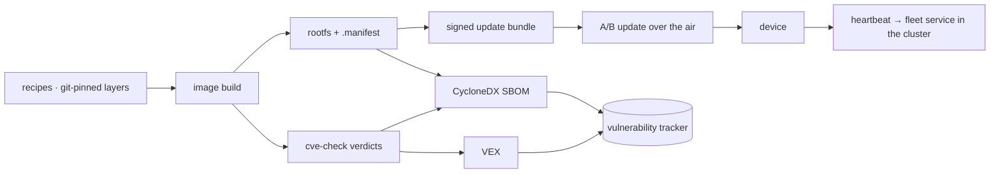

# The embedded side: Yocto, OTA, and making a scanner tell the truth


A custom Yocto layer that boots on a Raspberry Pi 3 B+, takes **signed A/B updates over the
air** with a proven live rollback, and — the part worth the walkthrough — feeds a bill of
materials into the same vulnerability tracking the cluster services use.

The board itself costs about the same as a takeaway dinner. The supply-chain discipline
around it does not know that: signed bundles, CPE-matched CVEs, VEX suppressions with a named
reason, a daily re-scan — the same reflex as the cluster, on **$35 of hardware**.

Getting that last part to work is where the interesting engineering is, because the obvious
implementation produces a beautiful dashboard that reports nothing.

---

## The device lifecycle



Two partitions, one active. An update is written to the inactive slot, the bootloader
switches, and a failed boot falls back. That was demonstrated with a real update *and* a
real rollback on hardware — not asserted from configuration.

The rollback is not a script; it is arithmetic in the bootloader. The boot environment holds
a slot order and an attempts-remaining counter per slot. Each boot decrements the counter for
the slot it picked; a successful start-up resets it. A kernel panic reboots the machine
automatically after a fixed delay rather than hanging, so a broken image spends its attempts
quickly and the bootloader falls back on its own. **Nothing in userspace has to survive for
the recovery to work**, which is the only design that helps when what you broke is userspace.

---

## The build is reproducible, remote, and never copies files

An embedded image is only trustworthy if the thing that produced it is. Two rules shape the
whole pipeline:

**Nothing is ever copied to the build host.** Source reaches it by pulling from version
control, always fast-forward only. Artefacts leave it by being published to an artefact
repository over HTTP. There is no step in which a file arrives on the build machine by
someone dragging it there, which means "what produced this image" is answerable from commits
alone.

**Every layer is pinned** to a branch or commit, and each release archives a provenance file
recording the exact layer commits and artefact hashes alongside the image, the bundle, the
SBOM and the VEX document. Cutting a release is one script: pull, read the version from a
single source of truth, build, **verify the produced bundle's signature and version before
going further**, publish the SBOM snapshot as an immutable project version, archive, upload,
tag.

That verify step is the same principle as the cluster's: producing a signature and checking
one are different acts, and only the second is a control.

### Shared build cache, and the part that makes it work

Building an operating system from source is expensive, so both the downloaded sources and
the intermediate task outputs are mirrored to the same artefact repository the cluster uses.
A wiped build tree restores over the LAN instead of recompiling.

The non-obvious prerequisite: **a shared hash-equivalence server**. Without one, a mirrored
cache entry produced on one machine resolves to a different identity on another and the
cache silently never hits. You get a cache that is present, populated, correct — and
bypassed on every build. It is the same *configured, plausible, inert* pattern that recurs
throughout this estate, in a place nobody thinks to look.

### A daily job keeps the bill of materials alive

Once a day the build host pulls the long-term-support layer branches, rebuilds, refreshes the
CVE database, regenerates the SBOM and VEX, and re-publishes. That last part matters more
than it sounds: an LTS branch receives backported security fixes continuously, so **a daily
SBOM without the layer pull is a false sense of security** — it faithfully reports
vulnerabilities that were fixed upstream weeks ago, and the noise trains you to ignore it.

---

## The part that does not work by default

An image build already knows exactly what it installed. The natural move is to feed that to
a vulnerability tracker and read the findings.

Doing that yields **zero findings** — on an image that demonstrably contains known
vulnerabilities.

Nothing errors. The upload succeeds, the component count is right, the dashboard is green.
This is the single most instructive failure in the whole estate, because *every* signal says
success:

> A vulnerability tracker matches components by **ecosystem package identifiers or CPEs**.
> An operating-system image's packages have neither by default. Their identifiers are
> `generic`-typed, which match **nothing**.
>
> **Zero findings and "nothing was evaluated" are indistinguishable on a dashboard.**

### Why not just use the build system's own SBOM output?

Yocto can emit SPDX, so that looks like the answer. It is not, for two independent reasons:

1. **It is a graph, not a document.** The output is 300+ linked documents — one per
   recipe/package, joined by external references. Converting the top-level document, which
   is the obvious thing to try, captures only the image itself as a single package. None of
   its constituent packages come along, because they live in the other, unreferenced files.
2. **The ingest endpoint takes CycloneDX only.** A well-formed SPDX document is rejected
   outright; the validator never attempts SPDX parsing at all.

So the SBOM is generated from the image manifest instead — which already *is* the exact
installed package list, flat and reliable.

---

## Making the components matchable

The build system already knows the right CPE product for every recipe — it is precisely
what its own build-time CVE checker matches on. So that data is reused rather than guessed:

```text
cpe:2.3:a:*:<product>:<version>:*:*:*:*:*:*:*
```

Three deliberate decisions, each of which changes the results:

**Version comes from the checker's summary, not the package revision.** The clean upstream
version is what the CVE database matches; the packaging suffix is not.

**The vendor field is left as ANY (`*`), on purpose.** Vendor strings in the CVE database
are inconsistent — the C library and the shell are both published under a vendor that
matches neither of their names. Pinning vendor to the product name silently drops exactly
those packages. The trade-off is honest: an ANY-vendor CPE could match a different vendor's
similarly-named product, so the failure mode is a **false positive** — an extra item to
triage — never a false negative. That is the safe direction.

**Virtual package groups get no CPE at all**, because they are not software.

### The hard part: mapping a package back to its recipe

This is the step that decides whether the whole exercise is worth anything.

Runtime package names follow Debian-style conventions. Recipe names do not. They frequently
share **no text at all**:

| Installed package | Actual recipe |
|---|---|
| `libssl3` | `openssl` |
| `libc6` | `glibc` |
| `libcurl4` | `curl` |

No name heuristic can bridge that. A longest-prefix fallback handles the easy cases —
a `busybox-`prefixed utility maps to `busybox` — and then misses **every `lib*` package**,
which are precisely the ones you most want CVE coverage on.

The build system does keep an authoritative reverse map on disk: a per-package record naming
its recipe. Reading that is the difference between covering the base utilities and covering
the cryptography, C library and HTTP stack.

### The result

On an 83-component image, adding CPEs took the finding count from **zero** to **100** —
six critical, twenty-nine high. Same image, same scanner, same day. The only thing that
changed was whether the components could be identified.

---

## Turning a flood of matches into a short list — without discarding anything real

Raw matches are unusable: a build-time checker's verdicts and a CVE database's matches
disagree constantly, and most of the disagreement is legitimate.

So the build's own verdicts are exported as a **VEX** document alongside the SBOM:

| Verdict | Meaning | Becomes |
|---|---|---|
| **Patched** | a backported or upstream fix is present | suppressed, with the evidence |
| **Ignored** | a human wrote a justification *in the recipe* | suppressed, carrying that justification |
| **Unpatched** | genuinely open | left to triage |

The auditable property this buys: **any suppressed finding traces back to a git-pinned
recipe annotation written by a person, with their reason attached.** That is the question a
reviewer actually asks — *why is this one fine?* — and it has an answer that is not "someone
clicked a button".

Measured effect: **100 raw matches become 46 left to triage.** Fifty-four were dismissed by
the build system's own evidence rather than by a human's patience, and each dismissal points
at the recipe that justifies it.

The same discipline applies on the cluster side, and it is worth stating because it is where
VEX is usually abused: a "not reachable" justification is only applied where it is *true*.
A Java service whose TLS is provided by the runtime genuinely does not load the base image's
crypto library. A web server or database in the same cluster genuinely does. Copying the
first justification onto the second would suppress live vulnerabilities on real attack
surface — which is worse than not scanning at all, because it manufactures confidence.

---

## Hardening: four layers, and only one of them is removal

The image ships in two variants from the same pipeline. The hardened one is not a
configuration profile bolted on at the end — it reaches down to what gets compiled at all.

| Layer | Mechanism | Strength |
|---|---|---|
| **Build features** | a capability is never compiled into anything | strongest — the code does not exist |
| **Kernel configuration** | no driver, so the hardware is inert | strong — needs a kernel replacement to undo |
| **Device tree / firmware config** | the bus or peripheral is switched off below the OS | strong, and independent of the kernel |
| **Runtime policy** | module blacklists, device rules, allow-lists | weakest — policing, not removing |

Only the first genuinely eliminates attack surface. The last is what most "hardening guides"
consist of, and it is a rule that something with enough privilege can simply not follow.

The hardened variant additionally drops the development conveniences the default build keeps
— no empty root password, key-based login only — and mounts its root filesystem **read-only
at the format level**. Not read-only by mount option, which is one remount away from being
untrue: the filesystem format itself has no write path. A reboot returns to a pristine image
by construction.

It is also **35 MB against 164 MB**, which is a security property before it is a bandwidth
one: everything absent is something that cannot be vulnerable, and both numbers matter
because the A/B layout gives each slot a hard size ceiling. Fitting a Python runtime inside
that ceiling required installing its components granularly rather than as one package — the
full runtime overflows the slot, a curated subset does not. Constraints like that are why
the image contents get audited: on a normal server nobody would have looked.

> The default variant is deliberately *not* hardened. It is a bench sandbox with a console
> and open access, and calling it anything else would be the dishonest option. The hardened
> variant is the one that has been booted, updated and rolled back on real hardware — that is
> what makes it a claim worth making.

---

## Traps that only real hardware finds

Three, all of which passed every check that was not a physical device.

**A newer bootloader silently disabled the entire A/B mechanism.** Following the upstream
layer's own recommended branch pulled in a bootloader release that does not pass its boot
arguments through on this hardware. The device booted perfectly. The update tooling reported
both slots healthy. But the kernel command line no longer carried the active-slot marker or
the panic-reboot setting — so userspace could not tell which slot it was on, and **the
automatic rollback was gone**. Signed updates, verified bundles, working boots, and no safety
net. The bootloader version is now pinned deliberately, with the reason recorded, because
the "upgrade" is a regression on this board. Only a serial console showed the truth.

**The read-only variant panicked on first boot after an update**, twice, for two different
reasons. The boot partition is *shared* between both slots and is not part of an over-the-air
update — only the root filesystem is. So the kernel that mounts the new root is always the
*old* kernel, and it needed the new filesystem type built in rather than loadable. Then, with
that fixed, the vendor layer was found to hard-code the root filesystem type into the boot
command line, overriding auto-detection. The fix is to stop hard-coding it and let the
bootloader supply the arguments instead. The general lesson is structural: **A/B updates
couple the kernel and the root filesystem more tightly than the diagram suggests, and a
change that needs a new kernel needs a re-flash, not an update.**

**A power cut mid-build produced 238 zero-byte object files** carrying fresh timestamps.
Make-based builds decide what is stale by *timestamp*, not content — so every truncated file
looked newer than its source and was treated as already built. The build system's own logs
recorded the interrupted tasks as having *succeeded*, because they had, right up until the
page cache never reached the disk. The shared cache was corrupted the same way. There is no
safe surgical repair: wipe and rebuild. (Which is now cheap, because the cache restores from
the mirror instead of recompiling.)

---

## The device reports back

A fielded device that cannot be seen is a device you are guessing about. Each one runs a
small agent — a couple of hundred lines, **standard library only, no dependencies**, which is
itself a supply-chain decision — posting a heartbeat to a service running on the cluster.

It reports the stable machine identity, the running image version and variant, **which boot
slot is active**, system-on-chip temperature, undervoltage flags, uptime, and memory and disk
utilisation. It degrades gracefully by design: if a tool it queries is missing, the field is
null and the heartbeat still arrives. An agent that crashes because it could not read one
optional value is worse than no agent, because it takes the device off the map for the wrong
reason.

The cluster side keeps the history in a replicated database and cross-references the artefact
repository to show which devices are behind the latest published release. Verified end to
end: an image carrying the agent was updated over the air onto the inactive slot, and the
device then appeared in the dashboard reporting its new version and the slot it had switched
to.

The dashboard's update button deliberately **shows the command rather than running it.** The
over-the-air path that is proven is the one the tooling drives; adding a second, self-service
trigger would create an unproven path that looks identical from the outside. Making it real
is a small change — the reason it has not been made is that it would need its own
verification, not that it is hard.

---

## Build-time checking and continuous re-evaluation do different jobs

Both are kept, deliberately:

- The **build-time checker** is more precise for this ecosystem — it uses the build system's
  own CPE knowledge and per-recipe patch state. But it is a **snapshot**: it knows only the
  CVE data present when the image was built.
- The **tracker** re-evaluates the *stored* bill of materials against fresh vulnerability
  data continuously. No rebuild, no re-upload, no device involvement — an image shipped
  months ago picks up a newly published CVE overnight.

A device fleet cannot be rebuilt every time the world learns something. That is the entire
argument for keeping an inventory rather than only a scan result.

---

## Honest limits

- **A scanner match is a hypothesis, not a vulnerability.** Everything above is machinery
  for turning a flood of hypotheses into a list a human can act on. None of it proves
  reachability.
- **ANY-vendor CPEs over-match by design.** Extra triage is the accepted cost of not
  missing packages whose published vendor differs from their name.
- **There is no secure boot and no hardware root of trust.** The target board cannot do it —
  it needs a later generation with fused keys. The update *bundles* are signed and verified
  before installation, but nothing verifies the bootloader itself, so an attacker with
  physical access to the storage card wins. That is a hardware ceiling, not an oversight,
  and the difference matters: signed updates protect the delivery path, not the device.
- **The bootloader and kernel are shared between slots**, so anything that needs a new kernel
  needs a physical re-flash rather than an update. The A/B guarantee covers the root
  filesystem only.
- **The CVE database's own completeness is assumed.** Nothing here validates it.
- **Configuration hardening is not covered** by a bill of materials at all — it describes
  what is installed, never how it is configured or what it is doing at runtime. Which is why
  a bill of materials is not the only scanner pointed at this image: network exposure, SSH
  posture, host configuration against a recognised baseline, binary hardening flags and
  kernel self-protection settings are all checked separately and aggregated with the CVE
  findings into one view. That aggregate runs to **385 findings, of which the vulnerability
  set is a minority** — a fair statement of how much of an embedded system's risk a bill of
  materials can actually see.

---

## Read next

- **[DevSecOps, end to end](devsecops.md)** — the same supply chain pointed at a cluster:
  derived scan scope, exposure-based triage, and the traps that produced confident wrong
  numbers.
- **[How the platform builds and ships things](platform.md)** — the delivery chain the
  artefact repository and vulnerability tracker in this page are shared with.
- **[High availability, audited](reliability.md)** — the *configured, plausible and inert*
  failure class that shows up here as a silently bypassed build cache, and there as a reboot
  daemon that never rebooted.
- **[Legal, licensing, and the regulatory posture](compliance.md)** — where a fleet of
  connected embedded devices sits against a real cyber-resilience regulation, not just a
  best-effort SBOM.

---

<sub>Written for publication. No hostnames, addresses or credential locations appear here,
and a guard fails the build if they ever do.</sub>

<script type="module">
  import mermaid from 'https://cdn.jsdelivr.net/npm/mermaid@11/dist/mermaid.esm.min.mjs';
  mermaid.initialize({ startOnLoad: false, theme: 'neutral' });
  document.querySelectorAll('pre > code.language-mermaid').forEach((el) => {
    const div = document.createElement('div');
    div.className = 'mermaid';
    div.textContent = el.textContent;
    el.parentElement.replaceWith(div);
  });
  mermaid.run();
</script>
