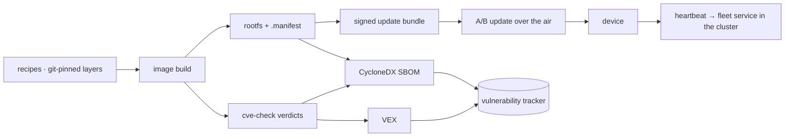

# The embedded side: Yocto, OTA, and making a scanner tell the truth

A custom Yocto layer that boots on a Raspberry Pi 3 B+, takes **signed A/B updates over the
air** with a proven live rollback, and — the part worth the walkthrough — feeds a bill of
materials into the same vulnerability tracking the cluster services use.

Getting that last part to work is where the interesting engineering is, because the obvious
implementation produces a beautiful dashboard that reports nothing.

---

## The device lifecycle



Two partitions, one active. An update is written to the inactive slot, the bootloader
switches, and a failed boot falls back. That was demonstrated with a real update *and* a
real rollback on hardware — not asserted from configuration.

---

## The part that does not work by default

An image build already knows exactly what it installed. The natural move is to feed that to
a vulnerability tracker and read the findings.

Doing that yields **zero findings** — on an image that demonstrably contains known
vulnerabilities.

Nothing errors. The upload succeeds, the component count is right, the dashboard is green.
This is the single most instructive failure in the whole estate, because *every* signal says
success:

> A vulnerability tracker matches components by **ecosystem package identifiers or CPEs**.
> An operating-system image's packages have neither by default. Their identifiers are
> `generic`-typed, which match **nothing**.
>
> **Zero findings and "nothing was evaluated" are indistinguishable on a dashboard.**

### Why not just use the build system's own SBOM output?

Yocto can emit SPDX, so that looks like the answer. It is not, for two independent reasons:

1. **It is a graph, not a document.** The output is 300+ linked documents — one per
   recipe/package, joined by external references. Converting the top-level document, which
   is the obvious thing to try, captures only the image itself as a single package. None of
   its constituent packages come along, because they live in the other, unreferenced files.
2. **The ingest endpoint takes CycloneDX only.** A well-formed SPDX document is rejected
   outright; the validator never attempts SPDX parsing at all.

So the SBOM is generated from the image manifest instead — which already *is* the exact
installed package list, flat and reliable.

---

## Making the components matchable

The build system already knows the right CPE product for every recipe — it is precisely
what its own build-time CVE checker matches on. So that data is reused rather than guessed:

```text
cpe:2.3:a:*:<product>:<version>:*:*:*:*:*:*:*
```

Three deliberate decisions, each of which changes the results:

**Version comes from the checker's summary, not the package revision.** The clean upstream
version is what the CVE database matches; the packaging suffix is not.

**The vendor field is left as ANY (`*`), on purpose.** Vendor strings in the CVE database
are inconsistent — the C library and the shell are both published under a vendor that
matches neither of their names. Pinning vendor to the product name silently drops exactly
those packages. The trade-off is honest: an ANY-vendor CPE could match a different vendor's
similarly-named product, so the failure mode is a **false positive** — an extra item to
triage — never a false negative. That is the safe direction.

**Virtual package groups get no CPE at all**, because they are not software.

### The hard part: mapping a package back to its recipe

This is the step that decides whether the whole exercise is worth anything.

Runtime package names follow Debian-style conventions. Recipe names do not. They frequently
share **no text at all**:

| Installed package | Actual recipe |
|---|---|
| `libssl3` | `openssl` |
| `libc6` | `glibc` |
| `libcurl4` | `curl` |

No name heuristic can bridge that. A longest-prefix fallback handles the easy cases —
a `busybox-`prefixed utility maps to `busybox` — and then misses **every `lib*` package**,
which are precisely the ones you most want CVE coverage on.

The build system does keep an authoritative reverse map on disk: a per-package record naming
its recipe. Reading that is the difference between covering the base utilities and covering
the cryptography, C library and HTTP stack.

### The result

On an 83-component image, adding CPEs took the finding count from **zero** to **100** —
six critical, twenty-nine high. Same image, same scanner, same day. The only thing that
changed was whether the components could be identified.

---

## Turning a flood of matches into a short list — without discarding anything real

Raw matches are unusable: a build-time checker's verdicts and a CVE database's matches
disagree constantly, and most of the disagreement is legitimate.

So the build's own verdicts are exported as a **VEX** document alongside the SBOM:

| Verdict | Meaning | Becomes |
|---|---|---|
| **Patched** | a backported or upstream fix is present | suppressed, with the evidence |
| **Ignored** | a human wrote a justification *in the recipe* | suppressed, carrying that justification |
| **Unpatched** | genuinely open | left to triage |

The auditable property this buys: **any suppressed finding traces back to a git-pinned
recipe annotation written by a person, with their reason attached.** That is the question a
reviewer actually asks — *why is this one fine?* — and it has an answer that is not "someone
clicked a button".

The same discipline applies on the cluster side, and it is worth stating because it is where
VEX is usually abused: a "not reachable" justification is only applied where it is *true*.
A Java service whose TLS is provided by the runtime genuinely does not load the base image's
crypto library. A web server or database in the same cluster genuinely does. Copying the
first justification onto the second would suppress live vulnerabilities on real attack
surface — which is worse than not scanning at all, because it manufactures confidence.

---

## Build-time checking and continuous re-evaluation do different jobs

Both are kept, deliberately:

- The **build-time checker** is more precise for this ecosystem — it uses the build system's
  own CPE knowledge and per-recipe patch state. But it is a **snapshot**: it knows only the
  CVE data present when the image was built.
- The **tracker** re-evaluates the *stored* bill of materials against fresh vulnerability
  data continuously. No rebuild, no re-upload, no device involvement — an image shipped
  months ago picks up a newly published CVE overnight.

A device fleet cannot be rebuilt every time the world learns something. That is the entire
argument for keeping an inventory rather than only a scan result.

---

## Honest limits

- **A scanner match is a hypothesis, not a vulnerability.** Everything above is machinery
  for turning a flood of hypotheses into a list a human can act on. None of it proves
  reachability.
- **ANY-vendor CPEs over-match by design.** Extra triage is the accepted cost of not
  missing packages whose published vendor differs from their name.
- **The CVE database's own completeness is assumed.** Nothing here validates it.
- **Configuration hardening is not covered** by a bill of materials at all — it describes
  what is installed, never how it is configured or what it is doing at runtime.

---

<sub>Written for publication. No hostnames, addresses or credential locations appear here,
and a guard fails the build if they ever do.</sub>

<script type="module">
  import mermaid from 'https://cdn.jsdelivr.net/npm/mermaid@11/dist/mermaid.esm.min.mjs';
  mermaid.initialize({ startOnLoad: false, theme: 'neutral' });
  document.querySelectorAll('pre > code.language-mermaid').forEach((el) => {
    const div = document.createElement('div');
    div.className = 'mermaid';
    div.textContent = el.textContent;
    el.parentElement.replaceWith(div);
  });
  mermaid.run();
</script>
