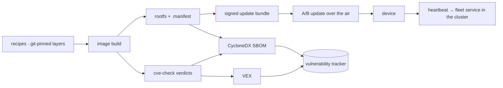

# The embedded side: Yocto, OTA, and making a scanner tell the truth

-0A64A4?logo=yoctoproject&logoColor=white)


-critical)


A custom Yocto layer that boots on a Raspberry Pi 3 B+, takes **signed A/B updates over the
air** with a live rollback proven on hardware, and feeds a bill of materials into the same
vulnerability tracking the cluster services use. The board launched at $35, about a takeaway
dinner; the supply-chain discipline around it does not know that. Getting the last part to
work is where the interesting engineering is, because the obvious implementation produces a
beautiful dashboard that reports nothing.

**State of the rig, as of 2026-10-09:** release 2026.09.1 on Yocto 6.0 LTS (wrynose), running
slot A with both slots good, last over-the-air update 2026-09-01. The layer has
{{ site.data.stats.hardware.yocto_commits }} commits (from [the status page](status.md)); the
repository is private, so there is nothing to link. Most of the numbers below are from the
**first build, July 2026, on the previous LTS (scarthgap, 5.0)**, and each says so. I have not
re-measured them on the current line, and where a figure could not be re-measured I have left
it as a dated figure rather than refreshing it by guesswork.

---

## The device lifecycle


```mermaid
flowchart LR
  R["recipes · git-pinned layers"] --> BLD["image build"]
  BLD --> IMG["rootfs + .manifest"]
  BLD --> CC["cve-check verdicts"]
  IMG --> BUNDLE["signed update bundle"]
  BUNDLE --> OTA["A/B update over the air"]
  OTA --> DEV["device"]
  DEV --> HB["heartbeat → fleet service in the cluster"]
  IMG --> SBOM["CycloneDX SBOM"]
  CC --> SBOM
  CC --> VEX["VEX"]
  SBOM --> DT[("vulnerability tracker")]
  VEX --> DT
```

Two partitions, one active. An update is written to the inactive slot, the bootloader
switches, and a failed boot falls back. That was demonstrated with a real update *and* a
real rollback on hardware — not asserted from configuration.

The rollback is not a script; it is arithmetic in the bootloader. The boot environment holds
a slot order and an attempts-remaining counter per slot. Each boot decrements the counter for
the slot it picked; a successful start-up resets it. A kernel panic reboots the machine
automatically after a fixed delay rather than hanging, so a broken image spends its attempts
quickly and the bootloader falls back on its own. **Nothing in userspace has to survive for
the recovery to work**, which is the only design that helps when what you broke is userspace.

---

## The build is reproducible, remote, and never copies files

An embedded image is only trustworthy if the thing that produced it is. Two rules shape the
pipeline.

**No source or build input is ever copied to the build host.** Source reaches it by pulling
from version control, fast-forward only. Artefacts leave it by being published to an artefact repository
over HTTP. No source file arrives by someone dragging it there, so "what produced this image" is
answerable from commits alone. (Two things are still placed by hand: a setup script copies
one service unit over, and the signing keys are put in place manually. Neither is a build
input, but neither is in version control either.)

**Every layer is pinned** to a branch or commit, and each release archives a provenance file
recording the exact layer commits and artefact hashes alongside the image, the bundle, the
SBOM and the VEX document. Cutting a release is one script: pull, read the version from a
single source of truth, build, **verify the produced bundle's signature and version before
going further**, publish the SBOM snapshot as an immutable project version, archive, upload,
tag. Producing a signature and checking one are different acts, and only the second is a
control. (The traps section has what happens when the check looks at the wrong thing.)

### Shared build cache

The downloaded **sources** are mirrored to the same artefact repository the cluster uses;
they genuinely disappear upstream, so that copy is a reproducibility guarantee. The
intermediate **task outputs** are not copied anywhere: the build host serves its own cache
read-only, in place. They used to be mirrored too, until the copy filled the repository, and a
second copy of derived data buys only disk pressure.

It is proven, not assumed. On 2026-09-25 a build started from an **empty** local cache
restored **490 of 490** tasks from the served cache and compiled nothing, and the same build
pointed at a dead mirror got zero and failed, which is what makes the first number mean
anything. I have not re-run it since.

The non-obvious prerequisite is **a shared hash-equivalence server**. Without one, a mirrored
entry produced on one machine resolves to a different identity on another and the cache
silently never hits: present, populated, correct, and bypassed on every build. The same
*configured, plausible, inert* pattern as [the reliability audit](reliability.md), in a place
nobody thinks to look.

### A daily job keeps the bill of materials alive

Once a day the build host pulls the long-term-support layer branches, rebuilds, refreshes the
CVE database, regenerates the SBOM and VEX, and re-publishes. The layer pull matters: an LTS
branch receives backported security fixes continuously, so **a daily SBOM without it is a
false sense of security**. It faithfully reports vulnerabilities fixed upstream weeks ago, and
the noise trains you to ignore it.

That job exists because the build-time checker and the tracker do different jobs, and both
are kept. The **build-time checker** is more precise for this ecosystem (the build system's
own CPE knowledge and per-recipe patch state) but it is a snapshot of the CVE data present
when the image was built. The **tracker** re-evaluates the *stored* bill of materials against
fresh data with no rebuild, no re-upload and no device involvement, so an image shipped months
ago picks up a newly published CVE overnight. A fleet cannot be rebuilt every time the world
learns something; that is the whole argument for keeping an inventory rather than only a scan
result.

---

## The part that does not work by default

An image build already knows exactly what it installed. The natural move is to feed that to a
vulnerability tracker and read the findings. Doing that yields **zero findings**, on an image
that demonstrably contains known vulnerabilities.

Nothing errors. The upload succeeds, the component count is right, the dashboard is green.
This is the most instructive failure in the whole estate, because *every* signal says
success:

> A vulnerability tracker matches components by **ecosystem package identifiers or CPEs**.
> An operating-system image's packages have neither by default. Their identifiers are
> `generic`-typed, which match **nothing**.
>
> **Zero findings and "nothing was evaluated" are indistinguishable on a dashboard.**

### Why not just use the build system's own SBOM output?

Yocto can emit SPDX, which looks like the answer. Two independent reasons say no. **It is a
graph, not a document**: my notes from the first build record 166+ linked files, one per
recipe, joined by external references (I have not recounted on the current line), and
converting the top-level document captures only the image itself as a single package. And
**the ingest endpoint takes CycloneDX only**; a well-formed SPDX document is rejected outright.
So the SBOM is generated from the image manifest, which already *is* the exact installed
package list, flat and reliable.

---

## Making the components matchable

The build system already knows the right CPE product for every recipe; it is what its own
build-time CVE checker matches on. That data is reused rather than guessed:

```text
cpe:2.3:a:*:<product>:<version>:*:*:*:*:*:*:*
```

Three deliberate decisions, each of which changes the results.

**Version comes from the checker's summary, not the package revision.** The clean upstream
version is what the CVE database matches; the packaging suffix is not.

**The vendor field is left as ANY (`*`), on purpose.** Vendor strings in the CVE database are
inconsistent: the C library and the shell are both published under a vendor that matches
neither of their names, and pinning vendor to the product name silently drops exactly those
packages. The trade-off is honest: an ANY-vendor CPE could match a different vendor's
similarly-named product, so the failure mode is a **false positive**, an extra item to
triage, never a false negative. That is the safe direction.

**Virtual package groups get no CPE at all**, because they are not software.

### The hard part: mapping a package back to its recipe

This step decides whether the exercise is worth anything. Runtime package names follow
Debian-style conventions; recipe names do not, and they frequently share **no text at all**:

| Installed package | Actual recipe |
|---|---|
| `libssl3` | `openssl` |
| `libc6` | `glibc` |
| `libcurl4` | `curl` |

No name heuristic bridges that. A longest-prefix fallback handles the easy cases (a
`busybox-`prefixed utility maps to `busybox`) and then misses **every `lib*` package**, which
are precisely the ones you most want covered. The build system keeps an authoritative reverse
map on disk, a per-package record naming its recipe. Reading that is the difference between
covering the base utilities and covering the cryptography, C library and HTTP stack.

### The result

On the first build (2026-07-05, scarthgap, 83 components), adding CPEs took the finding count
from **zero** to about **100**. Same image, same scanner, same day. The only thing that
changed was whether the components could be identified. (An earlier version of this page also
gave a critical/high split for those 100. I can find no record of where it came from, so it
is gone.) Later snapshots, same method: the hardened July image was 118 components and 56
findings; the 2026.09.1 SBOM has 123 components. I did not read current finding counts for
this revision.

---

## Turning a flood of matches into a short list without discarding anything real

Raw matches are unusable: a build-time checker's verdicts and a CVE database's matches
disagree constantly, and most of the disagreement is legitimate. So the build's own verdicts
are exported as a **VEX** document alongside the SBOM:

| Verdict | Meaning | Becomes |
|---|---|---|
| **Patched** | a backported or upstream fix is present | suppressed, with the evidence |
| **Ignored, not applicable** (wrong CPE, disputed) | a human wrote a justification *in the recipe* | suppressed, carrying that justification |
| **Ignored, upstream will not fix** | a human recorded it, but the vulnerability is real | **kept in triage on purpose** |
| **Unpatched** | genuinely open | left to triage |

One guard sits on top: a CVE that is unpatched in *any* in-scope recipe is never suppressed,
whatever another recipe says about it.

The auditable property this buys: **any suppressed finding traces back to a git-pinned recipe
annotation written by a person, with their reason attached.** That is the question a reviewer
actually asks, *why is this one fine?*, and the answer is not "someone clicked a button".

Measured effect on the first build (2026-07-05): **100 raw matches became 46 left to
triage**, and 54 were dismissed by the build system's own evidence rather than by a human's
patience. The 46 split as 38 genuinely unpatched, 6 the upstream will not fix, and 2 too new
for the build-time database. That split is the better number than the bare 46: none of the
leftovers is noise. The cluster side applies the same discipline, and
[the DevSecOps page](devsecops.md) covers the supply chain it belongs to. The misuse to watch
for: a "not reachable" justification is true for a Java service whose TLS comes from the
runtime and false for a web server or a database, and copying it from one to the other
manufactures confidence rather than evidence.

---

## Hardening: a four-layer framework, one layer shipped

The image ships in two variants from the same pipeline. The design has four ways of making a
capability go away, in descending strength:

| Layer | Mechanism | Strength |
|---|---|---|
| **Build features** | a capability is never compiled into anything | strongest, the code does not exist |
| **Kernel configuration** | no driver, so the hardware is inert | strong, needs a kernel replacement to undo |
| **Device tree / firmware config** | the bus or peripheral is switched off below the OS | strong, and independent of the kernel |
| **Runtime policy** | module blacklists, device rules, allow-lists | weakest, policing rather than removing |

Only the first genuinely eliminates attack surface; the last is what most "hardening guides"
consist of, and it is a rule that something with enough privilege can simply not follow.

**What the hardened image does today is narrower than that table, and an earlier version of
this page blurred the difference** (retracted 2026-10-09). The compile-out knobs (no
Bluetooth or Wi-Fi, no USB mass storage, radios switched off in the device tree) exist in the
sample configuration as opt-in settings, and all of them are still commented out. What the
hardened variant actually does is drop the three debug-tweaks features the default keeps
(the empty root password is among them), mount a **read-only squashfs** root, build the
squashfs driver into the kernel, and reboot automatically after a panic. The read-only part
is real: not read-only by mount option, which is one remount away from being untrue, but a
filesystem format with no write path, so a reboot returns the root filesystem to pristine
by construction. State that must survive (the SSH host keys and the clock, for instance)
lives on a separate data partition.

It is also small. On the July 2026 scarthgap build the hardened image was **35 MB against
164 MB** for the default; I have not recorded sizes for the current line. That is a security
property before it is a bandwidth one, since everything absent cannot be vulnerable, and it
matters because each A/B slot has a hard size ceiling. On the default image, fitting a
Python runtime required installing its components granularly rather than as one package: the
full runtime (224 MB) overflowed the 213 MB slot, and a curated subset (192 MB) fit.
Constraints like that are why the image contents get audited.

> The default variant is deliberately *not* hardened. It is a bench sandbox with a console and
> open access, and calling it anything else would be the dishonest option. The hardened
> variant was booted, updated and panic-rebooted on real hardware in July 2026 (first build).
> The current line has since been proven on the default image; the hardened build of it is
> wired and is the next proof, not a finished one.

---

## Traps that only real hardware finds

All of which passed every check that was not a physical device.

**A newer bootloader silently disabled the entire A/B mechanism.** Following the upstream
layer's recommended branch pulled in a bootloader release that does not pass its boot
arguments through on this hardware. The device booted perfectly and the update tooling
reported both slots healthy. But the kernel command line no longer carried the active-slot
marker or the panic-reboot setting, so userspace could not tell which slot it was on and
**the automatic rollback was gone**: signed updates, verified bundles, working boots, and no
safety net. Only a serial console showed the truth. On the 5.0 line the bootloader is
therefore pinned, with the reason recorded. On the 6.0 line the stock, newer bootloader works,
proven on hardware by the same rollback test on 2026-08-30. So the fault was one specific
release, narrowed to the 2025.04 one, and the mechanism is still unknown.

**The read-only variant panicked on first boot after an update**, twice, for two different
reasons. The boot partition is *shared* between both slots and is not part of an over-the-air
update, only the root filesystem is. So the kernel that mounts the new root is always the
*old* kernel, and it needed the new filesystem type built in rather than loadable. Then the
vendor layer was found to hard-code the root filesystem type into the boot command line,
overriding auto-detection; the fix is to let the bootloader supply the arguments. The lesson
is structural: **A/B updates couple the kernel and the root filesystem more tightly than the
diagram suggests, and a change that needs a new kernel needs a re-flash, not an update.**

**A power cut mid-build produced 238 zero-byte object files** carrying fresh timestamps.
Make-based builds decide what is stale by *timestamp*, not content, so every truncated file
looked newer than its source and was treated as already built. The build system's logs
recorded the interrupted tasks as having *succeeded*, because they had, right up until the
page cache never reached the disk. The shared cache was corrupted the same way. There is no
safe surgical repair: wipe and rebuild. (Sources restore from the mirror; the task-output
cache is served in place, so it shares the build host's fate.)

**A rollback proof is not an update proof (2026-08-30 to 2026-09-01).** After the move to the
6.0 line, the A/B rollback test passed while every real install failed. The bundles were
signed and the update tooling reported healthy, but its status command never reads the signing
keyring, so a keyring path that did not resolve (a relative-path fix landed 2026-09-01) broke
installation without showing up anywhere the test looked. Release 2026.09.0 was withdrawn;
2026.09.1, streamed from the artefact repository onto the inactive slot, is the first one
where an update was actually proven. Related, found in the same stretch: the bundle had been
signed with the upstream layer's public demo key, because a default in the layer
configuration beats a recipe's weak assignment. Same shape as the cache and the empty
scanner: configured, plausible, inert.

---

## The device reports back

A fielded device that cannot be seen is a device you are guessing about. Each one runs a small
agent (a couple of hundred lines, **standard library only, no dependencies**, which is itself
a supply-chain decision) posting a heartbeat to a service running on the cluster.

It reports the stable machine identity, the running image version and variant, **which boot
slot is active**, system-on-chip temperature, undervoltage flags, uptime, and memory and disk
utilisation. It degrades gracefully by design: if a tool it queries is missing, the field is
null and the heartbeat still arrives. An agent that crashes because it could not read one
optional value is worse than no agent, because it takes the device off the map for the wrong
reason.

The cluster side keeps the history in a replicated database and cross-references the artefact
repository to show which devices are behind the latest published release. Verified end to end
on 2026-07-14 (release 2026.07.1): an image carrying the agent was updated over the air onto
the inactive slot, and the device appeared in the dashboard reporting its new version and the
slot it had switched to. That proof was repeated with 2026.09.1 on 2026-09-01.

The dashboard's update button deliberately **shows the command rather than running it.** The
over-the-air path that is proven is the one the tooling drives; a second, self-service
trigger would be an unproven path that looks identical from the outside. Making it real is a
small change; it has not been made because it would need its own verification.

---

## Honest limits

- **A scanner match is a hypothesis, not a vulnerability.** Everything above turns a flood of
  hypotheses into a list a human can act on. None of it proves reachability.
- **ANY-vendor CPEs over-match by design.** Extra triage is the accepted cost of not missing
  packages whose published vendor differs from their name.
- **There is no secure boot and no hardware root of trust.** The target board cannot do it;
  it needs a later generation with fused keys. The update *bundles* are signed and verified
  before installation, but nothing verifies the bootloader itself, so an attacker with
  physical access to the storage card wins. Signed updates protect the delivery path, not the
  device.
- **The bootloader and kernel are shared between slots**, so anything that needs a new kernel
  needs a physical re-flash. The A/B guarantee covers the root filesystem only.
- **The CVE database's own completeness is assumed.** Nothing here validates it.
- **A bill of materials does not cover configuration.** Network exposure, SSH posture, binary
  hardening flags and kernel self-protection settings are checked by separate scanners and
  aggregated with the CVE findings. The baseline-audit and TLS scanners are **skipped on this
  minimal image** (it has no shell for the first to run in), and that is logged rather than
  hidden, so host configuration against a recognised baseline is *not* covered. The last
  aggregate, the live device on 2026-07-11 (with the binary checks run against the build tree), was 385
  findings across tools. The scheduled
  run of that stage is opt-in and not yet proven in the nightly.

---

## Read next

- **[DevSecOps, end to end](devsecops.md)**: the same supply chain pointed at a cluster.
- **[How the platform builds and ships things](platform.md)**: the delivery chain this page shares.
- **[High availability, audited](reliability.md)**: the *configured, plausible, inert* class.
- **[Legal, licensing, and the regulatory posture](compliance.md)**: where connected devices sit against a real regulation.

---

<sub>Written for publication. No hostnames, addresses or credential locations appear here,
and a guard fails the build if they ever do.</sub>

<script type="module">
  import mermaid from 'https://cdn.jsdelivr.net/npm/mermaid@11/dist/mermaid.esm.min.mjs';
  mermaid.initialize({ startOnLoad: false, theme: 'neutral' });
  document.querySelectorAll('pre > code.language-mermaid').forEach((el) => {
    const div = document.createElement('div');
    div.className = 'mermaid';
    div.textContent = el.textContent;
    el.parentElement.replaceWith(div);
  });
  mermaid.run();
</script>
